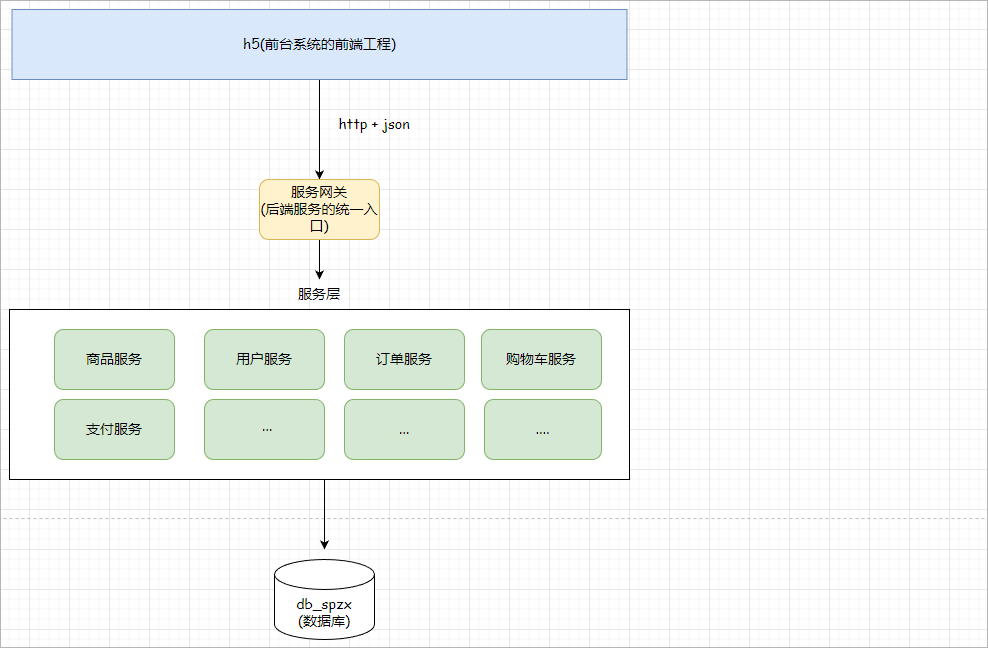

# 1 尚品甄选项目介绍

尚品甄选是一个B2C模式的电子商务平台，包含后台管理系统和前台用户系统。项目采用前后端分离开发模式，基于SpringBoot + SpringCloud微服务架构，集众多主流技术于一身，是一款最适合新手入门的企业级项目。

## 1.1 电商基本概念

### 1.1.1 电商简介

电商是指利用互联网技术，将商品信息、交易、支付等业务进行电子化处理，实现线上购买和线下物流配送的商业活动。它将传统的商业活动转化为了电子商务活动，使得消费者可以足不出户地浏览、挑选商品，并通过电子支付方式完成付款，最终实现商品的快速配送。常见的电商平台：京东、天猫、亚马逊、咸鱼、淘宝...

### 1.1.2 电商模式

电商模式是指电子商务平台和线上商家之间进行业务合作的方式，主要包括以下几种：

#### B2C

**B2C**是Business-to-Customer的缩写，而其中文简称为“**商对客**”。“商对客”是电子商务的一种模式，也就是通常说的直接面向消费者销售产品和服务商业零售模式。这种形式的电子商务一般以网络零售业为主，主要借助于互联网开展在线销售活动。B2C即企业通过互联网为消费者提供一个新型的购物环境——网上商店，消费者通过网络在网上购物、网上支付等消费行为。

案例：唯品会、亚马逊

#### B2B

B2B （ Business to Business）是指进行电子商务交易的供需双方都是商家（或企业、公司），她（他）们使用了互联网的技术或各种商务网络平台，完成商务交易的过程。电子商务是现代 B2B marketing的一种具体主要的表现形式。

案例：阿里巴巴1688

#### B2B2C

B2B2C是一种电子商务类型的网络购物商业模式，B是BUSINESS的简称，C是CUSTOMER的简称，第一个B指的是商品或服务的供应商，第二个B指的是从事电子商务的企业，C则是表示消费者。

案例：京东

#### C2C

C2C即 Customer（Consumer） to Customer（Consumer），意思就是消费者个人间的电子商务行为。比如一个消费者有一台电脑，通过网络进行交易，把它出售给另外一个消费者，此种交易类型就称为C2C电子商务。

案例：闲鱼

#### O2O

O2O即Online To Offline（在线离线/线上到线下），是指将线下的商务机会与互联网结合，让互联网成为线下交易的平台，这个概念最早来源于美国。O2O的概念非常广泛，既可涉及到线上，又可涉及到线下,可以通称为O2O。O2O这种在线支付购买线下的商品和服务，再到线下享受服务的模式也被证实可以很快被消费者接受。

案例：美团优选

## 1.2 业务功能介绍

**后台管理系统功能**：平台管理员用来维护系统相关的基础数据。包含用户登录、权限管理、商品管理、商品分类管理、商品规格管理、订单管理等

线上体验地址：http://spzx-admin.atguigu.cn/

**前台用户系统功能**： 包含首页数据显示，分类显示、查询商品数据、用户注册登录、购物车模块、订单模块等

线上体验地址：http://spzx.atguigu.cn/

## 1.3 系统架构介绍

* 后台管理系统后端采用的是单体架构【就是把所有的功能写在同一个项目中】，如下所示：

 

* 前台用户系统的后端采用的是微服务系统架构【一个模块就是一个独立服务】，如下图所示：

 

* 项目使用技术栈

* 后端：Spring Boot、Spring Cloud Alibaba、Redis、EasyExcel、Minio、短信平台、支付宝支付等
* 前端：Vue3、ES6、Node.js、NPM、Element Plus、ECharts等

## 1.4 前后端分离开发

尚品甄选采用的开发模式是前后端分离的开发模式。前后端分离开发是一种软件系统的设计和开发模式，将用户界面、逻辑处理和数据层从一个整体应用程序中分离出来，在前端和后端之间建立规范化接口，使得前端和后端可以独立开发、测试、部署和升级。

如下图所示：

 

注意：

1、接口：就是一个http的请求地址，接口就规定了请求方式、请求路径、请求参数、响应结果

2、在当前的前后端分离开发中前端和后端传输的数据是json格式

