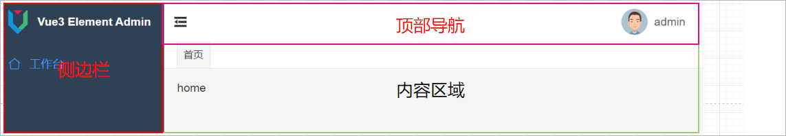
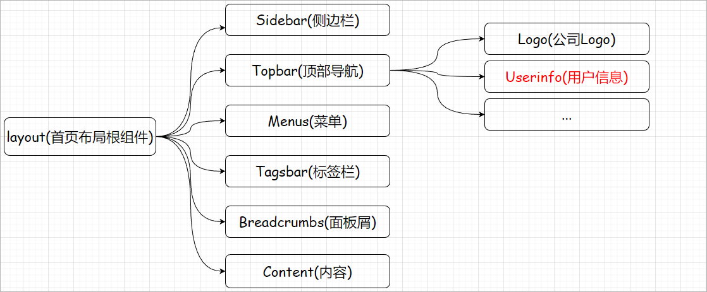

# 1 登录功能说明

在Element-Admin项目模板中已经将登陆的功能实现了，本小章节就来给大家介绍一下前后端分离项目中如何实现登录功能。

## 1.1 登录流程介绍

### 1.1.1 前后端分离开发的登录流程

如下所示：

 

注意：

1、令牌：登录成功以后系统给当前登录用户分配的唯一标识

2、前端：前端系统获取到后端返回的令牌的时候就会把令牌存储起来


### 1.1.2 验证用户是否登录流程

注：后端系统中所提供的一些请求地址(接口)中有一些是必须要求用户登录才可以访问，比如生成订单

 


Vue3-Element-Admin的登录功能实现：当登录成功以后，会将登录成功以后返回的数据存储到pinia的useApp模块中，同时会把数据存储到localStorage中。

```tex
在HTML5中，新加入了一个localStorage特性，这个特性主要是用来作为本地存储来使用的，解决了cookie存储空间不足的问题(cookie中每条cookie的存储空间为4k)，localStorage中一般浏览器支持的是5M大小，这个在不同的浏览器中localStorage会有所不同。
```

 


## 1.2 模板源码分析

### 1.2.1 登录请求过程

#### 登录页面

登录页面：src/views/login/index.vue

```vue
<script>
import {
  defineComponent,
  getCurrentInstance,
  reactive,
  toRefs,
  ref,
  computed,
  watch,
} from 'vue'
import { Login } from '@/api/login'   // 导入登录发送请求所需要的js文件
import { useRouter, useRoute } from 'vue-router'		// 导入路由组件
import { useApp } from '@/pinia/modules/app'	// 从pinia中导入useApp模块
export default defineComponent({
  name: 'login',
  setup() {
    const route = useRoute()	// 获取当前路由对象
    const state = reactive({
      model: {  // 登录表单默认的用户名和密码
        userName: 'admin',
        password: '123456',
      },
      submit: () => { // 登录方法
        state.loginForm.validate(async valid => {
          if (valid) {  // 校验数据的合法性，合法执行下述代码
            state.loading = true
            const { code, data, message } = await Login(state.model)  // 调用登录方法
            if (+code === 200) {  // 返回的状态码如果为200，给出登录成功提示信息
              ctx.$message.success({
                message: ctx.$t('login.loginsuccess'),	// 读取i18n中locals/zh-cn/login.js中的内容
                duration: 1000,
              })

              const targetPath = decodeURIComponent(route.query.redirect)	
              if (targetPath.startsWith('http')) {
                // 如果是一个url地址
                window.location.href = targetPath
              } else if (targetPath.startsWith('/')) {
                // 如果是内部路由地址
                router.push(targetPath)
              } else {
                router.push('/')  // 登录成功以后进行路由 , 查看src/router/index.js的路由配置
              }
              useApp().initToken(data)  // 保存后端返回给前端的数据
            } else {  // 登录失败给出错误提示信息
              ctx.$message.error(message)
            }
            state.loading = false
          }
        })
      },
    })
    return {
      ...toRefs(state),
    }
  },
})
</script>
```

#### login.js

/api/login.js文件源码分析：

```javascript
import request from '@/utils/request'		// 导入utils中的request.js

// 登录接口
export const Login = data => {
  return request({
    url: '/api/login',		// 请求的后端地址，可以可以将其更改为真实的后端地址
    method: 'post',			// 请求方式
    data,					// 请求的数据
  })
}
```

#### request.js

/utils/request.js文件

```javascript
import axios from 'axios'		// 导入axios
const service = axios.create({	// 创建axios对象
  baseURL: '/',					// 后期需要将这个地址更改为后端真实服务地址
  timeout: 10000,
  withCredentials: true,
})
export default service			// 导出axios对象
```

#### mock

当前登录请求时通过mock模拟的后端地址，请求的是mock/login.js模拟的后端接口，源码如下所示：

```javascript
export default [
  {
    url: '/api/login',
    method: 'post',
    timeout: 1000,
    statusCode: 200,
    response: ({ body }) => {
      // 响应内容
      return +body.password === 123456
        ? {
            code: 200,
            message: '登录成功',
            data: {
              token: '@word(50, 100)', // @word()是mockjs的语法
              refresh_token: '@word(50, 100)', // refresh_token是用来重新生成token的
            },
          }
        : {
            code: 400,
            message: '密码错误，请输入123456',
          }
    },
  },
]
```

### 1.2.2 响应结果分析

#### app.js

登录请求成功以后，那么此时会调用useApp().initToken(data) 将后端返回的数据保存起来。useApp导入的是pinia/modules/app.js文件，核心源码如

下所示：

```javascript
import { defineStore } from 'pinia'
import { getItem, setItem, removeItem } from '@/utils/storage' //getItem和setItem是封装的操作localStorage的方法
import { useAccount } from './account'	// pinia的account模块
import { useTags } from './tags'		// pinia的标签栏模块
import { useMenus } from './menu'		// pinia的menu模块
export const TOKEN = 'VEA-TOKEN'
const COLLAPSE = 'VEA-COLLAPSE'

export const useApp = defineStore('app', {  
  state: () => ({		// 当前pinia模块中所存储的状态数据
    title: 'Vue3 Element Admin',
    authorization: getItem(TOKEN),
    sidebar: {
      collapse: getItem(COLLAPSE),
    },
    device: 'desktop',
  }),
  actions: {  // pinia中定义的方法，用来操作pinia中所存储的数据
    setToken(data) {
      this.authorization = data		// 把后端返回的数据存到useApp模块的authorization变量中
      setItem(TOKEN, data)			// 保存到localStorage
    },
    initToken(data) {	// 初始化token的方法
      this.clearToken()	// 清空token
      this.setToken(data) // 设置token数据
    },
    clearToken() {
      this.authorization = ''	// 将authorization数据设置为空字符串
      removeItem(TOKEN)			// 删除localStorage中的token
      useAccount().clearUserinfo()	// 清除pinia的account模块中存储的用户信息
      useTags().clearAllTags()		// 清除pinia的useTags模块中存储的标签栏数据
      useMenus().setMenus([])		// 清空pinia的menu模块中存储的菜单数据
    },
 
  },
})

```

#### storage.js

setItem方法和removeItem方法都是来自于/utils/storage.js中的，源码如下所示：

```javascript
export const setItem = (name, value) => {		// 设置数据到localStorage中
  if (typeof value === 'object') {	// 判断数据的类型是否为对象类型
    value = JSON.stringify(value)	// 将对象转换成json字符串
  }
  window.localStorage.setItem(name, value)	// 存储数据到localStorage中
}

export const removeItem = name => {		// 从localStorage中删除数据
  window.localStorage.removeItem(name)
}
```


# 2 后端登录接口

本章节会给大家介绍一下如何开发尚品甄选项目中的第一个接口。

## 2.1 登录接口开发

### 2.1.1 基础环境配置

#### （1）创建配置文件

在spzx-manager服务的src/resources目录下创建application.yml、application-dev.yml文件，文件的内容如下所示：

```yml
# application.yml文件内容==================================================================================
spring:
  application:
    name: service-manager
  profiles:
    active: dev		# 激活的环境文件
    
#  application-dev.yml文件内容=============================================================================
# 配置服务端口号
server:
  port: 8501

# 配置数据库连接信息
spring:
  datasource:
    type: com.zaxxer.hikari.HikariDataSource
    driver-class-name: com.mysql.cj.jdbc.Driver
    url: jdbc:mysql://localhost:3306/db_spzx?characterEncoding=utf-8&useSSL=false&allowPublicKeyRetrieval=true
    username: root
    password: root
  # Redis的相关配置
  data:
    redis:
      host: localhost
      port: 6379
#  password: 1234

# mybatis的配置
mybatis:
  config-location: classpath:/mybatis-config.xml
  mapper-locations: classpath:/mapper/*/*.xml
```

导入课程资料中提供的：mybatis-config.xml和logback-spring.xml配置文件


#### （2）启动类创建

```java
package com.atguigu.spzx;

import org.springframework.boot.SpringApplication;
import org.springframework.boot.autoconfigure.SpringBootApplication;

@SpringBootApplication
public class ManagerApplication {

    public static void main(String[] args) {
        SpringApplication.run(ManagerApplication.class , args) ;
    }

}
```


### 2.1.2 SysUser

创建与数据库表对应的实体类：

BaseEntity: 定义一个BaseEntity实体类，在该实体类中定义公共的属性

```java
// com.atguigu.spzx.model.entity.base
@Data
public class BaseEntity implements Serializable {

    private Long id;
    private Date createTime;
    private Date updateTime;
    private Integer isDeleted;
    
}
```

SysUser实体类定义：

```java
// com.atguigu.spzx.model.entity.system
@Data
public class SysUser extends BaseEntity {

	private static final long serialVersionUID = 1L;
	private String userName;  // 该字段的属性名称和数据表字段不一致
	private String password;
	private String name;
	private String phone;
	private String avatar;
	private String description;
	private Integer status;

}
```


### 2.1.3 LoginDto

创建一个LoginDto实体类，封装登录请求参数。

```java
// com.atguigu.spzx.model.dto.system
@Data
public class LoginDto {

    private String userName ;
    private String password ;

}
```


### 2.1.4 LoginVo

创建一个LoginVo实体类，封装登录成以后响应结果数据。

```java
@Data
public class LoginVo {

    private String token ;
    private String refresh_token ;		// 该字段不会存储对应的值

}
```


### 2.1.5 IndexController

表现层代码实现

```java
package com.atguigu.spzx.controller;

import com.atguigu.spzx.model.dto.system.LoginDto;
import com.atguigu.spzx.model.vo.common.Result;
import com.atguigu.spzx.model.vo.common.ResultCodeEnum;
import com.atguigu.spzx.model.vo.system.LoginVo;
import com.atguigu.spzx.service.SysUserService;
import io.swagger.v3.oas.annotations.Operation;
import io.swagger.v3.oas.annotations.tags.Tag;
import org.springframework.beans.factory.annotation.Autowired;
import org.springframework.web.bind.annotation.PostMapping;
import org.springframework.web.bind.annotation.RequestBody;
import org.springframework.web.bind.annotation.RequestMapping;
import org.springframework.web.bind.annotation.RestController;

@Tag(name = "用户接口")
@RestController
@RequestMapping(value = "/admin/system/index")
public class IndexController {

    @Autowired
    private SysUserService sysUserService ;

    @Operation(summary = "登录接口")
    @PostMapping(value = "/login")
    public Result<LoginVo> login(@RequestBody LoginDto loginDto) {
        LoginVo loginVo = sysUserService.login(loginDto) ;
        return Result.build(loginVo , ResultCodeEnum.SUCCESS) ;
    }

}
```


### 2.1.6 SysUserService

业务层代码实现

```java
// com.atguigu.spzx.manager.service
public interface SysUserService {

    /**
     * 根据用户名查询用户数据
     * @return
     */
    public abstract LoginVo login(LoginDto loginDto) ;

}

// com.atguigu.spzx.manager.service.impl
@Service
public class SysUserServiceImpl implements SysUserService {

    @Autowired
    private SysUserMapper sysUserMapper ;

    @Autowired
    private RedisTemplate<String , String> redisTemplate ;

    @Override
    public LoginVo login(LoginDto loginDto) {

        // 根据用户名查询用户
        SysUser sysUser = sysUserMapper.selectByUserName(loginDto.getUserName());
        if(sysUser == null) {
            throw new RuntimeException("用户名或者密码错误") ;
        }

        // 验证密码是否正确
        String inputPassword = loginDto.getPassword();
        String md5InputPassword = DigestUtils.md5DigestAsHex(inputPassword.getBytes());
        if(!md5InputPassword.equals(sysUser.getPassword())) {
            throw new RuntimeException("用户名或者密码错误") ;
        }

        // 生成令牌，保存数据到Redis中
        String token = UUID.randomUUID().toString().replace("-", "");
        redisTemplate.opsForValue().set("user:login:" + token , JSON.toJSONString(sysUser) , 30 , TimeUnit.MINUTES);

        // 构建响应结果对象
        LoginVo loginVo = new LoginVo() ;
        loginVo.setToken(token);
        loginVo.setRefresh_token("");

        // 返回
        return loginVo;
    }
}
```


### 2.1.7 SysUserMapper

持久层代码实现

```java
@Mapper
public interface SysUserMapper {

    /**
     * 根据用户名查询用户数据
     * @param userName
     * @return
     */
    public abstract SysUser selectByUserName(String userName) ;

}
```


### 2.1.8 SysUserMapper.xml

创建映射文件并且编写sql语句:  文件位置classpath: /mapper/system/SysUserMapper.xml

```xml
<?xml version="1.0" encoding="UTF-8" ?>
<!DOCTYPE mapper PUBLIC "-//mybatis.org//DTD Mapper 3.0//EN" "http://mybatis.org/dtd/mybatis-3-mapper.dtd">
<mapper namespace="com.atguigu.spzx.manager.mapper.SysUserMapper">

    <!-- 用于select查询公用抽取的列 -->
    <sql id="columns">
        id,username userName ,password,name,phone,avatar,description,status,create_time,update_time,is_deleted
    </sql>

    <select id="selectByUserName" resultType="com.atguigu.spzx.model.entity.system.SysUser">
        select <include refid="columns" /> from sys_user where username = #{userName} and is_deleted = 0
    </select>

</mapper>
```


## 2.2 统一异常处理

我们想让异常结果也显示为统一的返回结果对象，并且统一处理系统的异常信息，那么需要统一异常处理

### 2.2.1 全局异常处理器

在common-service中创建统一异常处理类GlobalExceptionHandler.java：

```java
/**
 * 统一异常处理类
 */
@ControllerAdvice
public class GlobalExceptionHandler {

    @ExceptionHandler(Exception.class)
    @ResponseBody
    public Result error(Exception e){
        e.printStackTrace();
        return Result.build(null , 201,"出现了异常") ;
    }
}
```


### 2.2.2 自定义异常

**（1）创建自定义异常类**

```java
package com.atguigu.spzx.exception;

import com.atguigu.spzx.model.vo.common.ResultCodeEnum;
import lombok.Data;

@Data
public class GuiguException extends RuntimeException {

    private Integer code ;          // 错误状态码
    private String message ;        // 错误消息

    private ResultCodeEnum resultCodeEnum ;     // 封装错误状态码和错误消息

    public GuiguException(ResultCodeEnum resultCodeEnum) {
        this.resultCodeEnum = resultCodeEnum ;
        this.code = resultCodeEnum.getCode() ;
        this.message = resultCodeEnum.getMessage();
    }

    public GuiguException(Integer code , String message) {
        this.code = code ;
        this.message = message ;
    }

}
```

**（2）业务中抛出Exception**

修改登录方法，使用自定义异常

```java
if(sysUser == null) {
    throw new GuiguException(ResultCodeEnum.LOGIN_ERROR);
    //throw new RuntimeException("用户名或者密码错误") ;
}
```

**（3）添加异常处理方法**

GlobalExceptionHandler.java中添加

```java
@ExceptionHandler(value = GuiguException.class)     // 处理自定义异常
@ResponseBody
public Result error(GuiguException exception) {
    exception.printStackTrace();
    return Result.build(null , exception.getResultCodeEnum()) ;
}
```

 **（4）使用Swagger进行接口测试**


# 3 前端接入登录

当后端接口开发好了以后就可以让前端去请求该登录接口完成登录操作。

## 3.1 修改前端代码

修改src/utils/request.js更改基础请求路径

```javascript
const service = axios.create({
  baseURL: 'http://localhost:8501',    // 后端服务的ip地址和端口号
  timeout: 10000,
  withCredentials: true,
})
```

修改src/api/login.js更改登录接口地址

```javascript
// 登录接口
export const Login = data => {
  return request({
    url: '/admin/system/index/login',
    method: 'post',
    data,
  })
}
```

发送登录请求，那么此时会报一个错误：

 

报错的原因是因为此时的请求是一个跨域的请求。


## 3.2 跨域请求

### 3.2.1 跨域请求简介

跨域请求：通过一个域的JavaScript脚本和另外一个域的内容进行交互

域的信息：协议、域名、端口号

 

同域：当两个域的协议、域名、端口号均相同

如下所示：

 

**同源【域】策略**：在浏览器中存在一种安全策略就是同源策略，同源策略（Sameoriginpolicy）是一种约定，它是浏览器最核心也最基本的安全功能，如果缺少了同源策略，则浏览器的正常功能可能都会受到影响。可以说Web是构建在同源策略基础之上的，浏览器只是针对同源策略的一种实现。同源策略会阻止一个域的javascript脚本和另外一个域的内容进行交互。


### 3.2.2 CORS概述

官网地址：https://developer.mozilla.org/en-US/docs/Web/HTTP/CORS

* CORS的全称为Cross-origin Resource Sharing，中文含义是**跨域资源共享**，

* CORS 是跨域的一种解决方案，CORS 给了web服务器一种权限：服务器可以选择是否允许跨域请求访问到它们的资源。


### 3.2.3 CORS解决跨域

后端服务器开启跨域支持：

方案一：在IndexController上添加**@CrossOrigin**注解

```java
@RestController
@RequestMapping(value = "/admin/system/index")
@CrossOrigin(allowCredentials = "true" , originPatterns = "*" , allowedHeaders = "*") 
public class IndexController {

}
```

弊端：每一个controller类上都来添加这样的一个接口影响开发效率、维护性较差

方案二：添加一个配置类配置跨域请求

```java
// com.atguigu.spzx.manager.config
@Component
public class WebMvcConfiguration implements WebMvcConfigurer {

    @Override
    public void addCorsMappings(CorsRegistry registry) {
        registry.addMapping("/**")      // 添加路径规则
                .allowCredentials(true)               // 是否允许在跨域的情况下传递Cookie
                .allowedOriginPatterns("*")           // 允许请求来源的域规则
            	.allowedMethods("*")
                .allowedHeaders("*") ;                // 允许所有的请求头
    }
    
}
```


# 4 图片验证码

## 4.1 图片验证码意义

验证码可以防止恶意破解密码、刷票、论坛灌水，有效防止某个黑客对某一个特定注册用户用特定程序暴力破解方式进行不断的登录尝试。由于验证码技术具有随机性随机性较强、简单的特点，能够在一定程度上阻碍网络上恶意行为的访问，在互联网领域得到了广泛的应用。

页面效果如下所示：

 


## 4.2 实现思路

整体的实现思路，如下图所示：

 


## 4.3 后端接口编写

### 4.3.1 实体类创建

创建一个实体类封装，给前端返回的验证码数据：

```java
// com.atguigu.spzx.model.vo.system;
@Data
public class ValidateCodeVo {

    private String codeKey ;        // 验证码的key
    private String codeValue ;      // 图片验证码对应的字符串数据

}
```

### 4.3.2 IndexController

在IndexController中添加获取验证码接口方法：

```java
@Autowired
private ValidateCodeService validateCodeService;

@GetMapping(value = "/generateValidateCode")
public Result<ValidateCodeVo> generateValidateCode() {
    ValidateCodeVo validateCodeVo = validateCodeService.generateValidateCode();
    return Result.build(validateCodeVo , ResultCodeEnum.SUCCESS) ;
}
```

### 4.3.3 ValidateCodeService

业务层代码实现：

```java
// com.atguigu.spzx.manager.service
public interface ValidateCodeService {

    // 获取验证码图片
    public abstract ValidateCodeVo generateValidateCode();

}

// com.atguigu.spzx.manager.service.impl
@Service
public class ValidateCodeServiceImpl implements ValidateCodeService {

    @Autowired
    private RedisTemplate<String , String> redisTemplate ;

    @Override
    public ValidateCodeVo generateValidateCode() {

        // 使用hutool工具包中的工具类生成图片验证码
        //参数：宽  高  验证码位数 干扰线数量
        CircleCaptcha circleCaptcha = CaptchaUtil.createCircleCaptcha(150, 48, 4, 20);
        String codeValue = circleCaptcha.getCode();
        String imageBase64 = circleCaptcha.getImageBase64();

        // 生成uuid作为图片验证码的key
        String codeKey = UUID.randomUUID().toString().replace("-", "");

        // 将验证码存储到Redis中
        redisTemplate.opsForValue().set("user:login:validatecode:" + codeKey , codeValue , 5 , TimeUnit.MINUTES);

        // 构建响应结果数据
        ValidateCodeVo validateCodeVo = new ValidateCodeVo() ;
        validateCodeVo.setCodeKey(codeKey);
        validateCodeVo.setCodeValue("data:image/png;base64," + imageBase64);

        // 返回数据
        return validateCodeVo;
    }

}
```


## 4.4 前端接入

### 4.4.1 实现思路

整体实现思路：

1、登录表单中添加验证码表单项，绑定对应的数据模型(可以问GPT)

2、添加验证码输入框校验规则

3、在api/login.js中添加请求后端获取验证码接口方法

4、在首页中使用vue的onMounted钩子函数发送请求获取图片验证码


### 4.4.2 代码实现

#### （1）修改登录页面

修改views/login/index.vue

```html
<!--登录页面-->
<template>
  <div class="login">
    <el-form class="form" :model="model" :rules="rules" ref="loginForm">
      <h1 class="title">尚品甄选后台管理系统</h1>
      <el-form-item prop="userName">
        <el-input
          class="text"
          v-model="model.userName"
          prefix-icon="User"
          clearable
          :placeholder="$t('login.username')"
        />
      </el-form-item>
      <el-form-item prop="password">
        <el-input
          class="text"
          v-model="model.password"
          prefix-icon="Lock"
          show-password
          clearable
          :placeholder="$t('login.password')"
        />
      </el-form-item>

      <el-form-item prop="captcha">
          <div class="captcha">
              <el-input
                        class="text"
                        v-model="model.captcha"
                        prefix-icon="Picture"
                        placeholder="请输入验证码"
                        ></el-input>
              
          </div>
      </el-form-item>

      <el-form-item>
        <el-button
          :loading="loading"
          type="primary"
          class="btn"
          size="large"
          @click="submit"
        >
          {{ btnText }}
        </el-button>
      </el-form-item>
    </el-form>
  </div>
  <div class="change-lang">
    <change-lang />
  </div>
</template>

<script>
import {
  defineComponent,
  getCurrentInstance,
  reactive,
  toRefs,
  ref,
  computed,
  onMounted,
  watch,
} from 'vue'
import { Login , GetValidateCode } from '@/api/login'
import { useRouter, useRoute } from 'vue-router'
import ChangeLang from '@/layout/components/Topbar/ChangeLang.vue'
import useLang from '@/i18n/useLang'
import { useApp } from '@/pinia/modules/app'

export default defineComponent({
  components: { ChangeLang },
  name: 'login',
  setup() {
    const { proxy: ctx } = getCurrentInstance() // 可以把ctx当成vue2中的this
    const router = useRouter()
    const route = useRoute()
    const { lang } = useLang()
    watch(lang, () => {
      state.rules = getRules()
    })
    const getRules = () => ({
      userName: [
        {
          required: true,
          message: ctx.$t('login.rules-username'),
          trigger: 'blur',
        },
      ],
      password: [
        {
          required: true,
          message: ctx.$t('login.rules-password'),
          trigger: 'blur',
        },
        {
          min: 6,
          max: 12,
          message: ctx.$t('login.rules-regpassword'),
          trigger: 'blur',
        },
      ],
      captcha: [
        {
            required: true,
            message: ctx.$t('login.rules-validate-code'),
            trigger: 'blur',
        },
      ],

    })

    // onMounted钩子函数
    onMounted(() => {
      state.refreshCaptcha()
    })

    const state = reactive({
      model: {
        userName: 'admin',
        password: '111111',
        captcha: '',      // 用户输入的验证码
        codeKey: ''       // 后端返回的验证码key
      },
      rules: getRules(),
      loading: false,
      captchaSrc: "" ,
      refreshCaptcha: async () => {
          const { data } = await GetValidateCode() ;
          state.model.codeKey = data.codeKey
          state.captchaSrc = data.codeValue
      },
      btnText: computed(() =>
        state.loading ? ctx.$t('login.logining') : ctx.$t('login.login')
      ),
      loginForm: ref(null),
      submit: () => {
        if (state.loading) {
          return
        }
        state.loginForm.validate(async valid => {
          if (valid) {
            state.loading = true
            const { code, data, message } = await Login(state.model)
            if (+code === 200) {
              ctx.$message.success({
                message: ctx.$t('login.loginsuccess'),
                duration: 1000,
              })

              const targetPath = decodeURIComponent(route.query.redirect)
              if (targetPath.startsWith('http')) {
                // 如果是一个url地址
                window.location.href = targetPath
              } else if (targetPath.startsWith('/')) {
                // 如果是内部路由地址
                router.push(targetPath)
              } else {
                router.push('/')    // 请求成功以后，进入到首页
              }
              useApp().initToken(data)
            } else {
              ctx.$message.error(message)
            }
            state.loading = false
          }
        })
      },
    })

    return {
      ...toRefs(state),
    }
  },
})
</script>

<style lang="scss" scoped>
.login {
  transition: transform 1s;
  transform: scale(1);
  width: 100%;
  height: 100%;
  overflow: hidden;
  background: #2d3a4b;
  .form {
    width: 520px;
    max-width: 100%;
    padding: 0 24px;
    box-sizing: border-box;
    margin: 160px auto 0;
    :deep {
      .el-input__wrapper {
        box-shadow: 0 0 0 1px rgba(255, 255, 255, 0.1) inset;
        background: rgba(0, 0, 0, 0.1);
      }
      .el-input-group--append > .el-input__wrapper {
        border-top-right-radius: 0;
        border-bottom-right-radius: 0;
      }
      .el-input-group--prepend > .el-input__wrapper {
        border-top-left-radius: 0;
        border-bottom-left-radius: 0;
      }
    }
    .title {
      color: #fff;
      text-align: center;
      font-size: 24px;
      margin: 0 0 24px;
    }
    .text {
      font-size: 16px;
      :deep(.el-input__inner) {
        color: #fff;
        height: 48px;
        line-height: 48px;
        &::placeholder {
          color: rgba(255, 255, 255, 0.2);
        }
      }
    }
    .btn {
      width: 100%;
    }
  }
}

.captcha {
  display: flex;
  align-items: center;
  justify-content: space-between;
  margin-bottom: 10px;
}

.captcha img {
  cursor: pointer;
  margin-left: 20px;
}

.change-lang {
  position: fixed;
  right: 20px;
  top: 20px;
  :deep {
    .change-lang {
      height: 24px;
      &:hover {
        background: none;
      }
      .icon {
        color: #fff;
      }
    }
  }
}
</style>
```

#### （2）修改国际化文件

在国际化文件(i18n/locals/zh-cn/login.js)中添加提示信息：

```json
'rules-validate-code': '验证码不能为空'
```

#### （3）修改login.js

在api/login.js中添加请求后端获取验证码接口方法

```java
// 获取验证码
export const GetValidateCode = () => {
  return request({
    url: "/admin/system/index/generateValidateCode",
    method: 'get'
  })
}
```


## 4.5 校验验证码

对之前的登录方法进行修改，添加校验验证码的逻辑代码。

步骤：

1、实体类修改

```java
// com.atguigu.spzx.model.dto.system
@Data
public class LoginDto {

    private String userName ;
    private String password ;
    private String captcha ;
    private String codeKey ;

}
```

2、SysUserServiceImpl登录login方法修改

```java
@Override
public LoginVo login(LoginDto loginDto) {

    // 校验验证码是否正确
    String captcha = loginDto.getCaptcha();     // 用户输入的验证码
    String codeKey = loginDto.getCodeKey();     // redis中验证码的数据key

    // 从Redis中获取验证码
    String redisCode = redisTemplate.opsForValue().get("user:login:validatecode:" + codeKey);
    if(StrUtil.isEmpty(redisCode) || !StrUtil.equalsIgnoreCase(redisCode , captcha)) {
        throw new GuiguException(ResultCodeEnum.VALIDATECODE_ERROR) ;
    }

    // 验证通过删除redis中的验证码
    redisTemplate.delete("user:login:validatecode:" + codeKey) ;

//..................
```


# 5 获取用户信息接口

## 5.1 前端源码分析

需求说明：当登录成功以后，那么此时会调用后端接口获取登录成功以后的用户信息，然后在首页面展示

前置路由守卫：在当前的系统中提供了前置路由守卫，在该前置路由守卫中会调用后端服务器端口获取用户信息。

### 5.1.1 请求发送分析

前置路由守卫的配置在permission.js，该文件以及被main.js引入。因此查看源码以当前js为入口进行分析：

**permission.js**

```javascript
// vue-router4的路由守卫不再是通过next放行，而是通过return返回true或false或者一个路由地址
router.beforeEach(async to => {

  if (!window.localStorage[TOKEN]) {  // 如果token不存在，此时跳转到登录页面
    return {
      name: 'login',
      query: {
        redirect: to.fullPath, // redirect是指登录之后可以跳回到redirect指定的页面
      },
      replace: true,
    }
  } else {		// token存在
    const { userinfo, getUserinfo } = useAccount()		// 从pinia的用于账户模块解析出userinfo，getUserInfo方法
    // 获取用户角色信息，根据角色判断权限
    if (!userinfo) {
      try {
        // 获取用户信息
        await getUserinfo()		// 调用getUserInfo方法获取用户数据
      } catch (err) {
        loadingInstance.close()
        return false
      }
      return to.fullPath
    }
  }
})
```

**pinia/modules/account.js**源码分析

```javascript
import { GetUserinfo } from '@/api/login'
export const useAccount = defineStore('account', {
  state: () => ({
    userinfo: null,     // pinia账户模块存储的用户信息
    permissionList: [],
  }),
  actions: {
    // 清除用户信息
    clearUserinfo() {
      this.userinfo = null
    },
    // 获取用户信息
    async getUserinfo() {
      const { code, data } = await GetUserinfo()  // 调用/api/login.js中的GetUserinfo方法，请求后端接口
      if (+code === 200) {
        this.userinfo = data
        return Promise.resolve(data)
      }
    },
  },
})
```

**api/login.js**源码分析：

```javascript
// 获取登录用户信息
export const GetUserinfo = () => {
  return request({
    url: '/api/userinfo',		// 请求后端的接口地址，后期需要将其更改为
    method: 'get',
  })
}
```


### 5.1.2 用户信息使用

获取到当前登录成功以后的用户信息，将用户信息存储到Pinia的account模块中以后，该用户信息会在首页的进行使用。首页布局分析，以及对应的组件说明：

 

涉及到的核心组件关系说明：

 

layout/components/Topbar/Userinfo.vue组件源码分析：

```javascript
<template>
  <el-dropdown trigger="hover">
    <div class="userinfo">
      <template v-else>
          <!-- 从user对象中获取avatar属性值 -->
        {{ userinfo.name }}  <!-- 从user对象中获取name属性值 -->
      </template>
    </div>
  </el-dropdown>
</template>
<script>
import { useUserinfo } from '@/components/Avatar/hooks/useUserinfo'  // 导入该目录下useUserinfo.文件
export default defineComponent({
  setup() {
    const { userinfo } = useUserinfo()  // 调用导入的js文件中的useUserinfo方法，从Pinia中获取用户数据 
    return {
      userinfo,
    }
  },
})
</script>
```

通过源码查询得出结论：后端返回的数据中需要至少包含两个属性：avatar【用户头像的url】、name【用户名】


### 5.1.3 token传递

当登录成功以后，后端会给前端返回token数据。前端会将token数据存储到Pinia的app模块中。并且会将token数据保存到localStorage中。当再次请求获取登录用户信息接口的时候，就需要将token传递到后端。

token的传递是通过axios的请求前置拦截器进行完成的，源码如下所示：utils/request.js

```javascript
// 拦截请求
service.interceptors.request.use(
  config => {
    const { authorization } = useApp()   // 从Pinia的app模块中获取登录成功以后的用户数据
    if (authorization) {
        
      // 添加一个请求头Authorization ， 该请求头所对应的值为：Bearer token数据
      //config.headers.Authorization = `Bearer ${authorization.token}`
      
      // 上传传递方式后端解析太麻烦，因此可以更改传递token方式为如下方式
      config.headers.token = `${authorization.token}`
      
    }
    return config
  },
  error => {
    // console.log(error);
    return Promise.reject(error)
  }
)
```


## 5.2 后端接口

### 5.2.1 IndexController

IndexController中添加如下接口方法：

```java
@GetMapping(value = "/getUserInfo")
public Result<SysUser> getUserInfo(@RequestHeader(name = "token") String token) {
    SysUser sysUser = sysUserService.getUserInfo(token) ;
    return Result.build(sysUser , ResultCodeEnum.SUCCESS) ;
}
```

### 5.2.2 SysUserService

SysUserService添加根据token获取用户数据接口方法：

```java
// com.atguigu.spzx.manager.service.impl.SysUserServiceImpl
public SysUser getUserInfo(String token) {
    String userJson = redisTemplate.opsForValue().get("user:login:" + token);
    return JSON.parseObject(userJson , SysUser.class) ;
}
```


## 5.3 前端接入

更改前端发送请求的接口地址：api/login.js

```javascript
// 获取登录用户信息
export const GetUserinfo = () => {
  return request({
    url: '/admin/system/index/getUserInfo',
    method: 'get',
  })
}
```


## 5.4 进入首页

获取登录用户信息的接口开发完毕以后，此时还是无法进入到首页。因为在前置路由守卫中还存一段代码是获取当前登录用户的菜单信息，源码如下所示：permission.js

```javascript
// 生成菜单（如果你的项目有动态菜单，在此处会添加动态路由）
const { menus, generateMenus } = useMenus()
if (menus.length <= 0) {
    try {
        await generateMenus()
        return to.fullPath // 添加动态路由后，必须加这一句触发重定向，否则会404
    } catch (err) {
        loadingInstance.close()
        return false
    }
}
```

当前先不做动态菜单的功能，因此需要把获取动态菜单的代码注释掉：pinia/modules/menu.js

```javascript
const generateMenus = async () => {
    
    // // 方式一：只有固定菜单
    const menus = getFilterMenus(fixedRoutes)
    setMenus(menus)

    // 方式二：有动态菜单
    // 从后台获取菜单
    // const { code, data } = await GetMenus()

    // if (+code === 200) {
    //   // 添加路由之前先删除所有动态路由
    //   asyncRoutes.forEach(item => {
    //     router.removeRoute(item.name)
    //   })
    //   // 过滤出需要添加的动态路由
    //   const filterRoutes = getFilterRoutes(asyncRoutes, data)
    //   filterRoutes.forEach(route => router.addRoute(route))

    //   // 生成菜单
    //   const menus = getFilterMenus([...fixedRoutes, ...filterRoutes])
    //   setMenus(menus)
    // }
    
}
```


# 6 退出功能

## 6.1 需求分析

需求：用户在首页点击退出按钮，那么此时请求后端接口完成退出

实现思路：

1、后端根据token从Redis中删除用户数据

2、前端清空Pinia中保存的用户数据、从localStorage中删除用户token


## 6.2 代码实现

### 6.2.1 后端接口

#### IndexController

在IndexController中添加接口方法

```java
@GetMapping(value = "/logout")
public Result logout(@RequestHeader(value = "token") String token) {
    sysUserService.logout(token) ;
    return Result.build(null , ResultCodeEnum.SUCCESS) ;
}
```

#### SysUserService

```java
@Override
public void logout(String token) {
    redisTemplate.delete("user:login:" + token) ;
}
```


### 6.2.2 前端接入

#### login.js

在src\api\login.js文件中添加如下代码：

```javascript
// 退出功能
export const Logout = () => {
    return request({
        url: '/admin/system/index/logout',
        method: 'get',
    })
}
```

#### Userinfo.vue

修改layout\components\Topbar\Userinfo.vue的退出方法代码：

```vue
<script>
import { useRouter } from 'vue-router'
import { useUserinfo } from '@/components/Avatar/hooks/useUserinfo'
import LockModal from './LockModal.vue'
import { useApp } from '@/pinia/modules/app'

import { defineComponent , getCurrentInstance} from 'vue'
import { Logout } from '@/api/login'

export default defineComponent({
  components: {
    LockModal,
  },
  setup() {
    const router = useRouter()

    const { userinfo } = useUserinfo()

    const { proxy: ctx } = getCurrentInstance() // 可以把ctx当成vue2中的this
        
    // 退出
    const logout = async () => {
        const { code ,  data , message } = await Logout() ;
        if(code == 200) {
            // 清除token
            useApp().clearToken()
            router.push('/login')
        }else {
            ctx.$message.error(message)
        }

    }

    return {
        userinfo,
        logout,
    }
  },
})
</script>
```


# 7 登录校验

## 7.1 需求说明

后台管理系统中除了登录接口、获取验证码的接口在访问的时候不需要验证用户的登录状态，其余的接口在访问的时候都必须要求用户登录成功以后才可以进行访问。


## 7.2 实现思路

具体的实现流程如下所示：

  

注意：

1、请求url的判断可以通过拦截规则配置进行实现

2、更新Redis中数据的存活时间的主要目的就是为了保证用户在使用该系统的时候，Redis中会一直保证用户的登录状态，如果用户在30分钟之内没有使用该系统，那么此时登录超时。此时用户就需要重新进行登录。

3、将从Redis中获取到的用户存储到ThreadLocal中，这样在一次请求的中就可以在controller、service、mapper中获取用户数据


## 7.3 ThreadLocal

完成该功能需要使用到ThreadLocal，ThreadLocal是jdk所提供的一个线程工具类，叫做线程变量，意思是ThreadLocal中填充的变量属于当前线程，该变量对其他线程而言是隔离的，也就是说该变量是当前线程独有的变量，使用该工具类可以实现在同一个线程进行数据的共享。

代码如下所示：

```java
public class ThreadLocalTest {

    // 创建一个ThreadLocal对象
    private static final ThreadLocal<SysUser> threadLocal = new ThreadLocal<>() ;

    public static void main(String[] args){

        // 在主线程中创建SysUser对象
        SysUser sysUser = new SysUser() ;
        sysUser.setUserName("admin");
        sysUser.setAvatar("https://oss.aliyuncs.com/aliyun_id_photo_bucket/default_handsome.jpg");
        sysUser.setId(1L);

        // 将数据存储到ThreadLocal中
        threadLocal.set(sysUser);

        // 调用show方法,由于show方法main方法使用的是同一个线程，因此show方法中可以直接从ThreadLocal中获取数据
        show() ;

    }

    private static void show() {
        SysUser sysUser = threadLocal.get();
        System.out.println(sysUser);
    }

}
```


## 7.4 AuthContextUtil

在common-util模块中中创建一个AuthContextUtil类对ThreadLocal进行封装，代码如下所示：

```java
// com.atguigu.spzx.utils
public class AuthContextUtil {

    // 创建一个ThreadLocal对象
    private static final ThreadLocal<SysUser> threadLocal = new ThreadLocal<>() ;

    // 定义存储数据的静态方法
    public static void set(SysUser sysUser) {
        threadLocal.set(sysUser);
    }

    // 定义获取数据的方法
    public static SysUser get() {
        return threadLocal.get() ;
    }

    // 删除数据的方法
    public static void remove() {
        threadLocal.remove();
    }

}
```


## 7.5 拦截器使用

### 7.5.1 拦截器开发

在spzx-manager服务中创建一个拦截器，代码如下：

```java
@Component
public class LoginAuthInterceptor implements HandlerInterceptor {

    @Autowired
    private RedisTemplate<String , String> redisTemplate ;

    @Override
    public boolean preHandle(HttpServletRequest request, HttpServletResponse response, Object handler) throws Exception {
        
        // 获取请求方式
        String method = request.getMethod();
        if("OPTIONS".equals(method)) {      // 如果是跨域预检请求，直接放行
            return true ;
        }
        
        // 获取token
        String token = request.getHeader("token");
        if(StrUtil.isEmpty(token)) {
            responseNoLoginInfo(response) ;
            return false ;
        }

        // 如果token不为空，那么此时验证token的合法性
        String sysUserInfoJson = redisTemplate.opsForValue().get("user:login:" + token);
        if(StrUtil.isEmpty(sysUserInfoJson)) {
            responseNoLoginInfo(response) ;
            return false ;
        }

        // 将用户数据存储到ThreadLocal中
        SysUser sysUser = JSON.parseObject(sysUserInfoJson, SysUser.class);
        AuthContextUtil.set(sysUser);

        // 重置Redis中的用户数据的有效时间
        redisTemplate.expire("user:login:" + token , 30 , TimeUnit.MINUTES) ;

        // 放行
        return true ;
    }

    //响应208状态码给前端
    private void responseNoLoginInfo(HttpServletResponse response) {
        Result<Object> result = Result.build(null, ResultCodeEnum.LOGIN_AUTH);
        PrintWriter writer = null;
        response.setCharacterEncoding("UTF-8");
        response.setContentType("text/html; charset=utf-8");
        try {
            writer = response.getWriter();
            writer.print(JSON.toJSONString(result));
        } catch (IOException e) {
            e.printStackTrace();
        } finally {
            if (writer != null) writer.close();
        }
    }

    @Override
    public void afterCompletion(HttpServletRequest request, HttpServletResponse response, Object handler, Exception ex) throws Exception {
        AuthContextUtil.remove();  // 移除threadLocal中的数据
    }
}
```


### 7.5.2 拦截器注册

想让拦截器生效，那么此时就需要将拦截器注册到Spring MVC中，具体的代码如下所示：

```java
@Component
public class WebMvcConfiguration implements WebMvcConfigurer {

    @Autowired
    private LoginAuthInterceptor loginAuthInterceptor ;

    @Override
    public void addInterceptors(InterceptorRegistry registry) {
        registry.addInterceptor(loginAuthInterceptor)
                .excludePathPatterns("/admin/system/index/login" , "/admin/system/index/generateValidateCode")
                .addPathPatterns("/**");
    }
}
```


## 7.6 代码优化

### 7.6.1 配置优化

关于不需要验证登录的请求url， 需要将其定义到对应的配置文件中，以提高代码的维护性。

具体步骤：

1、application-dev.yml添加如下自定义配置

```yaml
# 自定义配置
spzx:
  auth:
    noAuthUrls:
      - /admin/system/index/login
      - /admin/system/index/generateValidateCode
```

2、实体类定义

```java
// com.atguigu.spzx.manager.properties;

@Data
@ConfigurationProperties(prefix = "spzx.auth")      // 前缀不能使用驼峰命名
public class UserAuthProperties {
    private List<String> noAuthUrls ;
}
```

3、启动类添加注解：**@EnableConfigurationProperties(value = {UserAuthProperties.class})**

4、配置类代码修改

```java
@Component
public class WebMvcConfiguration implements WebMvcConfigurer {

    @Autowired
    private UserAuthProperties userAuthProperties ;		// 注入实体类对象

    @Autowired
    private LoginAuthInterceptor loginAuthInterceptor ;

    @Override
    public void addInterceptors(InterceptorRegistry registry) {
        registry.addInterceptor(loginAuthInterceptor)
                .excludePathPatterns(userAuthProperties.getNoAuthUrls())
                .addPathPatterns("/**");
    }
    
}
```

注意：封装配置文件内容的实体类，此时会存在一个警告信息，解决方案就是参考官网访问，添加一个依赖

 


### 7.6.2 代码优化

后端获取用户信息的接口就无需获取token，然后根据token从Redis中进行查询。可以直接从ThreadLocal中获取用户信息，然后进行返回。

代码如下所示：

```java
// com.atguigu.spzx.manager.controller
@GetMapping(value = "/getUserInfo")
public Result<SysUser> getUserInfo() {
    return Result.build(AuthContextUtil.get()  , ResultCodeEnum.SUCCESS) ;
}
```


### 7.6.3 前端修改

更改axios响应拦截器代码，如下所示：utils\request.js

```javascript
response => {		// service.interceptors.response.use第一个参数
    const res = response.data
    if (res.code == 208) {
        const redirect = encodeURIComponent(window.location.href)  // 当前地址栏的url
        router.push(`/login?redirect=${redirect}`)
        return Promise.reject(new Error(res.message || 'Error'))
    }
    return res 
}
```

测试：通过前端登录成功以后，进入首页。删除Redis中的登录用户信息，刷新页面此时会跳转到登录页面。

