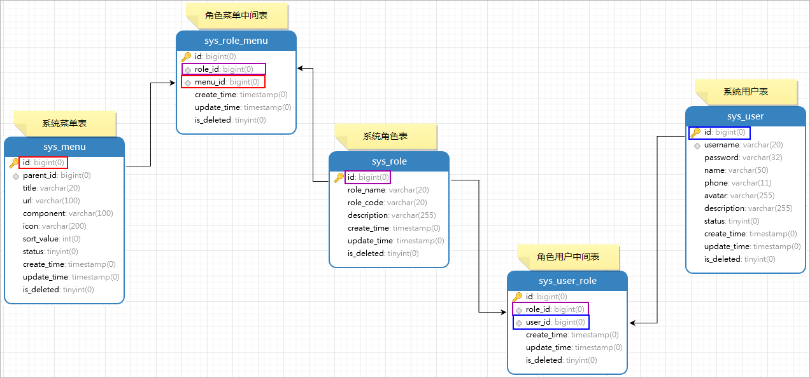
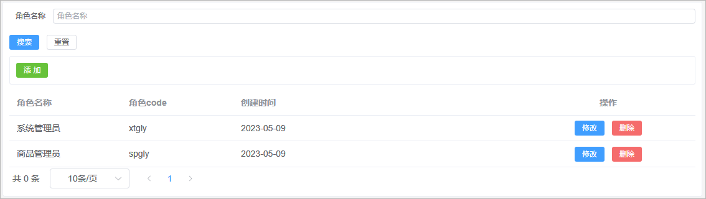
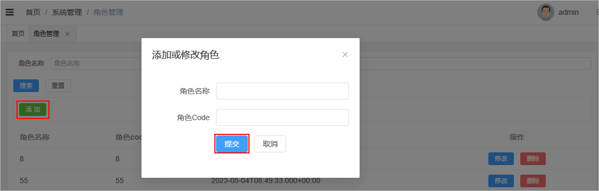
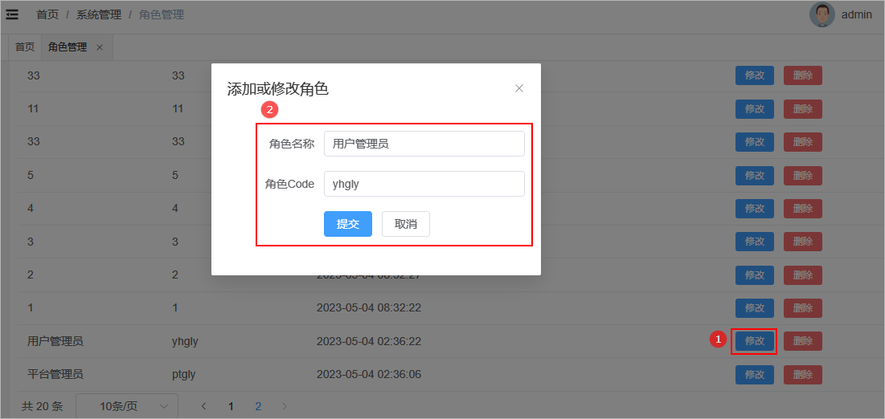
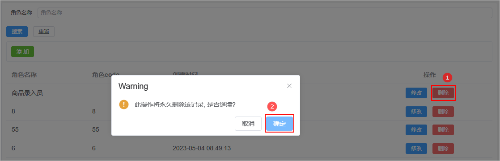

# 1 权限管理说明

## 1.1 权限管理介绍

在后台管理系统中，权限管理是指为了保证系统操作的安全性和可控性。对用户的操作权限进行限制和管理。简单的来说就是某一个用户可以使用我们系统的哪些功能。比如：管理员可以使用后台管理系统中的所有功能，普通业务人员只能使用系统中的一部分的功能。因此，权限管理是后台管理系统中的一个重要功能模块。


## 1.2 表结构介绍

一般来说，权限管理包括以下几个方面：

1、用户管理：通过对用户进行账号、密码、角色等信息的管理。

2、角色管理：将多个用户分组，并根据所属角色的权限区分用户的访问权限。

3、菜单管理：对系统的菜单进行管理，根据用户或角色的权限动态生成可访问的菜单列表。

4、日志管理：记录系统的操作日志，方便用户或管理员查看系统运行情况，以及对不当操作进行追踪和处理。


尚品甄选项目后台管理系统的权限管理所涉及到数据库表以及其对应关系如下所示：

  


sql演练：

需求1：查询id为1的用户所具有的角色数据

```sql
SELECT sr.id,sr.role_code,sr.role_name FROM sys_role sr
INNER JOIN sys_user_role sur ON sr.id=sur.role_id
WHERE sur.user_id=5
```

需求2：查询id为1的用户所具有的菜单数据

```sql
SELECT DISTINCT m.* FROM sys_menu m
INNER JOIN sys_role_menu rm ON rm.menu_id = m.id
INNER JOIN sys_user_role ur ON ur.role_id = rm.role_id
WHERE ur.user_id=1
```


# 2 角色管理

## 2.1 路由添加

关于首页导航菜单我们先在前端页面写固定，等权限管理中的相关功能都开发完毕以后，再将其更改为动态的。

具体步骤：

1、在views目录下创建一个system文件夹

2、在该文件夹下创建3个.vue文件

 

3、在router/modules目录下创建system.js文件，配置路由规则

```javascript
// 导入组件
const Layout = () => import('@/layout/index.vue')
const sysRole = () => import('@/views/system/sysRole.vue')
const sysUser = () => import('@/views/system/sysUser.vue')
const sysMenu = () => import('@/views/system/sysMenu.vue')

// 导出该组件
export default([
    {
        path: "/system",
        component: Layout,
        name: 'system',
        meta: {
            title: '系统管理',
        },
        icon: 'Location',
        children: [
            {
                path: '/sysRole',
                name: 'sysRole',
                component: sysRole,
                meta: {
                    title: '角色管理',
                },
                hidden: false
            },
            {
                path: '/sysUser',
                name: 'sysUser',
                component: sysUser,
                meta: {
                    title: '用户管理',
                },
                hidden: false
            },
            {
                path: '/menu',
                name: 'sysMenu',
                component: sysMenu,
                meta: {
                    title: '菜单管理',
                },
                hidden: false
            }
        ]
    }
])
```

4、修改router的index.js导入路由配置

```shell
import system from './modules/system'
export const fixedRoutes = [...home,...system]
```


## 2.2 页面制作

对比如下页面结构，使用Element Plus制作出对应的页面，数据可以暂时使用假数据。

  

该页面可以将其分为4部分：

1、搜索表单

2、添加按钮

3、数据展示表格

4、分页条组件


**sysRole.vue** 代码实现如下所示：

```vue
<template>
    <div class="search-div">
        <!-- 搜索表单 -->
        <el-form label-width="70px" size="small">
            <el-form-item label="角色名称">
                <el-input
                style="width: 100%"
                placeholder="角色名称"
                ></el-input>
            </el-form-item>
            <el-row style="display:flex">
                <el-button type="primary" size="small">
                搜索
                </el-button>
                <el-button size="small">重置</el-button>
            </el-row>
        </el-form>

        <!-- 添加按钮 -->
        <div class="tools-div">
            <el-button type="success" size="small">添 加</el-button>
        </div>
        
        <!--- 角色表格数据 -->
        <el-table :data="list" style="width: 100%">
            <el-table-column prop="roleName" label="角色名称" width="180" />
            <el-table-column prop="roleCode" label="角色code" width="180" />
            <el-table-column prop="createTime" label="创建时间" />
            <el-table-column label="操作" align="center" width="280">
            <el-button type="primary" size="small">
                修改
            </el-button>
            <el-button type="danger" size="small">
                删除
            </el-button>
            </el-table-column>
        </el-table>

        <!--分页条-->
        <el-pagination
            :page-sizes="[10, 20, 50, 100]"
            layout="total, sizes, prev, pager, next"
            :total="total"
        />
  </div>

</template>

<script setup>
import { ref } from 'vue';

// 分页条总记录数
let total = ref(0)

// 定义表格数据模型
let list = ref([
    {"id":9 ,  "roleName": "系统管理员" , "roleCode":"xtgly","createTime": '2023-07-31'},
    {"id":10 , "roleName": "商品管理员" , "roleCode":"spgly","createTime": '2023-07-31'}
])

</script>

<style scoped>

.search-div {
  margin-bottom: 10px;
  padding: 10px;
  border: 1px solid #ebeef5;
  border-radius: 3px;
  background-color: #fff;
}

.tools-div {
  margin: 10px 0;
  padding: 10px;
  border: 1px solid #ebeef5;
  border-radius: 3px;
  background-color: #fff;
}

</style>
```


## 2.3 查询角色

### 2.3.1 需求说明

需求说明：

1、如果在搜索表单中输入和角色名称，那么此时就需要按照角色名称进行模糊查询

2、搜索的时候需要进行分页搜索


### 2.3.2 后端接口

#### 需求分析

1、前端提交请求参数的时候包含了两部分的参数：搜索条件参数、分页参数。搜索条件参数可以通过?拼接到请求路径后面，分页参数【当前页码、每页显示的数据条数】可以让前端通过请求路径传递过来

2、后端查询完毕以后需要给前端返回一个分页对象，分页对象中就封装了分页相关的参数(当前页数据、总记录数、总页数...)

3、前端进行参数传递的时候，不一定会传递搜索条件，因此sql语句的编写需要使用到动态sql


#### PageHelper集成

要进行分页查询，可以使用mybatis提供的分页插件完成。在咱们的项目中集成mybatis的分页插件步骤如下所示：

1、spzx-manager工程中加入如下依赖：

```xml
<dependency>
    <groupId>com.github.pagehelper</groupId>
    <artifactId>pagehelper-spring-boot-starter</artifactId>
    <version>1.4.3</version>
</dependency>
```

2、在mybatis-config.xml配置文件中加入分页插件配置

```xml
<configuration>
    <plugins>
        <plugin interceptor="com.github.pagehelper.PageInterceptor"/>	<!-- 分页插件 -->
    </plugins>
</configuration>
```


#### SysRole

针对当前要操作的数据库表定义一个与之对应的实体类：

```java
@Data
@Schema(description = "SysRole")
public class SysRole extends BaseEntity {

    private static final long serialVersionUID = 1L;

    @Schema(description = "角色名称")
    private String roleName;

    @Schema(description = "角色编码")
    private String roleCode;

    @Schema(description = "描述")
    private String description;

}
```


#### SysRoleDto

定义一个实体类封装前端传递给后端的条件查询参数

```java
@Data
public class SysRoleDto {
    private String roleName ;
}
```


#### SysRoleController

表现层代码：

```java
@RestController
@RequestMapping(value = "/admin/system/sysRole")
public class SysRoleController {

    @Autowired
    private SysRoleService sysRoleService ;

    @PostMapping("/findByPage/{pageNum}/{pageSize}")
    public Result<PageInfo<SysRole>> findByPage(@RequestBody SysRoleDto sysRoleDto ,
                                                @PathVariable(value = "pageNum") Integer pageNum ,
                                                @PathVariable(value = "pageSize") Integer pageSize) {
        PageInfo<SysRole> pageInfo = sysRoleService.findByPage(sysRoleDto , pageNum , pageSize) ;
        return Result.build(pageInfo , ResultCodeEnum.SUCCESS) ;
    }
    
}
```


#### SysRoleService

业务层代码实现

```java
// 业务接口
public interface SysRoleService {
    public abstract PageInfo<SysRole> findByPage(SysRoleDto sysRoleDto, Integer pageNum, Integer pageSize);   
}

// 接口实现类
@Service
public class SysRoleServiceImpl implements SysRoleService {

    @Autowired
    private SysRoleMapper sysRoleMapper ;

    @Override
    public PageInfo<SysRole> findByPage(SysRoleDto sysRoleDto, Integer pageNum, Integer pageSize) {
        PageHelper.startPage(pageNum , pageSize) ;
        List<SysRole> sysRoleList = sysRoleMapper.findByPage(sysRoleDto) ;
        PageInfo<SysRole> pageInfo = new PageInfo(sysRoleList) ;
        return pageInfo;
    }
}
```


#### SysRoleMapper

持久层代码实现

```java
@Mapper
public interface SysRoleMapper {
    public abstract List<SysRole> findByPage(SysRoleDto sysRoleDto);
}
```


#### SysRoleMapper.xml

在映射文件中定义对应的sql语句

```xml
<?xml version="1.0" encoding="UTF-8" ?>
<!DOCTYPE mapper PUBLIC "-//mybatis.org//DTD Mapper 3.0//EN" "http://mybatis.org/dtd/mybatis-3-mapper.dtd">
<mapper namespace="com.atguigu.spzx.manager.mapper.SysRoleMapper">

    <!--  映射查询到的字段 -->
    <resultMap id="sysRoleMap" type="com.atguigu.spzx.model.entity.system.SysRole" autoMapping="true"></resultMap>

    <!-- 用于select查询公用抽取的列 -->
    <sql id="columns">
        id,role_name,role_code,description,create_time,update_time,is_deleted
    </sql>

    <sql id="findPageWhere">
        <where>
            <if test="roleName != null and roleName != ''">
                and role_name like CONCAT('%',#{roleName},'%')
            </if>
            and is_deleted = 0
        </where>
    </sql>

    <select id="findByPage" resultMap="sysRoleMap">
        select <include refid="columns" />
        from sys_role
        <include refid="findPageWhere"/>
        order by id desc
    </select>

</mapper>
```

**注意**：在BaseEntity实体类的createTime和updateTime属性上添加**@JsonFormat**注解对日期数据进行格式化。


### 2.3.3 前端对接

#### 实现思路

如下所示：

1、定义发送请求方法

2、搜索表单绑定对应数据模型

3、onMounted钩子函数发送请求查询数据

4、分页条绑定数据模型以及对应事件


#### sysRole.js

在api目录下创建一个sysRole.js文件，文件的内容如下所示：

```java
import request from '@/utils/request'

// 分页查询角色数据
export const GetSysRoleListByPage = (pageNum , pageSize , queryDto) => {
    return request({
        url: '/admin/system/sysRole/findByPage/' + pageNum + "/" + pageSize,
        method: 'get',
        params: queryDto
    })
}
```


#### sysRole.vue

更改views/system/sysRole.vue文件

```vue
<!-- template部分修改内容 -->
<!-- 搜索表单 -->
<el-form label-width="70px" size="small">
    <el-form-item label="角色名称">
        <el-input
                  v-model="queryDto.roleName"
                  style="width: 100%"
                  placeholder="角色名称"
                  ></el-input>
    </el-form-item>
    <el-row style="display:flex">
        <el-button type="primary" size="small" @click="searchSysRole">
            搜索
        </el-button>
        <el-button size="small" @click="resetData">重置</el-button>
    </el-row>
</el-form>


<!--分页条-->
<el-pagination
               v-model:current-page="pageParams.page"
               v-model:page-size="pageParams.limit"
               :page-sizes="[10, 20, 50, 100]"
               @size-change="fetchData"
               @current-change="fetchData"
               layout="total, sizes, prev, pager, next"
               :total="total"
/>

<!-- script部分修改内容 -->
<script setup>
import { ref , onMounted } from 'vue';
import { GetSysRoleListByPage } from '@/api/sysRole';

// 分页条总记录数
let total = ref(0)

// 定义表格数据模型
let list = ref([])

//分页数据
const pageParamsForm = {
  page: 1, // 页码
  limit: 10, // 每页记录数
}
const pageParams = ref(pageParamsForm)     // 将pageParamsForm包装成支持响应式的对象

// 搜索表单数据
const queryDto = ref({"roleName": ""})

// 页面加载完毕以后请求后端接口获取数据
onMounted(() => {
    fetchData() ;
})

// 搜索按钮点击事件处理函数
const searchSysRole = () => {
    //queryDto.value.roleName = ""
    fetchData() ;
}

// 远程调用后端分页查询接口
const fetchData = async () => {
    const {data , code , message } = await GetSysRoleListByPage(pageParams.value.page , pageParams.value.limit , queryDto.value) ;
    list.value = data.list ;
    total.value = data.total
}
</script>
```


## 2.4 添加角色

### 2.4.1 需求说明

当用户点击添加按钮的时候，那么此时就弹出对话框，在该对话框中需要展示添加角色表单。当用户在该表单中点击提交按钮的时候那么此时就需要将表单进行提交，在后端需要提交过来的表单数据保存到数据库中即可。页面效果如下所示：

 


### 2.4.2 页面制作

sysRole.vue页面代码如下所示：

* 添加按钮，绑定事件
* 添加角色弹出框

```vue
<div class="tools-div">
    <el-button type="success" size="small" @click="addShow">添 加</el-button>
</div>

<!-- 添加角色表单对话框 -->
<el-dialog v-model="dialogVisible" title="添加或修改角色" width="30%">
    <el-form label-width="120px">
        <el-form-item label="角色名称">
            <el-input />
        </el-form-item>
        <el-form-item label="角色Code">
            <el-input  />
        </el-form-item>
        <el-form-item>
            <el-button type="primary" >提交</el-button>
            <el-button @click="dialogVisible = false">取消</el-button>
        </el-form-item>
    </el-form>
</el-dialog>

<script setup>
    
// 控制对话是否展示的变量
const dialogVisible = ref(false)

//进入添加
const addShow = () => {
  	dialogVisible.value = true
}
</script>
```


### 2.4.3 后端接口

后端接收到数据后，将数据保存到数据库中即可，不要给前端返回业务数据，只需要返回对应的业务状态码即可。

#### SysRoleController

表现层代码实现

```java
// com.atguigu.spzx.manager.controller.SysRoleController
@PostMapping(value = "/saveSysRole")
public Result saveSysRole(@RequestBody SysRole SysRole) {
    sysRoleService.saveSysRole(SysRole) ;
    return Result.build(null , ResultCodeEnum.SUCCESS) ;
}
```


#### SysRoleService

业务层代码实现

```java
// com.atguigu.spzx.manager.service.impl.SysRoleServiceImpl
@Override
public void saveSysRole(SysRole sysRole) {
    sysRoleMapper.saveSysRole(sysRole) ;
}
```


#### SysRoleMapper

持久层代码实现

```java
// com.atguigu.spzx.manager.mapper.SysRoleMapper
@Mapper
public interface SysRoleMapper {
    public abstract void saveSysRole(SysRole sysRole);
}
```


#### SysRoleMapper.xml

在映射文件中定义对应的sql语句

```xml
<!-- 新增角色 -->
<insert id="saveSysRole">
    insert into sys_role (
    id,
    role_name,
    role_code,
    description
    ) values (
    #{id},
    #{roleName},
    #{roleCode},
    #{description}
    )
</insert>
```


### 2.4.4 前端对接

#### 实现思路

1、给表单绑定数据模型

2、给提交按钮绑定点击事件

3、点击按钮请求后端地址


#### sysRole.js

在api目录下创建一个sysRole.js文件，文件的内容如下所示：

```java
// 添加角色请求方法
export const SaveSysRole = (data) => {
    return request({
        url: '/admin/system/sysRole/saveSysRole',
        method: 'post',
        data
    })
}
```


#### sysRole.vue

更改views/system/sysRole.vue文件

```vue
<!-- 页面表单 -->
<el-dialog v-model="dialogVisible" title="添加或修改角色" width="30%">
    <el-form label-width="120px">
        <el-form-item label="角色名称">
            <el-input v-model="sysRole.roleName"/>
        </el-form-item>
        <el-form-item label="角色Code">
            <el-input  v-model="sysRole.roleCode"/>
        </el-form-item>
        <el-form-item>
            <el-button type="primary" @click="submit">提交</el-button>
            <el-button @click="dialogVisible = false">取消</el-button>
        </el-form-item>
    </el-form>
</el-dialog>

<script setup>
import { GetSysRoleListByPage , SaveSysRole} from '@/api/sysRole';
import { ElMessage } from 'element-plus'
    
//表单数据模型
const defaultForm = {
    id: "",
    roleCode: "",
    roleName: ""
}
const sysRole = ref(defaultForm)   // 使用ref包裹该对象，使用reactive不方便进行重置
 
// 添加角色
const submit = async () => {
    const { code } = await SaveSysRole(sysRole.value) ;
    if(code === 200) {
        dialogVisible.value = false
        ElMessage.success('操作成功')
        fetchData()
    }
}
</script>
```


## 2.5 修改角色

### 2.5.1 需求说明

当用户点击修改按钮的时候，那么此时就弹出对话框，在该对话框中需要将当前行所对应的角色数据在该表单页面进行展示。当用户在该表单中点击提交按钮的时候那么此时就需要将表单进行提交，在后端需要提交过来的表单数据修改数据库中的即可。页面效果如下所示：

 


### 2.5.2 数据回显

分析：

1、使用添加数据的表单即可

2、要将当前操作行的数据展示在表单中，那么此时需要用到插槽

代码如下所示：

```vue
<el-table-column label="操作" align="center" width="280" #default="scope">
    <el-button type="primary" size="small" @click="editShow(scope.row)">修改</el-button>
</el-table-column>

<script setup>
    // 修改按钮点击事件处理函数
    const editShow = (row) => {
        sysRole.value = row
        dialogVisible.value = true
    }
</script>
```


### 2.5.3 提交修改

#### 后端接口

##### SysRoleController

表现层代码实现

```java
// com.atguigu.spzx.manager.controller.SysRoleController
@PutMapping(value = "/updateSysRole")
public Result updateSysRole(@RequestBody SysRole sysRole) {
    sysRoleService.updateSysRole(sysRole) ;
    return Result.build(null , ResultCodeEnum.SUCCESS) ;
}
```


##### SysRoleService

业务层代码实现

```java
// com.atguigu.spzx.manager.service.impl.SysRoleServiceImpl
@Override
public void updateSysRole(SysRole sysRole) {
    sysRoleMapper.updateSysRole(sysRole) ;
}
```


##### SysRoleMapper

持久层代码实现

```java
// com.atguigu.spzx.manager.mapper.SysRoleMapper
@Mapper
public interface SysRoleMapper {
    public abstract void updateSysRole(SysRole sysRole);
}
```


##### SysRoleMapper.xml

在映射文件中定义对应的sql语句

```xml
<!-- 修改角色 -->
<update id="updateSysRole">
    update sys_role set
    <if test="roleName != null and roleName != ''">
        role_name = #{roleName},
    </if>
    <if test="roleCode != null and roleCode != ''">
        role_code = #{roleCode},
    </if>
    <if test="description != null and description != ''">
        description = #{description},
    </if>
    update_time =  now()
    where
    id = #{id}
</update>
```


#### 前端对接

##### sysRole.js

在api目录下创建一个sysRole.js文件，文件的内容如下所示：

```javascript
// 保存修改
export const UpdateSysRole = (data) => {
    return request({
        url: '/admin/system/sysRole/updateSysRole',
        method: 'put',
        data
    })
}
```


##### sysRole.vue

更改views/system/sysRole.vue文件

```vue
<script setup>
import { GetSysRoleListByPage , SaveSysRole , UpdateSysRole} from '@/api/sysRole';
    
// 添加角色
const submit = async () => {
    if(!sysRole.value.id) {
        const { code } = await SaveSysRole(sysRole.value) ;
        if(code === 200) {
            dialogVisible.value = false
            ElMessage.success('操作成功')
            fetchData()
        }
    }else {
        const { code } = await UpdateSysRole(sysRole.value) ;
        if(code === 200) {
            dialogVisible.value = false
            ElMessage.success('操作成功')
            fetchData()
        }
    }
}
</script>
```


## 2.6 删除角色

### 2.6.1 需求说明

当点击删除按钮的时候此时需要弹出一个提示框，询问是否需要删除数据？如果用户点击是，那么此时向后端发送请求传递id参数，后端接收id参数进行逻辑删除。页面效果如下所示：

 


### 2.6.2 后端接口

#### SysRoleController

表现层代码实现

```java
// com.atguigu.spzx.manager.controller.SysRoleController
@DeleteMapping(value = "/deleteById/{roleId}")
public Result deleteById(@PathVariable(value = "roleId") Long roleId) {
    sysRoleService.deleteById(roleId) ;
    return Result.build(null , ResultCodeEnum.SUCCESS) ;
}
```


#### SysRoleService

业务层代码实现

```java
// com.atguigu.spzx.manager.service.impl.SysRoleServiceImpl
@Override
public void deleteById(Long roleId) {
    sysRoleMapper.deleteById(roleId) ;
}
```


#### SysRoleMapper

持久层代码实现

```java
// com.atguigu.spzx.manager.mapper.SysRoleMapper
@Mapper
public interface SysRoleMapper {
    public abstract void deleteById(Long roleId);
}
```


#### SysRoleMapper.xml

在映射文件中定义对应的sql语句

**注：这是使用的是逻辑删除**

```xml
<!-- 根据id删除角色数据 -->
<update id="delete">
    update sys_role set is_deleted=1 where id=#{roleId}
</update>
```


### 2.6.3 前端对接

#### sysRole.js

在api目录下创建一个sysRole.js文件，文件的内容如下所示：

```java
// 删除角色
export const DeleteSysRoleById = (roleId) => {
    return request({
        url: '/admin/system/sysRole/deleteById/' + roleId,
        method: 'delete'
    })
}
```


#### sysRole.vue

更改views/system/sysRole.vue文件

```vue
<el-table-column label="操作" align="center" width="280" #default="scope">
    <el-button type="danger" size="small" @click="deleteById(scope.row)">
        删除
    </el-button>
</el-table-column>

<script setup>
import { GetSysRoleListByPage , SaveSysRole , UpdateSysRole , DeleteSysRoleById } from '@/api/sysRole';
import { ElMessage, ElMessageBox } from 'element-plus'

// 删除数据
const deleteById = (row) => {
    ElMessageBox.confirm('此操作将永久删除该记录, 是否继续?', 'Warning', {
        confirmButtonText: '确定',
        cancelButtonText: '取消',
        type: 'warning',
    }).then(async () => {
       const {code } = await DeleteSysRoleById(row.id)
       if(code === 200) {
            ElMessage.success('删除成功')
            pageParams.value.page = 1
            fetchData()
       }
    })
}
</script>
```

