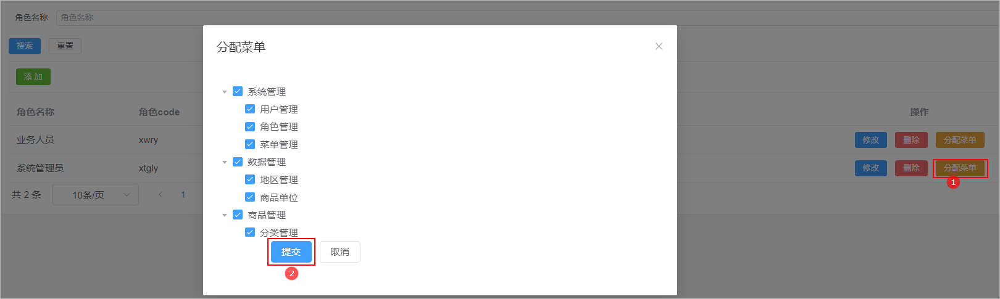
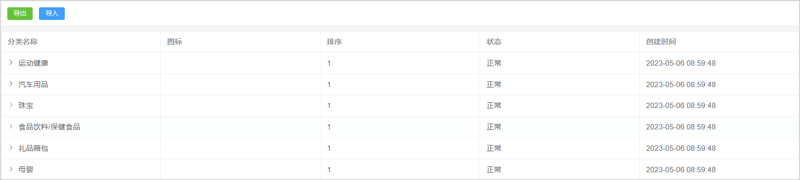
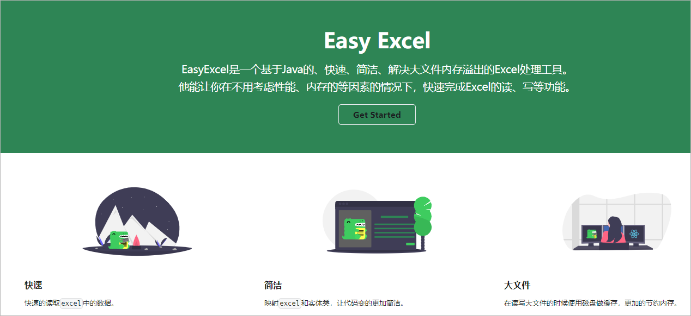
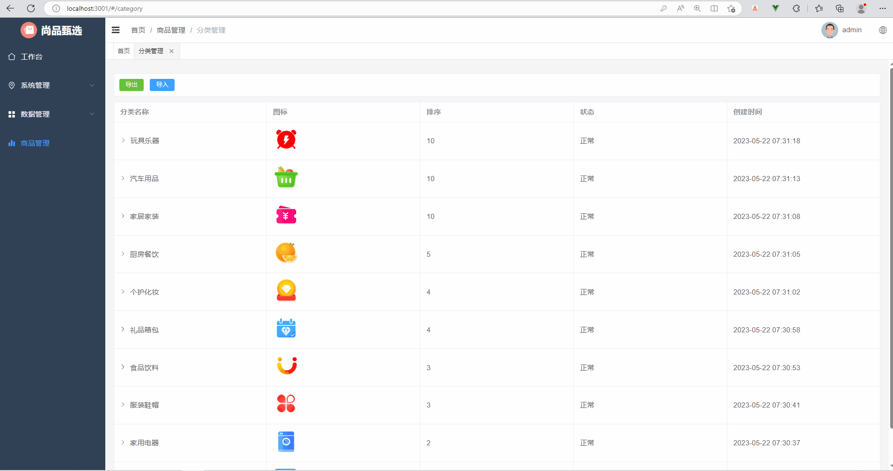
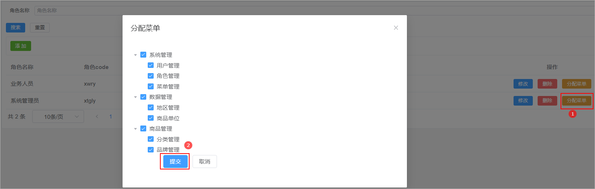
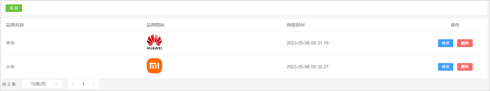
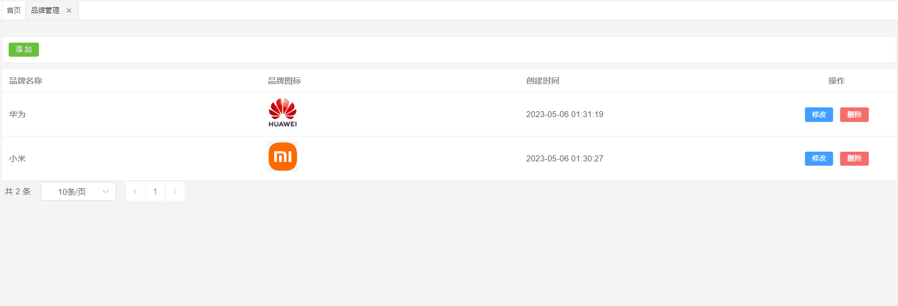
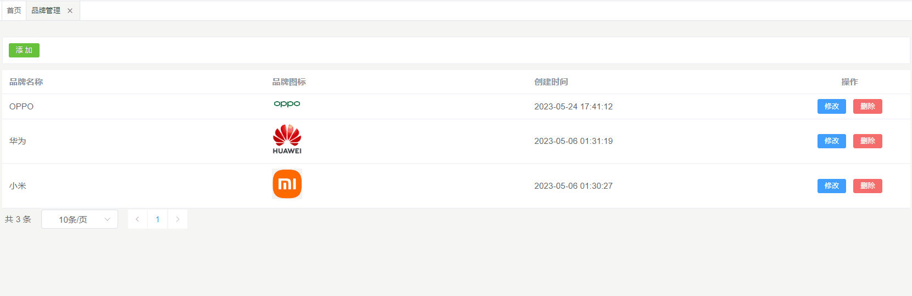
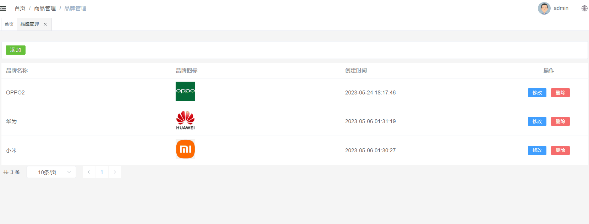

# 1 分类管理

分类管理就是对商品的分类数据进行维护。常见的分类数据：电脑办公、玩具乐器、家居家装、汽车用品...

## 1.1 菜单添加

首先在系统中添加分类管理的菜单，具体步骤如下所示：

1、在后台管理系统中通过系统管理的菜单管理添加分类管理的相关菜单，如下所示：

  

2、给系统管理员角色分配分类管理菜单访问权限：

 

3、在前端项目中创建对应的页面，以及配置对应的异步路由

* 在src/views下创建文件夹product
* 在product文件夹下创建文件 category.vue

 


* 在src/router/modules文件夹下创建product.js路由文件，文件内容如下所示：

```java
const Layout = () => import('@/layout/index.vue')
const category = () => import('@/views/product/category.vue')

export default [
  {
    path: '/product',
    component: Layout,
    name: 'product',
    meta: {
      title: '商品管理',
    },
    icon: 'Histogram',
    children: [
      {
        path: '/category',
        name: 'category',
        component: category,
        meta: {
          title: '分类管理',
        },
      },
    ],
  },
]
```


* 在src/router/index.js中添加异步路由，如下所示：

```java
import product from './modules/product'
    
// 动态菜单
export const asyncRoutes = [...system,...product]
```


## 1.2 表结构介绍

分类数据所对应的表结构如下所示：

```java
CREATE TABLE `category` (
  `id` bigint NOT NULL AUTO_INCREMENT COMMENT '分类id',
  `name` varchar(50) DEFAULT NULL COMMENT '分类名称',
  `image_url` varchar(200) DEFAULT NULL,
  `parent_id` bigint DEFAULT NULL COMMENT '父分类id',
  `status` tinyint DEFAULT NULL COMMENT '是否显示[0-不显示，1显示]',
  `order_num` int DEFAULT NULL COMMENT '排序',
  `create_time` timestamp NOT NULL DEFAULT CURRENT_TIMESTAMP COMMENT '创建时间',
  `update_time` timestamp NOT NULL DEFAULT CURRENT_TIMESTAMP ON UPDATE CURRENT_TIMESTAMP COMMENT '更新时间',
  `is_deleted` tinyint NOT NULL DEFAULT '0' COMMENT '删除标记（0:不可用 1:可用）',
  PRIMARY KEY (`id`)
) ENGINE=InnoDB AUTO_INCREMENT=704 DEFAULT CHARSET=utf8mb4 COLLATE=utf8mb4_0900_ai_ci COMMENT='商品分类';
```

注意：分类数据是具有层级结构的，因此在进行数据展示的时候可以考虑使用树形表格进行展示。在咱们的尚品甄选项目中关于分类的数据只支持三级。


## 1.3 页面制作

对比如下页面结构，使用Element Plus制作出对应的页面，数据可以暂时使用假数据。

 

该页面可以将其分为2部分：

1、导入导出按钮

2、分类列表展示【树形表格】


**category.vue**代码实现如下所示：

```vue
<template>
    <div class="tools-div">
      <el-button type="success" size="small" >导出</el-button>
      <el-button type="primary" size="small" >导入</el-button>
    </div>

    <!---懒加载的树形表格-->
    <el-table
        :data="list"
        style="width: 100%"
        row-key="id"
        border
        lazy
        :load="fetchData"
        :tree-props="{ children: 'children', hasChildren: 'hasChildren' }"
    >
        <el-table-column prop="name" label="分类名称" />
        <el-table-column prop="imageUrl" label="图标" #default="scope">
            
        </el-table-column>
        <el-table-column prop="orderNum" label="排序" />
        <el-table-column prop="status" label="状态" #default="scope">
        {{ scope.row.status == 1 ? '正常' : '停用' }}
        </el-table-column>
        <el-table-column prop="createTime" label="创建时间" />
    </el-table>
  
  </template>

<script setup>
import { ref } from 'vue';

// 定义list属性模型
const list = ref([
    {"id":1 , "name":"数码" , "orderNum":"1" , "status":1 , "createTime":"2023-05-22" , "hasChildren": true},
    {"id":2 , "name":"手机" , "orderNum":"1", "status":1, "createTime":"2023-05-22"},
])

// 加载数据的方法
const fetchData = (row, treeNode, resolve) => {
    
    // 向后端发送请求获取数据
    const data = [
        {"id":3 , "name":"智能设备" , "orderNum":"1" , "status":1 , "createTime":"2023-05-22" },
        {"id":4 , "name":"电子教育" , "orderNum":"2" , "status":1 , "createTime":"2023-05-22" },
    ]

    // 返回数据
    resolve(data)

}

</script>

<style scoped>
.search-div {
  margin-bottom: 10px;
  padding: 10px;
  border: 1px solid #ebeef5;
  border-radius: 3px;
  background-color: #fff;
}
.tools-div {
  margin: 10px 0;
  padding: 10px;
  border: 1px solid #ebeef5;
  border-radius: 3px;
  background-color: #fff;
}
</style>
```


## 1.4 列表查询

### 1.4.1 需求分析

当页面初始化完毕以后，此时就需要从请求后端接口查询所有的一级分类数据，一级分类数据的parent_id为0。当用户点击某一个分类前的小箭头，那么此时就需要查询该分类下所对应的所有的子分类数据。对应的sql语句如下所示：

```sql
select * from category where parent_id = 0 ;
```


### 1.4.2 后端接口

#### Category

定义一个与数据库表相对应的实体类：

```java
// com.atguigu.spzx.model.entity.product
@Data
public class Category extends BaseEntity {

	private String name;
	private String imageUrl;
	private Long parentId;
	private Integer status;
	private Integer orderNum;
    
	private Boolean hasChildren;
    
	private List<Category> children;

}
```


#### CategoryController

表现层代码实现：

```java
// com.atguigu.spzx.manager.controller
@RestController
@RequestMapping(value="/admin/product/category")
public class CategoryController {

    @Autowired
    private CategoryService categoryService;

    @Operation(summary = "根据parentId获取下级节点")
    @GetMapping(value = "/findByParentId/{parentId}")
    public Result<List<Category>> findByParentId(@PathVariable Long parentId) {
        List<Category> list = categoryService.findByParentId(parentId);
        return Result.build(list , ResultCodeEnum.SUCCESS) ;
    }
}
```


#### CategoryService

业务层代码实现：

```java
// com.atguigu.spzx.manager.service.impl
@Service
public class CategoryServiceImpl implements CategoryService {

    @Autowired
    private CategoryMapper categoryMapper ;

    @Override
    public List<Category> findByParentId(Long parentId) {

        // 根据分类id查询它下面的所有的子分类数据
        List<Category> categoryList = categoryMapper.selectByParentId(parentId);
        if(!CollectionUtils.isEmpty(categoryList)) {

            // 遍历分类的集合，获取每一个分类数据
            categoryList.forEach(item -> {

                // 查询该分类下子分类的数量
                int count = categoryMapper.countByParentId(item.getId());
                if(count > 0) {
                    item.setHasChildren(true);
                } else {
                    item.setHasChildren(false);
                }

            });
        }
        return categoryList;
    }

}
```


#### CategoryMapper

持久层代码实现：

```java
@Mapper
public interface CategoryMapper {
    public abstract List<Category> selectByParentId(Long parentId);
    public abstract int countByParentId(Long id);
}
```


#### CategoryMapper.xml

映射文件中添加如下的sql语句：

```xml
<?xml version="1.0" encoding="UTF-8" ?>
<!DOCTYPE mapper PUBLIC "-//mybatis.org//DTD Mapper 3.0//EN" "http://mybatis.org/dtd/mybatis-3-mapper.dtd">
<mapper namespace="com.atguigu.spzx.mapper.CategoryMapper">

	<resultMap id="categoryMap" type="com.atguigu.spzx.model.entity.product.Category" autoMapping="true">
	</resultMap>
	
	<!-- 用于select查询公用抽取的列 -->
	<sql id="columns">
		id,name,image_url,parent_id,status,order_num,create_time,update_time,is_deleted
	</sql>

    <select id="selectByParentId" resultMap="categoryMap">
    	select <include refid="columns" />
	    from category
		where parent_id = #{parentId}
		and is_deleted = 0
		order by id desc
    </select>

	<select id="countByParentId" resultType="Integer">
		select count(id)
		from category
		where parent_id = #{parentId}
		and is_deleted = 0
	</select>

</mapper>
```


### 1.4.3 前端对接

#### category.js

在src/api文件夹下创建一个category.js文件，文件的内容如下所示：

```javascript
import request from '@/utils/request'

const api_name = '/admin/product/category'

// 根据parentId获取下级节点
export const FindCategoryByParentId = parentId => {
  return request({
    url: `${api_name}/findByParentId/${parentId}`,
    method: 'get',
  })
}
```

#### category.vue

修改category.vue文件，内容如下所示：

```vue
<script setup>
import { ref , onMounted} from 'vue';
import { FindCategoryByParentId } from '@/api/category.js'
import { ElMessage, ElMessageBox } from 'element-plus'

// 定义list属性模型
const list = ref([])

// 页面初始化完毕以后请求后端接口查询数据
onMounted(async () => {
  const {code , data , message} = await FindCategoryByParentId(0)
  list.value = data ; 
})

// 加载数据的方法
const fetchData = async (row, treeNode, resolve) => {
    
    // 向后端发送请求获取数据
    const {code , data , message} = await FindCategoryByParentId(row.id)

    // 返回数据
    resolve(data)

}
</script>
```


# 2 EasyExcel

## 2.1 数据导入导出意义

后台管理系统是管理、处理企业业务数据的重要工具，在这样的系统中，数据的导入和导出功能是非常重要的，其主要意义包括以下几个方面：

1、提高数据操作效率：手动逐条添加或修改数据不仅费时费力，而且容易出错，此时就可以将大量数据从Excel等表格软件中导入到系统中时，通过数据导入功能，可以直接将表格中的数据批量导入到系统中，提高了数据操作的效率。

2、实现数据备份与迁移：通过数据导出功能，管理员可以将系统中的数据导出为 Excel 或其他格式的文件，以实现数据备份，避免数据丢失。同时，也可以将导出的数据文件用于数据迁移或其他用途。

3、方便企业内部协作：不同部门可能会使用不同的系统或工具进行数据处理，在这种情况下，通过数据导入和导出功能，可以方便地转换和共享数据，促进企业内部协作。


## 2.2 EasyExcel简介

官网地址：https://easyexcel.opensource.alibaba.com/

 

EasyExcel 的主要特点如下：

1、高性能：EasyExcel 采用了异步导入导出的方式，并且底层使用 NIO 技术实现，使得其在导入导出大数据量时的性能非常高效。

2、易于使用：EasyExcel 提供了简单易用的 API，用户可以通过少量的代码即可实现复杂的 Excel 导入导出操作。

3、增强的功能“EasyExcel 支持多种格式的 Excel 文件导入导出，同时还提供了诸如合并单元格、数据校验、自定义样式等增强的功能。

4、可扩展性好：EasyExcel 具有良好的扩展性，用户可以通过自定义 Converter 对自定义类型进行转换，或者通过继承 EasyExcelListener 来自定义监听器实现更加灵活的需求。


## 2.3 入门案例

### 2.3.1 读取Excel数据

需求：对资料中的excel数据进行解析，将其存储到对应的List集合中，并遍历List集合

步骤：

1、在spzx-model的pom.xml文件中添加如下依赖：

```xml
<dependency>
    <groupId>com.alibaba</groupId>
    <artifactId>easyexcel</artifactId>
    <version>3.1.0</version>
</dependency>
```

2、定义一个实体类来封装每一行的数据，如下所示：

```java
// com.atguigu.spzx.model.vo.product
@Data
public class CategoryExcelVo {

	@ExcelProperty(value = "id" ,index = 0)
	private Long id;

	@ExcelProperty(value = "名称" ,index = 1)
	private String name;

	@ExcelProperty(value = "图片url" ,index = 2)
	private String imageUrl ;

	@ExcelProperty(value = "上级id" ,index = 3)
	private Long parentId;

	@ExcelProperty(value = "状态" ,index = 4)
	private Integer status;

	@ExcelProperty(value = "排序" ,index = 5)
	private Integer orderNum;
}
```

3、定义一个监听器，监听解析到的数据，如下所示：

```java
public class ExcelListener<T> extends AnalysisEventListener<T> {
    
    //可以通过实例获取该值
    private List<T> datas = new ArrayList<>();

    @Override
    public void invoke(T o, AnalysisContext analysisContext) {  // 每解析一行数据就会调用一次该方法
        datas.add(o);//数据存储到list，供批量处理，或后续自己业务逻辑处理。
    }

    public List<T> getDatas() {
        return datas;
    }

    @Override
    public void doAfterAllAnalysed(AnalysisContext analysisContext) {
        // excel解析完毕以后需要执行的代码
    }
    
}
```

4、编写测试方法

```java
public class EasyExcelTest {

    public static void main(String[] args) {
        readDateToExcel();
    }

    //读取方法
    public static void readDateToExcel() {
        String fileName = "D://分类数据.xlsx" ;
        // 创建一个监听器对象
        ExcelListener<CategoryExcelVo> excelListener = new ExcelListener<>();  
        EasyExcel.read(fileName, CategoryExcelVo.class, excelListener).sheet().doRead();         // 解析excel表格
        List<CategoryExcelVo> excelVoList = excelListener.getDatas();    //获取解析到的数据
        excelVoList.forEach(s -> System.out.println(s) );   // 进行遍历操作
    }
}
```


### 2.3.2 添加数据到Excel

需求：将如下的集合数据存储到Excel中文件中

```java
List<CategoryExcelVo> list = new ArrayList<>() ;
list.add(new CategoryExcelVo(1L , "数码办公" , "",0L, 1, 1)) ;
list.add(new CategoryExcelVo(11L , "华为手机" , "",1L, 1, 2)) ;
```

代码实现：

```java
public class EasyExcelTest {

    public static void main(String[] args) {
        writeDataToExcel();
    }

    public static void writeDataToExcel() {
        List<CategoryExcelVo> list = new ArrayList<>() ;
        list.add(new CategoryExcelVo(1L , "数码办公" , "",0L, 1, 1)) ;
        list.add(new CategoryExcelVo(11L , "华为手机" , "",1L, 1, 2)) ;
        EasyExcel.write("D://分类数据1.xlsx" , CategoryExcelVo.class).sheet("分类数据1").doWrite(list);
    }
}
```


## 2.4 导出功能

### 2.4.1 需求说明

当用户点击导出按钮的时候，此时将数据库中的所有的分类的数据导出到一个excel文件中，如下所示：




### 2.4.2 后端接口

#### CategoryController

表现层代码实现：

```java
// com.atguigu.spzx.manager.controller#CategoryController
@GetMapping(value = "/exportData")
public void exportData(HttpServletResponse response) {
    categoryService.exportData(response);
}
```

#### CategoryService

业务层代码实现：

```java
// com.atguigu.spzx.manager.service.impl#CategoryServiceImpl
@Override
public void exportData(HttpServletResponse response) {

    try {

        // 设置响应结果类型 
        response.setContentType("application/vnd.ms-excel");
        response.setCharacterEncoding("utf-8");

        // 这里URLEncoder.encode可以防止中文乱码 当然和easyexcel没有关系
        String fileName = URLEncoder.encode("分类数据", "UTF-8");
        response.setHeader("Content-disposition", "attachment;filename=" + fileName + ".xlsx");
        //response.setHeader("Access-Control-Expose-Headers", "Content-Disposition");

        // 查询数据库中的数据
        List<Category> categoryList = categoryMapper.selectAll();
        List<CategoryExcelVo> categoryExcelVoList = new ArrayList<>(categoryList.size());

        // 将从数据库中查询到的Category对象转换成CategoryExcelVo对象
        for(Category category : categoryList) {
            CategoryExcelVo categoryExcelVo = new CategoryExcelVo();
            BeanUtils.copyProperties(category, categoryExcelVo, CategoryExcelVo.class);
            categoryExcelVoList.add(categoryExcelVo);
        }

        // 写出数据到浏览器端
        EasyExcel.write(response.getOutputStream(), CategoryExcelVo.class).sheet("分类数据").doWrite(categoryExcelVoList);

    } catch (IOException e) {
        e.printStackTrace();
    }
}
```

#### CategoryMapper

持久层代码实现：

```java
@Mapper
public interface CategoryMapper {
    public abstract List<Category> selectAll();
}
```

#### CategoryMapper.xml

在映射文件中添加如下sql语句：

```xml
<select id="selectAll" resultMap="categoryMap">
    select <include refid="columns" />
    from category
    where is_deleted = 0
    order by id
</select>
```


### 2.4.3 前端对接

#### category.js

在src/api文件夹下创建一个category.js文件，文件的内容如下所示：

```javascript
// 导出方法
export const ExportCategoryData = () => {
  return request({
    url: `${api_name}/exportData`,
    method: 'get',
    responseType: 'blob'  // // 这里指定响应类型为blob类型,二进制数据类型，用于表示大量的二进制数据
  })
}
```

#### category.vue

* 导出按钮绑定事件
* 添加导出方法

```vue
<div class="tools-div">
    <el-button type="success" size="small" @click="exportData">导出</el-button>
    <el-button type="primary" size="small" >导入</el-button>
</div>

<script setup>
import { FindCategoryByParentId , ExportCategoryData} from '@/api/category.js'

const exportData = () => {
  // 调用 ExportCategoryData() 方法获取导出数据
  ExportCategoryData().then(res => {
      // 创建 Blob 对象，用于包含二进制数据
      const blob = new Blob([res]);             
      // 创建 a 标签元素，并将 Blob 对象转换成 URL
      const link = document.createElement('a'); 
      link.href = window.URL.createObjectURL(blob);
      // 设置下载文件的名称
      link.download = '分类数据.xlsx';
      // 模拟点击下载链接
      link.click();
  })  
}
</script>
```


## 2.5 导入功能

### 2.5.1 需求说明

当用户点击导入按钮的时候，此时会弹出一个对话框，让用户选择要导入的excel文件，选择完毕以后将文件上传到服务端，服务端通过easyExcel解析文件的内容，然后将解析的结果存储到category表中。如下所示：

 


### 2.5.2 后端接口

#### CategoryController

表现层代码实现：

```java
// com.atguigu.spzx.manager.controller#CategoryController
@PostMapping("importData")
public Result importData(MultipartFile file) {
    categoryService.importData(file);
    return Result.build(null , ResultCodeEnum.SUCCESS) ;
}
```

#### 创建监听器

创建包listener，创建监听器类ExcelListener，参考官方文档编写代码

https://easyexcel.opensource.alibaba.com/docs/current/quickstart/read

```java
package com.atguigu.spzx.listener;

import com.alibaba.excel.context.AnalysisContext;
import com.alibaba.excel.event.AnalysisEventListener;
import com.alibaba.excel.util.ListUtils;
import com.atguigu.spzx.mapper.CategoryMapper;
import com.atguigu.spzx.model.vo.product.CategoryExcelVo;

import java.util.ArrayList;
import java.util.List;

public class ExcelListener<T> extends AnalysisEventListener<T> {

    /**
       每隔5条存储数据库，实际使用中可以100条，然后清理list ，方便内存回收
     */
    private static final int BATCH_COUNT = 100;
    /**
     * 缓存的数据
     */
    private List cachedDataList = ListUtils.newArrayListWithExpectedSize(BATCH_COUNT);

	//获取mapper对象
    private CategoryMapper categoryMapper;
    public ExcelListener(CategoryMapper categoryMapper) {
        this.categoryMapper = categoryMapper;
    }

	// 每解析一行数据就会调用一次该方法
    @Override
    public void invoke(T o, AnalysisContext analysisContext) {  
        CategoryExcelVo data = (CategoryExcelVo)o;
        cachedDataList.add(data);
        // 达到BATCH_COUNT了，需要去存储一次数据库，防止数据几万条数据在内存，容易OOM
        if (cachedDataList.size() >= BATCH_COUNT) {
            saveData();
            // 存储完成清理 list
            cachedDataList = ListUtils.newArrayListWithExpectedSize(BATCH_COUNT);
        }
    }

    @Override
    public void doAfterAllAnalysed(AnalysisContext analysisContext) {
        // excel解析完毕以后需要执行的代码
        // 这里也要保存数据，确保最后遗留的数据也存储到数据库
        saveData();
    }

    private void saveData() {
        categoryMapper.batchInsert(cachedDataList);
    }
}
```

#### CategoryService

业务层代码实现：

```java
// com.atguigu.spzx.service.impl#CategoryServiceImpl
@Override
public void importData(MultipartFile file) {
    try {
        //创建监听器对象，传递mapper对象
        ExcelListener<CategoryExcelVo> excelListener = new ExcelListener<>(categoryMapper);
        //调用read方法读取excel数据
        EasyExcel.read(file.getInputStream(),
                    CategoryExcelVo.class,
                    excelListener).sheet().doRead();
    } catch (IOException e) {
        throw new GuiguException(ResultCodeEnum.DATA_ERROR);
    }
}
```

#### CategoryMapper

持久层代码实现：

```java
@Mapper
public interface CategoryMapper {
    public abstract void batchInsert(List<Category> categoryList);
}
```

#### CategoryMapper.xml

映射文件中添加如下sql语句：

```xml
<insert id="batchInsert" useGeneratedKeys="true" keyProperty="id">
    insert into category (
        id,
        name,
        image_url,
        parent_id,
        status,
        order_num,
    	create_time ,
    	update_time ,
    	is_deleted
    ) values
    <foreach collection="categoryList" item="item" separator="," >
        (
        #{item.id},
        #{item.name},
        #{item.imageUrl},
        #{item.parentId},
        #{item.status},
        #{item.orderNum},
        now(),
        now(),
        0
        )
    </foreach>
</insert>
```


### 2.5.3 前端对接

修改category.vue文件，内容如下所示：

* 导入按钮绑定事件
* 增加导入弹出框
* 增加导入方法

```vue
<div class="tools-div">
    <el-button type="success" size="small" @click="exportData">导出</el-button>
    <el-button type="primary" size="small" @click="importData">导入</el-button>
</div>

<el-dialog v-model="dialogImportVisible" title="导入" width="30%">
    <el-form label-width="120px">
        <el-form-item label="分类文件">
            <el-upload
                       class="upload-demo"
                       action="http://localhost:8501/admin/product/category/importData"
                       :on-success="onUploadSuccess"
                       :headers="headers"
                       >
                <el-button type="primary">上传</el-button>
            </el-upload>
        </el-form-item>
    </el-form>
</el-dialog>

<script setup>
import { useApp } from '@/pinia/modules/app'
    
// 文件上传相关变量以及方法定义
const dialogImportVisible = ref(false)
const headers = {
  token: useApp().authorization.token     // 从pinia中获取token，在进行文件上传的时候将token设置到请求头中
}
const importData = () => {
  dialogImportVisible.value = true
}

// 上传文件成功以后要执行方法
const onUploadSuccess = async (response, file) => {
  ElMessage.success('操作成功')
  dialogImportVisible.value = false
  const { data } = await FindCategoryByParentId(0)
  list.value = data ; 
}
</script>
```


# 3 品牌管理

品牌管理就是对商品的所涉及到的品牌数据进行维护。常见的品牌数据：小米、华为、海尔...

## 3.1 菜单添加

首先在系统中添加品牌管理的菜单，具体步骤如下所示：

1、在后台管理系统中通过系统管理的菜单管理添加品牌管理的菜单，如下所示：

  

2、给系统管理员角色分配品牌管理菜单访问权限：

 

3、在前端项目中创建对应的页面，以及配置对应的异步路由

* 在src/views/product目录下，创建brand.vue和category.vue文件

  

* 在src/router/modules文件夹下创建product.js路由文件

```javascript
const Layout = () => import('@/layout/index.vue')
const category = () => import('@/views/product/category.vue')
const brand = () => import('@/views/product/brand.vue')

export default [
  {
    path: '/product',
    component: Layout,
    name: 'product',
    meta: {
      title: '商品管理',
    },
    icon: 'Histogram',
    children: [
      {
        path: '/category',
        name: 'category',
        component: category,
        meta: {
          title: '分类管理',
        },
      },
      {
        path: '/brand',
        name: 'brand',
        component: brand,
        meta: {
          title: '品牌管理',
        },
      },
    ],
  },
]
```


## 3.2 表结构介绍

品牌数据所对应的表结构如下所示：

```sql
CREATE TABLE `brand` (
  `id` bigint NOT NULL AUTO_INCREMENT COMMENT 'ID',
  `name` varchar(100) CHARACTER SET utf8mb3 COLLATE utf8mb3_general_ci DEFAULT NULL COMMENT '品牌名称',
  `logo` varchar(255) CHARACTER SET utf8mb3 COLLATE utf8mb3_general_ci DEFAULT NULL COMMENT '品牌图标',
  `create_time` timestamp NOT NULL DEFAULT CURRENT_TIMESTAMP COMMENT '创建时间',
  `update_time` timestamp NOT NULL DEFAULT CURRENT_TIMESTAMP ON UPDATE CURRENT_TIMESTAMP COMMENT '更新时间',
  `is_deleted` tinyint NOT NULL DEFAULT '0' COMMENT '删除标记（0:不可用 1:可用）',
  PRIMARY KEY (`id`)
) ENGINE=InnoDB AUTO_INCREMENT=5 DEFAULT CHARSET=utf8mb4 COLLATE=utf8mb4_0900_ai_ci COMMENT='分类品牌'
```


## 3.3 页面制作

对比如下页面结构，使用Element Plus制作出对应的页面，数据可以暂时使用假数据。

 

该页面可以将其分为3部分：

1、添加按钮

2、数据表格

3、分页组件

**brand.vue** 代码实现如下所示：

```vue
<template>
    <div class="tools-div">
        <el-button type="success" size="small">添 加</el-button>
    </div>

    <el-table :data="list" style="width: 100%">
        <el-table-column prop="name" label="品牌名称" />
        <el-table-column prop="logo" label="品牌图标" #default="scope">
            
        </el-table-column>
        <el-table-column prop="createTime" label="创建时间" />
        <el-table-column label="操作" align="center" width="200" >
            <el-button type="primary" size="small">
                修改
            </el-button>
            <el-button type="danger" size="small">
                删除
            </el-button>
        </el-table-column>
    </el-table>

    <el-pagination
        :page-sizes="[10, 20, 50, 100]"
        layout="total, sizes, prev, pager, next"
        :total="total"
    />

</template>

<script setup>
import { ref } from 'vue'

// 定义表格数据模型
const list = ref([
    {"id":1 , "name":"华为" , "logo":"http://139.198.127.41:9000/sph/20230506/华为.png"} , 
    {"id":2 , "name":"小米" , "logo":"http://139.198.127.41:9000/sph/20230506/小米.png"} , 
])

// 分页条数据模型
const total = ref(0)

</script>

<style scoped>
.tools-div {
  margin: 10px 0;
  padding: 10px;
  border: 1px solid #ebeef5;
  border-radius: 3px;
  background-color: #fff;
}
</style>
```


## 3.4 列表查询

需求说明：当品牌管理页面加载完毕以后就向后端发送分页查询请求，后端进行分页查询，返回分页结果数据。

### 3.4.1 后端接口

#### Brand

创建一个与数据库表相对应的实体类，如下所示：

```java
// 
@Data
public class Brand extends BaseEntity {

	private String name;
	private String logo;

}
```

#### BrandController

表现层代码实现：

```java
// com.atguigu.spzx.manager.controller
@RestController
@RequestMapping(value="/admin/product/brand")
public class BrandController {

    @Autowired
    private BrandService brandService ;

    @GetMapping("/{page}/{limit}")
    public Result<PageInfo<Brand>> findByPage(@PathVariable Integer page, @PathVariable Integer limit) {
        PageInfo<Brand> pageInfo = brandService.findByPage(page, limit);
        return Result.build(pageInfo , ResultCodeEnum.SUCCESS) ;
    }

}
```

#### BrandService

业务层代码实现：

```java
// com.atguigu.spzx.manager.service.impl;
@Service
public class BrandServiceImpl implements BrandService {

    @Autowired
    private BrandMapper brandMapper ;

    @Override
    public PageInfo<Brand> findByPage(Integer page, Integer limit) {
        PageHelper.startPage(page, limit);
        List<Brand> brandList = brandMapper.findByPage() ;
        return new PageInfo(brandList);
    }
}
```

#### BrandMapper

持久层代码实现：

```java
// com.atguigu.spzx.manager.mapper
@Mapper
public interface BrandMapper {
    
    public abstract List<Brand> findByPage();
    
}
```

#### BrandMapper.xml

在BrandMapper.xml映射文件中添加如下的sql语句：

```xml
<?xml version="1.0" encoding="UTF-8" ?>
<!DOCTYPE mapper PUBLIC "-//mybatis.org//DTD Mapper 3.0//EN" "http://mybatis.org/dtd/mybatis-3-mapper.dtd">
<mapper namespace="com.atguigu.spzx.mapper.BrandMapper">

    <resultMap id="brandMap" type="com.atguigu.spzx.model.entity.product.Brand" autoMapping="true">
    </resultMap>

    <!-- 用于select查询公用抽取的列 -->
    <sql id="columns">
        id,name,logo,create_time,update_time,is_deleted
    </sql>

    <select id="findByPage" resultMap="brandMap">
        select <include refid="columns" />
        from brand
        where is_deleted = 0
        order by id desc
    </select>

</mapper>
```


### 3.4.2 前端对接

#### brand.js

在src/api目录下添加brand.js文件，内容如下所示：

```javascript
import request from '@/utils/request'

const api_name = '/admin/product/brand'

// 分页列表
export const GetBrandPageList = (page, limit) => {
  return request({
    url: `${api_name}/${page}/${limit}`,
    method: 'get'
  })
}
```

#### brand.vue

修改brand.vue文件，内容如下所示：

```vue
<el-pagination
               v-model:current-page="pageParams.page"
               v-model:page-size="pageParams.limit"
               :page-sizes="[10, 20, 50, 100]"
               layout="total, sizes, prev, pager, next"
               :total="total"
               @size-change="handleSizeChange"
               @current-change="handleCurrentChange"
               />

<script setup>
import { ref , onMounted } from 'vue'
import { GetBrandPageList } from '@/api/brand.js'

// 定义表格数据模型
const list = ref([])

// 分页条数据模型
const total = ref(0)

//分页条数据模型
const pageParamsForm = {
  page: 1, // 页码
  limit: 10, // 每页记录数
}
const pageParams = ref(pageParamsForm)

// 钩子函数
onMounted(()=> {
    fetchData()
})

//页面变化
const handleSizeChange = size => {
  pageParams.value.limit = size
  fetchData()
}
const handleCurrentChange = number => {
  pageParams.value.page = number
  fetchData()
}

// 分页查询
const fetchData = async () => {
   const {code , message , data} = await GetBrandPageList(pageParams.value.page , pageParams.value.limit) 
   list.value = data.list
   total.value = data.total
}
</script>
```


## 3.5 品牌添加

### 3.5.1 需求说明

用户点击添加按钮，此时需要展示一个添加数据的表单对话框，用户填写表单数据，点击提交按钮，请求后端接口完成数据的保存操作。效果如下所示：

   


### 3.5.2 后端接口

#### BrandController

表现层代码实现：

```java
// com.atguigu.spzx.manager.controller
@PostMapping("save")
public Result save(@RequestBody Brand brand) {
    brandService.save(brand);
    return Result.build(null , ResultCodeEnum.SUCCESS) ;
}
```

#### BrandService

业务层代码实现：

```java
// com.atguigu.spzx.manager.service.impl;
@Override
public void save(Brand brand) {
    brandMapper.save(brand) ;
}
```

#### BrandMapper

持久层代码实现：

```java
// com.atguigu.spzx.manager.mapper
@Mapper
public interface BrandMapper {
    public abstract void save(Brand brand);
}
```

#### BrandMapper.xml

在BrandMapper.xml映射文件中添加如下的sql语句：

```xml
<insert id="save">
    insert into brand (
        id,
        name,
        logo,
        create_time ,
        update_time ,
        is_deleted
    ) values (
        #{id},
        #{name},
        #{logo},
        now(),
        now(),
        0
    )
</insert>
```


### 3.5.3 前端对接

#### brand.js

在src/api目录下添加brand.js文件，内容如下所示：

```javascript
// 保存品牌
export const SaveBrand = brand => {
    return request({
        url: `${api_name}/save`,
        method: 'post',
        data: brand,
    })
}
```

#### brand.vue

修改brand.vue文件，内容如下所示：

```vue
<div class="tools-div">
    <el-button type="success" size="small" @click="addShow">添 加</el-button>
</div>

<el-dialog v-model="dialogVisible" title="添加或修改" width="30%">
    <el-form label-width="120px">
        <el-form-item label="品牌名称">
            <el-input v-model="brand.name"/>
        </el-form-item>
        <el-form-item label="品牌图标">
            <el-upload
                       class="avatar-uploader"
                       action="http://localhost:8501/admin/system/fileUpload"
                       :show-file-list="false"
                       :on-success="handleAvatarSuccess"
                       :headers="headers"
                       >
                
                <el-icon v-else class="avatar-uploader-icon"><Plus /></el-icon>
            </el-upload>
        </el-form-item>
        <el-form-item>
            <el-button type="primary" @click="saveOrUpdate">提交</el-button>
            <el-button @click="dialogVisible = false">取消</el-button>
        </el-form-item>
    </el-form>
</el-dialog>

<script setup>
import { ref , onMounted } from 'vue'
import { GetBrandPageList , SaveBrand } from '@/api/brand.js'
import { ElMessage, ElMessageBox } from 'element-plus'
import { useApp } from '@/pinia/modules/app'
    
const headers = {
  // 从pinia中获取token，在进行文件上传的时候将token设置到请求头中
  token: useApp().authorization.token     
}
// 定义提交表单数据模型
const defaultForm = {
    id: '',
    name: '',
    logo: ""
}
const brand = ref(defaultForm)
const dialogVisible = ref(false) 

// 显示添加品牌表单
const addShow = () => {
    brand.value = {}
    dialogVisible.value = true 
}

//上传
const handleAvatarSuccess = (response) => {
  brand.value.logo = response.data
}

// 保存数据
const saveOrUpdate = () => {
  if (!brand.value.id) {
    saveData()
  } 
}

// 新增
const saveData = async () => {
  await SaveBrand(brand.value)
  dialogVisible.value = false
  ElMessage.success('操作成功')
  fetchData()
}
</script>
```


## 3.6 修改品牌

### 3.6.1 需求说明

当用户点击修改按钮的时候，那么此时就弹出对话框，在该对话框中需要将当前行所对应的品牌数据在该表单页面进行展示。当用户在该表单中点击提交按钮的时候那么此时就需要将表单进行提交，在后端需要提交过来的表单数据修改数据库中的即可。

效果如下所示：

 


### 3.6.2 数据回显

分析：

1、使用添加数据的表单即可

2、要将当前操作行的数据展示在表单中，那么此时需要用到插槽

代码如下所示：

```vue
<el-table-column label="操作" align="center" width="200" #default="scope">
    <el-button type="primary" size="small" @click="editShow(scope.row)">
        修改
    </el-button>
</el-table-column>

<script setup>
    
//进入修改
const editShow = row => {
  brand.value = row
  dialogVisible.value = true
}

</script>
```


### 3.6.3 后端接口

#### BrandController

表现层代码实现：

```java
// com.atguigu.spzx.manager.controller
@PutMapping("updateById")
public Result updateById(@RequestBody Brand brand) {
    brandService.updateById(brand);
    return Result.build(null , ResultCodeEnum.SUCCESS) ;
}
```

#### BrandService

业务层代码实现：

```java
// com.atguigu.spzx.manager.service.impl;
@Override
public void updateById(Brand brand) {
    brandMapper.updateById(brand) ;
}
```

#### BrandMapper

持久层代码实现：

```java
// com.atguigu.spzx.manager.mapper
@Mapper
public interface BrandMapper {
    public abstract void updateById(Brand brand);
}
```

#### BrandMapper.xml

在BrandMapper.xml映射文件中添加如下的sql语句：

```xml
<update id="updateById" >
    update brand set
    <if test="name != null and name != ''">
        name = #{name},
    </if>
    <if test="logo != null and logo != ''">
        logo = #{logo},
    </if>
    update_time =  now()
    where
    id = #{id}
</update>
```


### 3.6.4 前端对接

#### brand.js

在src/api目录下添加brand.js文件，内容如下所示：

```javascript
// 修改信息
export const UpdateBrandById = brand => {
    return request({
        url: `${api_name}/updateById`,
        method: 'put',
        data: brand,
    })
}
```

#### brand.vue

修改brand.vue文件，内容如下所示：

```vue
<script setup>
import { GetBrandPageList , SaveBrand , UpdateBrandById} from '@/api/brand.js'

    
// 保存数据
const saveOrUpdate = () => {
  if (!brand.value.id) {
    saveData()
  } else {
    updateData() 
  }
}

// 修改
const updateData = async () => {
    await UpdateBrandById(brand.value)
    dialogVisible.value = false
    ElMessage.success('操作成功')
    fetchData()
}

</script>
```


## 3.7 删除品牌

### 3.7.1 需求说明

当点击删除按钮的时候此时需要弹出一个提示框，询问是否需要删除数据？如果用户点击是，那么此时向后端发送请求传递id参数，后端接收id参数进行逻辑删除。

效果如下所示：

 


### 3.7.2 后端接口

#### BrandController

表现层代码实现：

```java
// com.atguigu.spzx.manager.controller
@DeleteMapping("/deleteById/{id}")
public Result deleteById(@PathVariable Long id) {
    brandService.deleteById(id);
    return Result.build(null , ResultCodeEnum.SUCCESS) ;
}
```

#### BrandService

业务层代码实现：

```java
// com.atguigu.spzx.manager.service.impl;
@Override
public void deleteById(Long id) {
    brandMapper.deleteById(id) ;
}
```

#### BrandMapper

持久层代码实现：

```java
// com.atguigu.spzx.manager.mapper
@Mapper
public interface BrandMapper {
    public abstract void deleteById(Long id);
}
```

#### BrandMapper.xml

在BrandMapper.xml映射文件中添加如下的sql语句：

```xml
<update id="deleteById">
    update brand set
        update_time = now() ,
        is_deleted = 1
    where
    id = #{id}
</update>
```


### 3.7.3 前端对接

#### brand.js

在src/api目录下添加brand.js文件，内容如下所示：

```javascript
// 根据id删除品牌
export const DeleteBrandById = id => {
    return request({
      url: `${api_name}/deleteById/${id}`,
      method: 'delete',
    })
}
```

#### brand.vue

修改brand.vue文件，内容如下所示：

```vue
<el-table-column label="操作" align="center" width="200" #default="scope">
    <el-button type="primary" size="small" @click="editShow(scope.row)">
        修改
    </el-button>
    <el-button type="danger" size="small" @click="remove(scope.row.id)">
        删除
    </el-button>
</el-table-column>

<script setup>
import { GetBrandPageList , SaveBrand , UpdateBrandById , DeleteBrandById} from '@/api/brand.js'

//删除
const remove = async id => {
  ElMessageBox.confirm('此操作将永久删除该记录, 是否继续?', 'Warning', {
    confirmButtonText: '确定',
    cancelButtonText: '取消',
    type: 'warning',
  })
    .then(async () => {
      await DeleteBrandById(id)
      ElMessage.success('删除成功')
      fetchData()
    })
}
</script>
```


