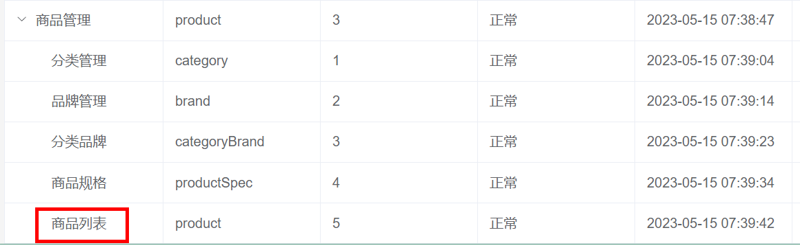
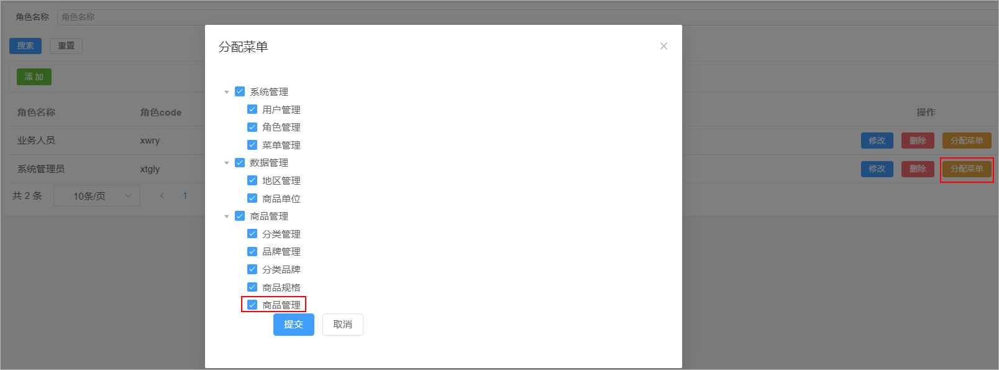
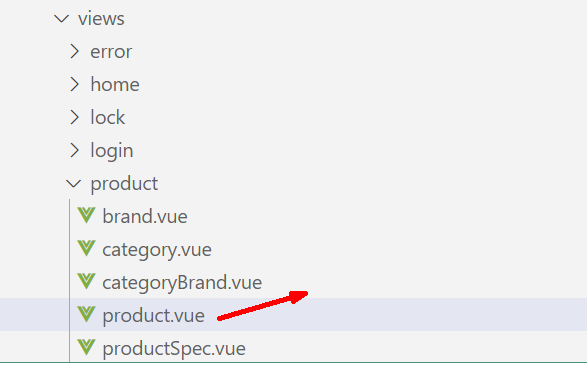
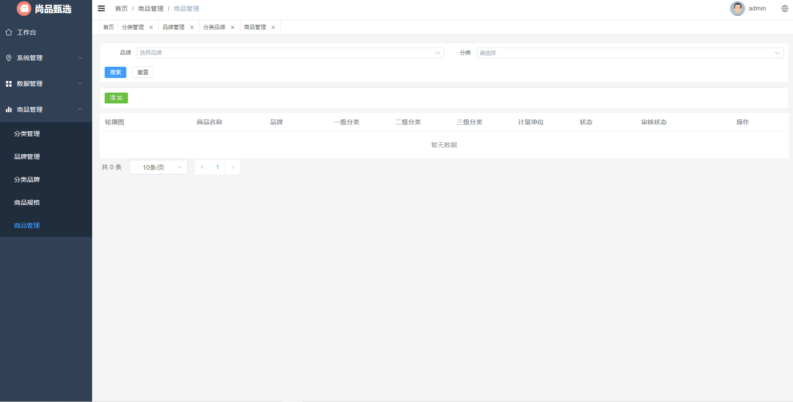
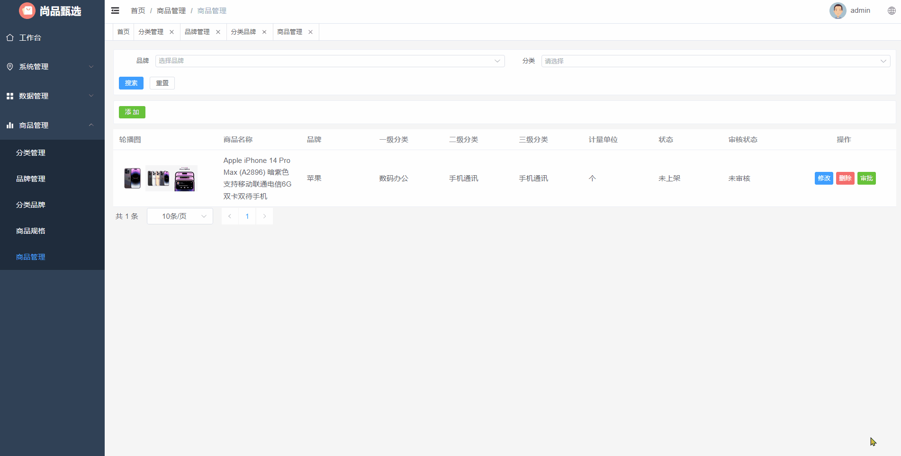
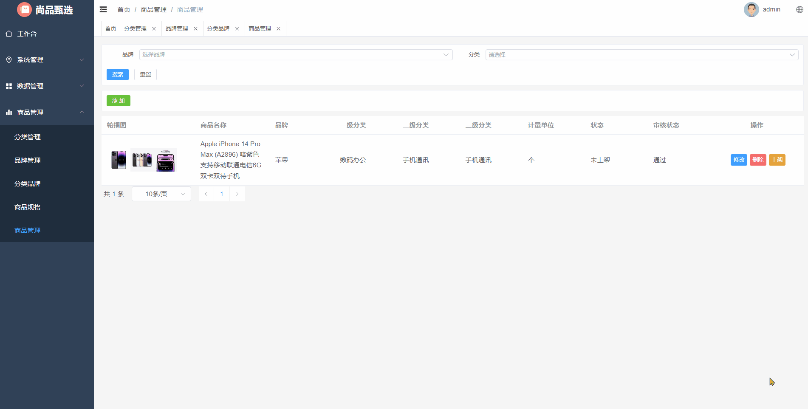
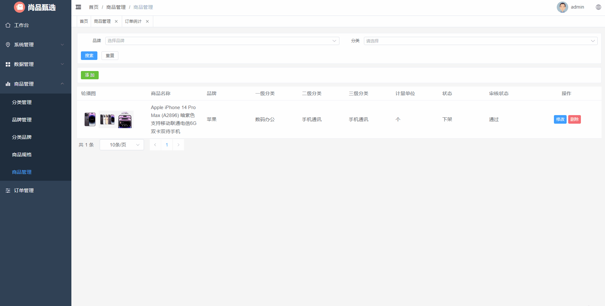
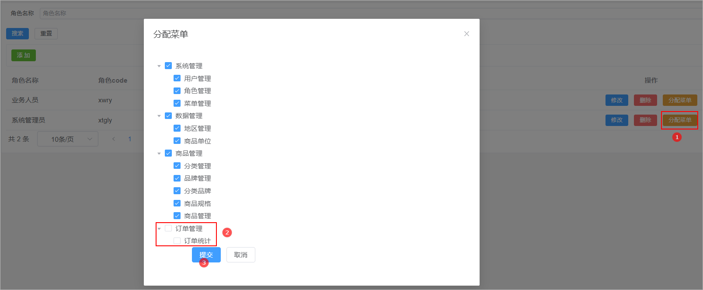
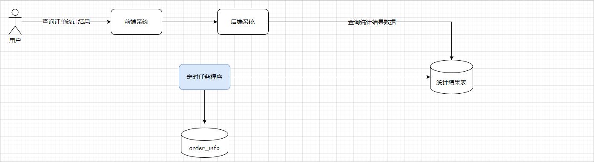

# 1 商品管理

商品管理就是对电商项目中所涉及到的商品数据进行维护。

## 1.1 菜单添加

首先在系统中添加商品管理的菜单，具体步骤如下所示：

1、在后台管理系统中通过系统管理的菜单管理添加商品管理的相关菜单，如下所示：

 

2、给系统管理员角色分配商品商品管理菜单访问权限：

 

3、在前端项目中创建对应的页面，以及配置对应的异步路由

* 在src/views/product的文件夹中加入商品管理页面文件**product.vue**，如下所示：

 

* 在src/router/modules文件夹下创建product.js路由文件，文件内容如下所示：

```java
const Layout = () => import('@/layout/index.vue')
const category = () => import('@/views/product/category.vue')
const brand = () => import('@/views/product/brand.vue')
const categoryBrand = () => import('@/views/product/categoryBrand.vue')
const productSpec = () => import('@/views/product/productSpec.vue')
const product = () => import('@/views/product/product.vue')

export default [
  {
    path: '/product',
    component: Layout,
    name: 'product',
    meta: {
      title: '商品管理',
    },
    icon: 'Histogram',
    children: [
      {
        path: '/category',
        name: 'category',
        component: category,
        meta: {
          title: '分类管理',
        },
      },
      {
        path: '/brand',
        name: 'brand',
        component: brand,
        meta: {
          title: '品牌管理',
        },
      },
      {
        path: '/categoryBrand',
        name: 'categoryBrand',
        component: categoryBrand,
        meta: {
          title: '分类品牌',
        },
      },
      {
        path: '/productSpec',
        name: 'productSpec',
        component: productSpec,
        meta: {
          title: '商品规格',
        },
      },
      {
        path: '/product',
        name: 'product',
        component: product,
        meta: {
          title: '商品管理',
        },
      },
    ],
  },
]
```


## 1.2 表结构介绍

商品数据所对应的表结构如下所示：

```sql
CREATE TABLE `product` (
  `id` bigint NOT NULL AUTO_INCREMENT COMMENT 'ID',
  `name` varchar(255) CHARACTER SET utf8mb3 COLLATE utf8_general_ci DEFAULT NULL COMMENT '商品名称',
  `brand_id` bigint DEFAULT NULL COMMENT '品牌ID',
  `category1_id` bigint DEFAULT NULL COMMENT '一级分类id',
  `category2_id` bigint DEFAULT NULL COMMENT '二级分类id',
  `category3_id` bigint DEFAULT NULL COMMENT '三级分类id',
  `unit_name` varchar(50) CHARACTER SET utf8mb3 COLLATE utf8_general_ci DEFAULT NULL COMMENT '计量单位',
  `slider_urls` text COMMENT '轮播图',
  `spec_value` varchar(255) DEFAULT NULL COMMENT '商品规格json',
  `status` tinyint NOT NULL DEFAULT '0' COMMENT '线上状态：0-初始值，1-上架，-1-自主下架',
  `audit_status` tinyint NOT NULL DEFAULT '0' COMMENT '审核状态：0-初始值，1-通过，-1-未通过',
  `audit_message` varchar(255) CHARACTER SET utf8mb3 COLLATE utf8_general_ci DEFAULT NULL COMMENT '审核信息',
  `create_time` timestamp NOT NULL DEFAULT CURRENT_TIMESTAMP COMMENT '创建时间',
  `update_time` timestamp NOT NULL DEFAULT CURRENT_TIMESTAMP ON UPDATE CURRENT_TIMESTAMP COMMENT '更新时间',
  `is_deleted` tinyint NOT NULL DEFAULT '0' COMMENT '删除标记（0:不可用 1:可用）',
  PRIMARY KEY (`id`)
) ENGINE=InnoDB AUTO_INCREMENT=2 DEFAULT CHARSET=utf8mb4 COLLATE=utf8mb4_0900_ai_ci COMMENT='商品';
```


## 1.3 列表查询

### 1.3.1 需求说明

需求说明：

1、如果在搜索表单中选择了某一个品牌以及分类，那么此时就需要按照品牌id和分类id进行查询

2、搜索的时候需要进行分页搜索

### 1.3.2 后端接口

#### 需求分析

1、前端提交请求参数的时候包含了两部分的参数：搜索条件参数、分页参数。搜索条件参数可以通过?拼接到请求路径后面，分页参数【当前页码、每页显示的数据条数】可以让前端通过请求路径传递过来

2、后端查询完毕以后需要给前端返回一个分页对象，分页对象中就封装了分页相关的参数(当前页数据、总记录数、总页数...)

3、前端进行参数传递的时候，不一定会传递搜索条件，因此sql语句的编写需要使用到动态sql

#### ProductDto

定义一个用来封装请求参数的Dto对象，如下所示：

```java
// com.atguigu.spzx.model.dto.product;
@Data
public class ProductDto extends BaseEntity {

    private Long brandId;
    private Long category1Id;
    private Long category2Id;
    private Long category3Id;

}
```

#### Product

针对当前要操作的数据库表定义一个与之对应的实体类：

```java
// com.atguigu.spzx.model.entity.product
@Data
public class Product extends BaseEntity {

	private String name;					// 商品名称
	private Long brandId;					// 品牌ID
	private Long category1Id;				// 一级分类id
	private Long category2Id;				// 二级分类id
	private Long category3Id;				// 三级分类id
	private String unitName;				// 计量单位
	private String sliderUrls;				// 轮播图
	private String specValue;				// 商品规格值json串
	private Integer status;					// 线上状态：0-初始值，1-上架，-1-自主下架
	private Integer auditStatus;			// 审核状态
	private String auditMessage;			// 审核信息

	// 扩展的属性，用来封装响应的数据
	private String brandName;				// 品牌
	private String category1Name;			// 一级分类
	private String category2Name;			// 二级分类
	private String category3Name;			// 三级分类

}
```

#### ProductController

表现层代码实现

```java
// com.atguigu.spzx.manager.controller;
@RestController
@RequestMapping(value="/admin/product/product")
public class ProductController {

    @Autowired
    private ProductService productService ;

    @GetMapping(value = "/{page}/{limit}")
    public Result<PageInfo<Product>> findByPage(@PathVariable Integer page, @PathVariable Integer limit, ProductDto productDto) {
        PageInfo<Product> pageInfo = productService.findByPage(page, limit, productDto);
        return Result.build(pageInfo , ResultCodeEnum.SUCCESS) ;
    }

}
```

#### ProductService

业务层代码实现

```java
//  com.atguigu.spzx.manager.service.impl;
@Service
public class ProductServiceImpl implements ProductService {

    @Autowired
    private ProductMapper productMapper ;

    @Override
    public PageInfo<Product> findByPage(Integer page, Integer limit, ProductDto productDto) {
        PageHelper.startPage(page , limit) ;
        List<Product> productList =  productMapper.findByPage(productDto) ;
        return new PageInfo<>(productList);
    }

}
```

#### ProductMapper

持久层代码实现

```java
@Mapper
public interface ProductMapper {
    public abstract List<Product> findByPage(ProductDto productDto);  
}
```

#### ProductMapper.xml

在ProductMapper.xml映射文件中添加如下的sql语句：

```xml
<?xml version="1.0" encoding="UTF-8" ?>
<!DOCTYPE mapper PUBLIC "-//mybatis.org//DTD Mapper 3.0//EN" "http://mybatis.org/dtd/mybatis-3-mapper.dtd">
<mapper namespace="com.atguigu.spzx.manager.mapper.ProductMapper">

    <resultMap id="productMap" type="com.atguigu.spzx.model.entity.product.Product" autoMapping="true"></resultMap>

    <!-- 用于select查询公用抽取的列 -->
    <sql id="columns">
        id,name,brand_id,category1_id,category2_id,category3_id,unit_name,slider_urls,spec_value,status,audit_status,audit_message,create_time,update_time,is_deleted
    </sql>


    <sql id="findPageWhere">
        <where>
            <if test="brandId != null and brandId != ''">
                and p.brand_id = #{brandId}
            </if>
            <if test="category1Id != null and category1Id != ''">
                and p.category1_id = #{category1Id}
            </if>
            <if test="category2Id != null and category2Id != ''">
                and p.category2_id = #{category2Id}
            </if>
            <if test="category3Id != null and category3Id != ''">
                and p.category3_id = #{category3Id}
            </if>
            and p.is_deleted = 0
        </where>
    </sql>

    <select id="findByPage" resultMap="productMap">
        select
            p.id, p.name , p.brand_id , p.category1_id , p.category2_id , p.category3_id, p.unit_name,
            p.slider_urls , p.spec_value , p.status , p.audit_status , p.audit_message , p.create_time , p.update_time , p.is_deleted ,
            b.name brandName , c1.name category1Name , c2.name category2Name , c3.name category3Name
        from product p
            LEFT JOIN brand b on b.id = p.brand_id
            LEFT JOIN category c1 on c1.id = p.category1_id
            LEFT JOIN category c2 on c2.id = p.category2_id
            LEFT JOIN category c3 on c3.id = p.category3_id
        <include refid="findPageWhere"/>
        order by id desc
    </select>

</mapper>
```


## 1.4 添加功能

### 1.4.1 需求说明

当用户点击添加按钮的时候，那么此时就弹出对话框，在该对话框中需要展示添加商品的表单。当用户在该表单中点击提交按钮的时候那么此时就需要将表单进行提交，在后端需要将提交过来的表单数据保存到数据库中即可。


**效果如下所示：** 

  


### 1.4.2 核心概念

在完成商品添加功能之前，必须先要了解电商系统中常见的两个核心的概念。

#### SPU

SPU = Standard Product Unit （标准化产品单元）, SPU是商品信息聚合的最小单位，是一组可复用、易检索的标准化信息的**集合**，该[集合](https://so.csdn.net/so/search?q=集合&spm=1001.2101.3001.7020)描述了一个产品的特性。通俗点讲就是泛指一类商品，这种商品具有相同的属性。

#### SKU

SKU = stock keeping unit(库存量单位) SKU即库存进出计量的单位（买家购买、商家进货、供应商备货、工厂生产都是依据SKU进行的）。是和具体的属性值有直接的关联关系。SKU是**物理上不可分割的最小存货单元。**也就是说一款商品，可以**根据SKU来确定具体的货物存量。**


以手机为例，假设有一款名为 "XPhone" 的手机品牌，它推出了一款型号为 "X10" 的手机。这款手机一共有以下几种属性：

1、颜色：黑色、白色、金色

2、存储容量：64GB、128GB

3、内存大小：4GB、6GB

那么，“X10” 这款手机就是这个商品的 SPU，它包含所有属性。而根据不同的属性组合，可以形成多个不同的 SKU。如下所示：

| SPU  |  SKU  | 颜色 | 存储容量 | 内存大小 |
| :--: | :---: | :--: | :------: | :------: |
| X10  | SKU1  | 黑色 |   64GB   |   4GB    |
| X10  | SKU2  | 白色 |   64GB   |   4GB    |
| X10  | SKU3  | 金色 |   64GB   |   4GB    |
| X10  | SKU4  | 黑色 |  128GB   |   4GB    |
| X10  | SKU5  | 白色 |  128GB   |   4GB    |
| X10  | SKU6  | 金色 |  128GB   |   4GB    |
| X10  | SKU7  | 黑色 |   64GB   |   6GB    |
| X10  | SKU8  | 白色 |   64GB   |   6GB    |
| X10  | SKU9  | 金色 |   64GB   |   6GB    |
| X10  | SKU10 | 黑色 |  128GB   |   6GB    |
| X10  | SKU11 | 白色 |  128GB   |   6GB    |
| X10  | SKU12 | 金色 |  128GB   |   6GB    |


再以衣服为例，假设有一家服装网店推出了一款名为 "A衬衫" 的衣服。这款衣服一共有以下几种属性：

1、尺寸：S、M、L、XL

2、颜色：白色、黑色、灰色、蓝色

那么，“A衬衫” 这款衣服就是这个商品的 SPU，它包含所有属性。而根据不同的属性组合，可以形成多个不同的 SKU。如下所示：

|  SPU  |  SKU  | 尺寸 | 颜色 |
| :---: | :---: | :--: | :--: |
| A衬衫 | SKU1  |  S   | 白色 |
| A衬衫 | SKU2  |  M   | 白色 |
| A衬衫 | SKU3  |  L   | 白色 |
| A衬衫 | SKU4  |  XL  | 白色 |
| A衬衫 | SKU5  |  S   | 黑色 |
| A衬衫 | SKU6  |  M   | 黑色 |
| A衬衫 | SKU7  |  L   | 黑色 |
| A衬衫 | SKU8  |  XL  | 黑色 |
| A衬衫 | SKU9  |  S   | 灰色 |
| A衬衫 | SKU10 |  M   | 灰色 |
| A衬衫 | SKU11 |  L   | 灰色 |
| A衬衫 | SKU12 |  XL  | 灰色 |
| A衬衫 | SKU13 |  S   | 蓝色 |
| A衬衫 | SKU14 |  M   | 蓝色 |
| A衬衫 | SKU15 |  L   | 蓝色 |
| A衬衫 | SKU16 |  XL  | 蓝色 |


### 1.4.3 加载品牌数据

需求：当用户选择了三级分类以后，此时需要将三级分类所对应的品牌数据查询出来在品牌下拉框中进行展示

#### CategoryBrandController

表现层代码实现：

```java
// com.atguigu.spzx.manager.controller
@GetMapping("/findBrandByCategoryId/{categoryId}")
public Result findBrandByCategoryId(@PathVariable Long categoryId) {
    List<Brand> brandList =   categoryBrandService.findBrandByCategoryId(categoryId);
    return Result.build(brandList , ResultCodeEnum.SUCCESS) ;
}
```

#### CategoryBrandService

业务层代码实现：

```java
// com.atguigu.spzx.manager.service.impl
@Override
public List<Brand> findBrandByCategoryId(Long categoryId) {
    return categoryBrandMapper.findBrandByCategoryId(categoryId);
}
```

#### CategoryBrandMapper

持久层代码实现：

```java
// com.atguigu.spzx.manager.mapper
@Mapper
public interface CategoryBrandMapper {
    public abstract List<Brand> findBrandByCategoryId(Long categoryId);
}
```

#### CategoryBrandMapper.xml

在CategoryBrandMapper.xml映射文件中添加如下sql语句：

```xml
<resultMap id="brandMap" type="com.atguigu.spzx.model.entity.product.Brand" autoMapping="true"></resultMap>
<select id="findBrandByCategoryId" resultMap="brandMap">
    select
    b.*
    from category_brand cb
    left join brand b  on b.id = cb.brand_id
    where cb.category_id = #{categoryId} and cb.is_deleted = 0
    order by cb.id desc
</select>
```


### 1.4.4 加载商品单元数据

需求：当添加商品的表单对话框展示出来以后，此时就需要从数据库中查询出来所有的商品单元数据，并将查询到的商品单元数据在商品单元下拉框中进行展示。

#### ProductUnitController

表现层代码实现：

```java
// com.atguigu.spzx.manager.controller
@RestController
@RequestMapping("/admin/product/productUnit")
public class ProductUnitController {

    @Autowired
    private ProductUnitService productUnitService;
    
    @GetMapping("findAll")
    public Result<List<ProductUnit>> findAll() {
        List<ProductUnit> productUnitList = productUnitService.findAll();
        return Result.build(productUnitList , ResultCodeEnum.SUCCESS) ;
    }
}
```

#### ProductUnitService

业务层代码实现：

```java
// com.atguigu.spzx.manager.service.impl
@Autowired
private ProductUnitMapper productUnitMapper ;

@Override
public List<ProductUnit> findAll() {
    return productUnitMapper.findAll() ;
}
```

#### ProductUnitMapper

持久层代码实现：

```java
// com.atguigu.spzx.manager.mapper
@Mapper
public interface ProductUnitMapper {
    public abstract List<ProductUnit> findAll();
}
```

#### ProductUnitMapper.xml

在ProductUnitMapper.xml映射文件中添加如下的sql语句：

```xml
<?xml version="1.0" encoding="UTF-8" ?>
<!DOCTYPE mapper PUBLIC "-//mybatis.org//DTD Mapper 3.0//EN" "http://mybatis.org/dtd/mybatis-3-mapper.dtd">
<mapper namespace="com.atguigu.spzx.mapper.ProductUnitMapper">
    <resultMap id="productUnitMap" type="com.atguigu.spzx.model.entity.base.ProductUnit" autoMapping="true"></resultMap>

    <sql id="columns">
        id,name,create_time,update_time,is_deleted
    </sql>

    <select id="findAll" resultMap="productUnitMap">
        select <include refid="columns" />
        from product_unit
        where is_deleted = 0
        order by id
    </select>
</mapper>
```


### 1.4.5 加载商品规格数据

需求：当添加商品的表单对话框展示出来以后，此时就需要从数据库中查询出来所有的商品规格数据，并将查询到的商品规格数据在商品规格下拉框中进行展示。

#### ProductSpecController

表现层代码实现：

```java
// com.atguigu.spzx.manager.controller
@GetMapping("findAll")
public Result findAll() {
    List<ProductSpec> list = productSpecService.findAll();
    return Result.build(list , ResultCodeEnum.SUCCESS) ;
}
```

#### ProductSpecService

业务层代码实现：

```java
// com.atguigu.spzx.manager.service.impl;
@Override
public List<ProductSpec> findAll() {
    return productSpecMapper.findAll();
}
```

#### ProductSpecMapper

持久层代码实现：

```java
// com.atguigu.spzx.manager.mapper
@Mapper
public interface ProductSpecMapper {
    public abstract List<ProductSpec> findAll();
}
```

#### ProductSpecMapper.xml

在ProductSpecMapper.xml映射文件中添加如下sql语句：

```xml
<select id="findAll" resultMap="productSpecMap">
    select <include refid="columns" />
    from product_spec
    order by id desc
</select>
```


### 1.4.6 保存商品数据接口

#### 思路分析

思路分析：

1、前端提交过来的数据，包含了SPU的基本数据，SKU的列表数据，商品详情数据

2、后端可以直接使用Product接收请求参数，但是需要扩展对应的属性

3、保存数据的时候需要操作三张表：product、product_sku、product_detail

#### Product

修改Product实体类，添加接收sku列表和商品详情的属性，如下所示：

```java
// com.atguigu.spzx.model.entity.product;
@Data
public class Product extends BaseEntity {

	private String name;					// 商品名称
	private Long brandId;					// 品牌ID
	private Long category1Id;				// 一级分类id
	private Long category2Id;				// 二级分类id
	private Long category3Id;				// 三级分类id
	private String unitName;				// 计量单位
	private String sliderUrls;				// 轮播图
	private String specValue;				// 商品规格值json串
	private Integer status;					// 线上状态：0-初始值，1-上架，-1-自主下架
	private Integer auditStatus;			// 审核状态
	private String auditMessage;			// 审核信息

	// 扩展的属性，用来封装响应的数据
	private String brandName;				// 品牌
	private String category1Name;			// 一级分类
	private String category2Name;			// 二级分类
	private String category3Name;			// 三级分类


	private List<ProductSku> productSkuList;		// sku列表集合
	private String detailsImageUrls;				// 图片详情列表

}
```

#### ProductSku

商品sku实体类定义：

```java
// com.atguigu.spzx.model.entity.product;
@Data
public class ProductSku extends BaseEntity { 

	private String skuCode;
	private String skuName;
	private Long productId;
	private String thumbImg;
	private BigDecimal salePrice;
	private BigDecimal marketPrice;
	private BigDecimal costPrice;
	private Integer stockNum;
	private Integer saleNum;
	private String skuSpec;
	private String weight;
	private String volume;
	private Integer status;

}
```

#### ProductDetails

商品详情实体类：

```java
// com.atguigu.spzx.model.entity.product;
@Data
public class ProductDetails extends BaseEntity {

	private Long productId;
	private String imageUrls;

}
```

#### ProductController

表现层代码：

```java
// com.atguigu.spzx.manager.controller;
@PostMapping("/save")
public Result save(@RequestBody Product product) {
    productService.save(product);
    return Result.build(null , ResultCodeEnum.SUCCESS) ;
}
```

#### ProductService

业务层代码：

```java
// com.atguigu.spzx.manager.service.impl;
@Autowired
private ProductSkuMapper productSkuMapper;
    
@Autowired
private ProductDetailsMapper productDetailsMapper;

@Transactional
@Override
public void save(Product product) {

    // 保存商品数据
    product.setStatus(0);              // 设置上架状态为0
    product.setAuditStatus(0);         // 设置审核状态为0
    productMapper.save(product);

    // 保存商品sku数据
    List<ProductSku> productSkuList = product.getProductSkuList();
    for(int i=0,size=productSkuList.size(); i<size; i++) {

        // 获取ProductSku对象
        ProductSku productSku = productSkuList.get(i);
        productSku.setSkuCode(product.getId() + "_" + i);       // 构建skuCode
        
        productSku.setProductId(product.getId());               // 设置商品id
        productSku.setSkuName(product.getName() + productSku.getSkuSpec());
        productSku.setSaleNum(0);                               // 设置销量
        productSku.setStatus(0);
        productSkuMapper.save(productSku);                    // 保存数据

    }

    // 保存商品详情数据
    ProductDetails productDetails = new ProductDetails();
    productDetails.setProductId(product.getId());
    productDetails.setImageUrls(product.getDetailsImageUrls());
    productDetailsMapper.save(productDetails);

}
```

#### ProductMapper

商品持久层代码：

```java
// com.atguigu.spzx.manager.mapper
@Mapper
public interface ProductMapper {
    public abstract void save(Product product);
}
```

#### ProductMapper.xml

在ProductMapper.xml文件中添加如下的SQL语句：

```xml
<insert id="save" useGeneratedKeys="true" keyProperty="id">
    insert into product (
        id,
        name,
        brand_id,
        category1_id,
        category2_id,
        category3_id,
        unit_name,
        slider_urls,
        spec_value,
        status,
        audit_status,
        audit_message,
        create_time,
        update_time,
        is_deleted
    ) values (
        #{id},
        #{name},
        #{brandId},
        #{category1Id},
        #{category2Id},
        #{category3Id},
        #{unitName},
        #{sliderUrls},
        #{specValue},
        #{status},
        #{auditStatus},
        #{auditMessage},
        now(),
        now() ,
        0
    )
</insert>
```

#### ProductSkuMapper

商品SKU的持久层代码：

```java
// com.atguigu.spzx.manager.mapper;
@Mapper
public interface ProductSkuMapper {
    public abstract void save(ProductSku productSku);
}
```

#### ProductSkuMapper.xml

在ProductSkuMapper.xml映射文件中添加如下的SQL语句：

```xml
<?xml version="1.0" encoding="UTF-8" ?>
<!DOCTYPE mapper PUBLIC "-//mybatis.org//DTD Mapper 3.0//EN" "http://mybatis.org/dtd/mybatis-3-mapper.dtd">
<mapper namespace="com.atguigu.spzx.mapper.ProductSkuMapper">

    <insert id="save" useGeneratedKeys="true" keyProperty="id">
        insert into product_sku (
            id,
            sku_code,
            sku_name,
            product_id,
            thumb_img,
            sale_price,
            market_price,
            cost_price,
            stock_num,
            sku_spec,
            weight,
            volume,
            status,
            sale_num,
            create_time,
            update_time,
            is_deleted
        ) values (
             #{id},
             #{skuCode},
             #{skuName},
             #{productId},
             #{thumbImg},
             #{salePrice},
             #{marketPrice},
             #{costPrice},
             #{stockNum},
             #{skuSpec},
             #{weight},
             #{volume},
             #{status},
             #{saleNum},
             now(),
             now(),
             0
         )
    </insert>

</mapper>
```

#### ProductDetailsMapper

商品详情的持久层代码：

```java
// com.atguigu.spzx.manager.mapper;
@Mapper
public interface ProductDetailsMapper {
    public abstract void save(ProductDetails productDetails);
}
```

#### ProductDetailsMapper.xml

在ProductDetailsMapper.xml映射文件中添加如下的SQL语句：

```xml
<?xml version="1.0" encoding="UTF-8" ?>
<!DOCTYPE mapper PUBLIC "-//mybatis.org//DTD Mapper 3.0//EN" "http://mybatis.org/dtd/mybatis-3-mapper.dtd">
<mapper namespace="com.atguigu.spzx.mapper.ProductDetailsMapper">

    <insert id="save" useGeneratedKeys="true" keyProperty="id">
        insert into product_details (
        	id,
            product_id,
            image_urls,
            create_time,update_time,is_deleted
        ) values (
            #{id},
            #{productId},
            #{imageUrls},
            now(),
            now(),
            0
        )
    </insert>

</mapper>
```


## 1.5 修改功能

### 1.5.1 需求说明

当用户点击修改按钮的时候，那么此时就弹出对话框，在该对话框的商品表单中回显商品相关数据，此时用户对商品数据进行修改，修改完毕以后点击提交按钮将表单进行提交，后端服务修改数据库中数据即可。

效果如下所示：

 

修改功能实现的时候需要开发两个接口：

1、根据id查询商品详情

2、保存修改数据接口


### 1.5.2 查询商品详情

#### ProductController

表现层代码：

```java
// com.atguigu.spzx.manager.controller;
@GetMapping("/getById/{id}")
public Result<Product> getById(@PathVariable Long id) {
    Product product = productService.getById(id);
    return Result.build(product , ResultCodeEnum.SUCCESS) ;
}
```

#### ProductService

业务层代码：

```java
// com.atguigu.spzx.manager.service.impl;
@Override
public Product getById(Long id) {

    // 根据id查询商品数据
    Product product = productMapper.selectById(id);

    // 根据商品的id查询sku数据
    List<ProductSku> productSkuList = productSkuMapper.selectByProductId(id);
    product.setProductSkuList(productSkuList);

    // 根据商品的id查询商品详情数据
    ProductDetails productDetails = productDetailsMapper.selectByProductId(product.getId());
    product.setDetailsImageUrls(productDetails.getImageUrls());

    // 返回数据
    return product;
}
```

#### ProductMapper

商品持久层代码：

```java
// com.atguigu.spzx.manager.mapper
@Mapper
public interface ProductMapper {
    public abstract Product selectById(Long id);
}
```

#### ProductMapper.xml

在ProductMapper.xml文件中添加如下的SQL语句：

```xml
<select id="selectById" resultMap="productMap">
    select
        p.id, p.name , p.brand_id , p.category1_id , p.category2_id , p.category3_id, p.unit_name,
        p.slider_urls , p.spec_value , p.status , p.audit_status , p.audit_message , p.create_time , p.update_time , p.is_deleted ,
        b.name brandName , c1.name category1Name , c2.name category2Name , c2.name category3Name
    from product p
        LEFT JOIN brand b on b.id = p.brand_id
        LEFT JOIN category c1 on c1.id = p.category1_id
        LEFT JOIN category c2 on c2.id = p.category2_id
        LEFT JOIN category c3 on c3.id = p.category3_id
    where
    p.id = #{id}
</select>
```

#### ProductSkuMapper

商品SKU的持久层代码：

```java
// com.atguigu.spzx.manager.mapper;
@Mapper
public interface ProductSkuMapper {
    public abstract List<ProductSku> selectByProductId(Long id);
}
```

#### ProductSkuMapper.xml

在ProductSkuMapper.xml映射文件中添加如下的SQL语句：

```xml
<resultMap id="productSkuMap" type="com.atguigu.spzx.model.entity.product.ProductSku" autoMapping="true"></resultMap>

<!-- 用于select查询公用抽取的列 -->
<sql id="columns">
    id,sku_code,sku_name,product_id,thumb_img,sale_price,market_price,cost_price,stock_num,sku_spec,weight,volume,status,create_time,update_time,is_deleted
</sql>

<select id="selectByProductId" resultMap="productSkuMap">
    select <include refid="columns" />
    from product_sku
    where product_id = #{productId}
    and is_deleted = 0
    order by id desc
</select>
```

#### ProductDetailsMapper

商品详情的持久层代码：

```java
// com.atguigu.spzx.manager.mapper;
@Mapper
public interface ProductDetailsMapper {
    public abstract ProductDetails selectByProductId(Long id);
}
```

#### ProductDetailsMapper.xml

在ProductDetailsMapper.xml映射文件中添加如下的SQL语句：

```xml
<resultMap id="productDetailsMap" type="com.atguigu.spzx.model.entity.product.ProductDetails" autoMapping="true"></resultMap>

<!-- 用于select查询公用抽取的列 -->
<sql id="columns">
    id,product_id,image_urls,create_time,update_time,is_deleted
</sql>

<select id="selectByProductId" resultMap="productDetailsMap">
    select <include refid="columns" />
    from product_details
    where
    product_id = #{productId}
</select>
```


### 1.5.3 保存修改数据接口

#### ProductController

表现层代码：

```java
// com.atguigu.spzx.manager.controller;
@PutMapping("/updateById")
public Result updateById(@Parameter(name = "product", description = "请求参数实体类", required = true) @RequestBody Product product) {
    productService.updateById(product);
    return Result.build(null , ResultCodeEnum.SUCCESS) ;
}
```

#### ProductService

业务层代码：

```java
// com.atguigu.spzx.manager.service.impl;
@Transactional
@Override
public void updateById(Product product) {

    // 修改商品基本数据
    productMapper.updateById(product);

    // 修改商品的sku数据
    List<ProductSku> productSkuList = product.getProductSkuList();
    productSkuList.forEach(productSku -> {
        productSkuMapper.updateById(productSku);
    });

    // 修改商品的详情数据
    ProductDetails productDetails = productDetailsMapper.selectByProductId(product.getId());
    productDetails.setImageUrls(product.getDetailsImageUrls());
    productDetailsMapper.updateById(productDetails);

}
```

#### ProductMapper

商品持久层代码：

```java
// com.atguigu.spzx.manager.mapper
@Mapper
public interface ProductMapper {
    public abstract  void updateById(Product product);
}
```

#### ProductMapper.xml

在ProductMapper.xml文件中添加如下的SQL语句：

```xml
<update id="updateById" >
    update product set
    <if test="name != null and name != ''">
        name = #{name},
    </if>
    <if test="brandId != null and brandId != ''">
        brand_id = #{brandId},
    </if>
    <if test="category1Id != null and category1Id != ''">
        category1_id = #{category1Id},
    </if>
    <if test="category2Id != null and category2Id != ''">
        category2_id = #{category2Id},
    </if>
    <if test="category3Id != null and category3Id != ''">
        category3_id = #{category3Id},
    </if>
    <if test="unitName != null and unitName != ''">
        unit_name = #{unitName},
    </if>
    <if test="sliderUrls != null and sliderUrls != ''">
        slider_urls = #{sliderUrls},
    </if>
    <if test="specValue != null and specValue != ''">
        spec_value = #{specValue},
    </if>
    <if test="status != null and status != ''">
        status = #{status},
    </if>
    <if test="auditStatus != null and auditStatus != ''">
        audit_status = #{auditStatus},
    </if>
    <if test="auditMessage != null and auditMessage != ''">
        audit_message = #{auditMessage},
    </if>
    update_time =  now()
    where
    id = #{id}
</update>
```

#### ProductSkuMapper

商品SKU的持久层代码：

```java
// com.atguigu.spzx.manager.mapper;
@Mapper
public interface ProductSkuMapper {
    public abstract  void updateById(ProductSku productSku);
}
```

#### ProductSkuMapper.xml

在ProductSkuMapper.xml映射文件中添加如下的SQL语句：

```xml
<update id="updateById" >
    update product_sku set
    <if test="skuCode != null and skuCode != ''">
        sku_code = #{skuCode},
    </if>
    <if test="skuName != null and skuName != ''">
        sku_name = #{skuName},
    </if>
    <if test="productId != null and productId != ''">
        product_id = #{productId},
    </if>
    <if test="thumbImg != null and thumbImg != ''">
        thumb_img = #{thumbImg},
    </if>
    <if test="salePrice != null and salePrice != ''">
        sale_price = #{salePrice},
    </if>
    <if test="marketPrice != null and marketPrice != ''">
        market_price = #{marketPrice},
    </if>
    <if test="costPrice != null and costPrice != ''">
        cost_price = #{costPrice},
    </if>
    <if test="stockNum != null and stockNum != ''">
        stock_num = #{stockNum},
    </if>
    <if test="skuSpec != null and skuSpec != ''">
        sku_spec = #{skuSpec},
    </if>
    <if test="weight != null and weight != ''">
        weight = #{weight},
    </if>
    <if test="volume != null and volume != ''">
        volume = #{volume},
    </if>
    <if test="status != null and status != ''">
        status = #{status},
    </if>
    update_time =  now()
    where
    id = #{id}
</update>
```

#### ProductDetailsMapper

商品详情的持久层代码：

```java
// com.atguigu.spzx.manager.mapper;
@Mapper
public interface ProductDetailsMapper {
    public abstract void updateById(ProductDetails productDetails);
}
```

#### ProductDetailsMapper.xml

在ProductDetailsMapper.xml映射文件中添加如下的SQL语句：

```xml
<update id="updateById" >
    update product_details set
    <if test="productId != null and productId != ''">
        product_id = #{productId},
    </if>
    <if test="imageUrls != null and imageUrls != ''">
        image_urls = #{imageUrls},
    </if>
    update_time =  now()
    where
    id = #{id}
</update>
```


## 1.6 删除商品

### 1.6.1 需求说明

当点击删除按钮的时候此时需要弹出一个提示框，询问是否需要删除数据？如果用户点击是，那么此时向后端发送请求传递id参数，后端接收id参数进行逻辑删除。

效果如下所示：


### 1.6.2 后端接口

#### ProductController

表现层代码：

```java
// com.atguigu.spzx.manager.controller;
@DeleteMapping("/deleteById/{id}")
public Result deleteById(@Parameter(name = "id", description = "商品id", required = true) @PathVariable Long id) {
    productService.deleteById(id);
    return Result.build(null , ResultCodeEnum.SUCCESS) ;
}
```

#### ProductService

业务层代码：

```java
// com.atguigu.spzx.manager.service.impl;
@Transactional
@Override
public void deleteById(Long id) {
    productMapper.deleteById(id);                   // 根据id删除商品基本数据
    productSkuMapper.deleteByProductId(id);         // 根据商品id删除商品的sku数据
    productDetailsMapper.deleteByProductId(id);     // 根据商品的id删除商品的详情数据
}
```

#### ProductMapper

商品持久层代码：

```java
// com.atguigu.spzx.manager.mapper
@Mapper
public interface ProductMapper {
    public abstract void deleteById(Long id);
}
```

#### ProductMapper.xml

在ProductMapper.xml文件中添加如下的SQL语句：

```xml
<update id="deleteById">
    update product set
    update_time = now() ,
    is_deleted = 1
    where
    id = #{id}
</update>
```

#### ProductSkuMapper

商品SKU的持久层代码：

```java
// com.atguigu.spzx.manager.mapper;
@Mapper
public interface ProductSkuMapper {
    public abstract void deleteByProductId(Long id);
}
```

#### ProductSkuMapper.xml

在ProductSkuMapper.xml映射文件中添加如下的SQL语句：

```xml
<update id="deleteByProductId">
    update product_sku set
    update_time = now() ,
    is_deleted = 1
    where
    product_id = #{productId}
</update>
```

#### ProductDetailsMapper

商品详情的持久层代码：

```java
// com.atguigu.spzx.manager.mapper;
@Mapper
public interface ProductDetailsMapper {
    public abstract void deleteByProductId(Long id);
}
```

#### ProductDetailsMapper.xml

在ProductDetailsMapper.xml映射文件中添加如下的SQL语句：

```xml
<update id="deleteByProductId">
    update product_details set
    update_time = now() ,
    is_deleted = 1
    where
    product_id = #{productId}
</update>
```


## 1.7 商品审核

### 1.7.1 需求说明

当点击审核按钮的时候此时需要弹出一个对话框，在该对话框中展示商品的详情信息，用户可以在该对话框中点击通过或者驳回按钮对商品进行审核操作。

效果如下所示：




### 1.7.2 后端接口

#### ProductController

表现层代码：

```java
// com.atguigu.spzx.manager.controller;
@GetMapping("/updateAuditStatus/{id}/{auditStatus}")
public Result updateAuditStatus(@PathVariable Long id, @PathVariable Integer auditStatus) {
    productService.updateAuditStatus(id, auditStatus);
    return Result.build(null , ResultCodeEnum.SUCCESS) ;
}
```

#### ProductService

业务层代码：

```java
// com.atguigu.spzx.manager.service.impl;
@Override
public void updateAuditStatus(Long id, Integer auditStatus) {
    Product product = new Product();
    product.setId(id);
    if(auditStatus == 1) {
        product.setAuditStatus(1);
        product.setAuditMessage("审批通过");
    } else {
        product.setAuditStatus(-1);
        product.setAuditMessage("审批不通过");
    }
    productMapper.updateById(product);
}
```


## 1.8 商品上下架

### 1.8.1 需求说明

当用户点击上架按钮的时候对商品进行上架操作，点击下架按钮的时候对商品进行下架操作。

实现思路：更改商品的上下架状态

效果如下所示：

 


### 1.8.2 后端接口

#### ProductController

表现层代码：

```java
// com.atguigu.spzx.manager.controller;
@GetMapping("/updateStatus/{id}/{status}")
public Result updateStatus(@PathVariable Long id, @PathVariable Integer status) {
    productService.updateStatus(id, status);
    return Result.build(null , ResultCodeEnum.SUCCESS) ;
}
```

#### ProductService

业务层代码：

```java
// com.atguigu.spzx.manager.service.impl;
@Override
public void updateStatus(Long id, Integer status) {
    Product product = new Product();
    product.setId(id);
    if(status == 1) {
        product.setStatus(1);
    } else {
        product.setStatus(-1);
    }
    productMapper.updateById(product);
}
```


## 1.9 前端整合

### 1.9.1 编写product.js

* 在src/api下创建product.js文件

```js
import request from '@/utils/request'

const api_name = '/admin/product/product'

// 分页列表
export const GetProductPageList = (page, limit, queryDto) => {
  return request({
    url: `${api_name}/${page}/${limit}`,
    method: 'get',
    params: queryDto,
  })
}


// 保存信息
export const SaveProduct = product => {
  return request({
    url: `${api_name}/save`,
    method: 'post',
    data: product,
  })
}

// 修改信息
export const UpdateProductById = product => {
  return request({
    url: `${api_name}/updateById`,
    method: 'put',
    data: product,
  })
}

// 根据id获取信息
export const GetProductById = id => {
  return request({
    url: `${api_name}/getById/${id}`,
    method: 'get',
  })
}


// 根据id删除商品
export const DeleteProductById = id => {
  return request({
    url: `${api_name}/deleteById/${id}`,
    method: 'delete',
  })
}


//审核
export const UpdateProductAuditStatus = (id, auditStatus) => {
  return request({
    url: `${api_name}/updateAuditStatus/${id}/${auditStatus}`,
    method: 'get',
  })
}

//上下架
export const UpdateProductStatus = (id, status) => {
  return request({
    url: `${api_name}/updateStatus/${id}/${status}`,
    method: 'get',
  })
}
```


### 1.9.2 编写product.vue

* 在views/product目录下product.vue文件

```vue
<template>
    <div class="search-div">
    <el-form label-width="70px" size="small">
      <el-row>
        <el-col :span="12">
          <el-form-item label="品牌">
            <el-select
              class="m-2"
              v-model="queryDto.brandId"
              placeholder="选择品牌"
              size="small"
              style="width: 100%"
            >
              <el-option
                v-for="item in brandList"
                :key="item.id"
                :label="item.name"
                :value="item.id"
              />
            </el-select>
          </el-form-item>
        </el-col>
        <el-col :span="12">
          <el-form-item label="分类">
            <el-cascader
              :props="categoryProps"
              style="width: 100%"
              v-model="searchCategoryIdList"
            />
          </el-form-item>
        </el-col>
      </el-row>
      <el-row style="display:flex">
        <el-button type="primary" size="small" @click="fetchData">
          搜索
        </el-button>
        <el-button size="small" @click="resetData">重置</el-button>
      </el-row>
    </el-form>
  </div>

    <div class="tools-div">
        <el-button type="success" size="small" @click="addShow">添 加</el-button>
    </div>

    <el-table :data="list" style="width: 100%">
        <el-table-column
            prop="sliderUrls"
            label="轮播图"
            #default="scope"
            width="200"
        >
            <div style="height: 50px;float: left;">
                
            </div>
        </el-table-column>
        <el-table-column prop="name" label="商品名称" width="160" />
        <el-table-column prop="brandName" label="品牌" />
        <el-table-column prop="category1Name" label="一级分类" />
        <el-table-column prop="category2Name" label="二级分类" />
        <el-table-column prop="category3Name" label="三级分类" />
        <el-table-column prop="unitName" label="计量单位" />
        <el-table-column prop="status" label="状态" #default="scope">
            {{
                scope.row.status == 0
                ? '未上架'
                : scope.row.status == 1
                ? '上架'
                : '下架'
            }}
        </el-table-column>
        <el-table-column prop="auditStatus" label="审核状态" #default="scope">
            {{
                scope.row.auditStatus == 0
                ? '未审核'
                : scope.row.auditStatus == 1
                ? '通过'
                : '驳回'
            }}
        </el-table-column>
        <el-table-column label="操作" align="center" width="200" #default="scope" >
            <el-button type="primary" size="small" @click="editShow(scope.row)" style="padding: 5px; margin-left: 5px;">
                修改
            </el-button>
            <el-button type="danger" size="small" @click="remove(scope.row.id)" style="padding: 5px; margin-left: 5px;">
                删除
            </el-button>
            <el-button
              v-if="scope.row.auditStatus == 0 || scope.row.auditStatus == -1"
              type="success"
              size="small"
              @click="audit(scope.row.id)"
              style="padding: 5px; margin-left: 5px;"
            >
              审批
      </el-button>
        <el-button
          v-if=" scope.row.auditStatus == 1 && (scope.row.status == 0 || scope.row.status == -1)
          && scope.row.status == 0 "
          type="warning"
          size="small"
          @click="updateStatus(scope.row.id, 1)"
          style="padding: 5px; margin-left: 5px;"
        >
          上架
        </el-button>
        <el-button
          v-if="
            scope.row.auditStatus == 1 &&
              (scope.row.status == 0 || scope.row.status == 1) && scope.row.status == 1 
          "
          type="warning"
          plain
          size="small"
          @click="updateStatus(scope.row.id, -1)"
          style="padding: 5px; margin-left: 5px;"
        >
          下架
        </el-button>
        </el-table-column>
    </el-table>

    <el-pagination
        v-model:current-page="pageParams.page"
        v-model:page-size="pageParams.limit"
        :page-sizes="[10, 20, 50, 100]"
        layout="total, sizes, prev, pager, next"
        :total="total"
        @size-change="handleSizeChange"
        @current-change="handleCurrentChange"
    />

    <el-dialog v-model="dialogVisible" title="添加或修改" width="80%">
        <el-form label-width="120px" style="margin-top: 10px;" :label-position="labelPosition">
            <el-collapse v-model="activeNames">
                <el-collapse-item title="商品基本信息" name="productBaseInfo">
                    <el-form-item label="商品名称">
                        <el-input v-model="product.name"/>
                    </el-form-item>
                    <el-form-item label="分类">
                        <el-cascader
                            style="width: 100%;"
                            :props="categoryProps"
                            v-model="categoryIdList"
                            @change="categoryChange"
                        />
                    </el-form-item>
                    <el-form-item label="品牌">
                        <el-select class="m-2" placeholder="选择品牌" v-model="product.brandId" style="width: 100%;">
                            <el-option 
                                v-for="item in categoryBrandList"
                                :key="item.id"
                                :label="item.name"
                                :value="item.id"
                            />
                        </el-select>
                    </el-form-item>
                    <el-form-item label="商品单元">
                        <el-select
                            v-model="product.unitName"
                            style="width: 100%;"
                            class="m-2"
                            placeholder="商品单元"
                        >
                        <el-option 
                            v-for="item in unitList"
                            :key="item.id"
                            :label="item.name"
                            :value="item.name"
                        />
                        </el-select>
                    </el-form-item>

                    <el-form-item label="轮播图">
                        <el-upload
                            v-model:file-list="fileList"
                            action="http://localhost:8501/admin/system/fileUpload"
                            list-type="picture-card"
                            multiple
                            :on-success="handleSliderSuccess"
                            :on-remove="handleRemove"
                            :headers="headers"
                        >
                        <el-icon><Plus /></el-icon>
                        </el-upload>
                    </el-form-item>
                </el-collapse-item>

                <el-collapse-item title="商品SKU信息" name="skuInfo">
                    <el-form-item label="选择规格">
                        <el-select
                            :disabled="product.id != '' && product.id != undefined "
                            v-model="product.specValue"
                            style="width: 100%;" 
                            class="m-2"
                            placeholder="选择规格"
                            size="default"
                            @change="changeSpecValueList"
                        >
                        <el-option 
                            v-for="item in specList"
                            :key="item.specValue"
                            :label="item.specName"
                            :value="item.specValue"
                        />
                        </el-select>
                    </el-form-item>
 
                    <div class="specValue" v-for="(item , index) in specValueList" :key="index">
                      <span class="tag-group__title">{{item.key}}</span>
                      <el-tag class="tag-group__title" type="success" effect="dark" v-for="(specValue , index) in item.valueList" :key="index">
                        {{specValue}}
                      </el-tag>
                    </div>
                    
                    <el-form-item label="商品SKU">
                    <el-table :data="product.productSkuList" border style="width: 100%">
                        <el-table-column prop="skuSpec" label="规格" width="180" />
                        <el-table-column label="图片" #default="scope" width="80">
                          <el-upload
                            class="avatar-uploader"
                            action="http://localhost:8501/admin/system/fileUpload"
                            :show-file-list="false"
                            :on-success="
                              (response, uploadFile, fileList) => handleSkuSuccess(response, uploadFile, fileList, scope.row)
                            "
                            :headers="headers"
                          >
                            
                            <el-icon v-else class="avatar-uploader-icon"><Plus /></el-icon>
                          </el-upload>
                        </el-table-column>
                        <el-table-column label="售价" #default="scope">
                            <el-input v-model="scope.row.salePrice" />
                        </el-table-column>
                        <el-table-column label="市场价" #default="scope">
                            <el-input v-model="scope.row.marketPrice" />
                        </el-table-column>
                        <el-table-column label="成本价" #default="scope">
                            <el-input v-model="scope.row.costPrice" />
                        </el-table-column>
                        <el-table-column label="库存数" #default="scope">
                            <el-input v-model="scope.row.stockNum" />
                        </el-table-column>
                        <el-table-column label="重量" #default="scope">
                            <el-input v-model="scope.row.weight" />
                        </el-table-column>
                        <el-table-column label="体积" #default="scope">
                            <el-input v-model="scope.row.volume" />
                        </el-table-column>
                    </el-table>
                </el-form-item>


                </el-collapse-item>
                <el-collapse-item title="商品详情信息" name="productDetails">
                    <el-form-item label="详情图片">
                        <el-upload
                          v-model:file-list="detailsFileList"
                          action="http://localhost:8501/admin/system/fileUpload"
                          list-type="picture-card"
                          multiple
                          :on-success="handleDetailsSuccess"
                          :on-remove="handleDetailsRemove"
                          :headers="headers"
                        >
                        <el-icon><Plus /></el-icon>
                        </el-upload>
                    </el-form-item>
                   
                </el-collapse-item>
                <el-collapse-item title="保存修改数据" name="submit" :disabled="true">
                    <el-form-item>
                        <el-button type="primary" @click="saveOrUpdate">提交</el-button>
                        <el-button @click="dialogVisible = false">取消</el-button>
                    </el-form-item> 
                </el-collapse-item>  
            </el-collapse>
        </el-form>
    </el-dialog>

    <el-dialog v-model="dialogAuditVisible" title="审批" width="80%">
    <el-form :model="product" label-width="120px" style="margin-top: 10px;">
      <el-divider />
      <span style="margin-bottom: 5px;">商品基本信息</span>
      <el-row>
        <el-col :span="12">
          <el-form-item label="商品名称">
            {{ product.name }}
          </el-form-item>
        </el-col>
        <el-col :span="12">
          <el-form-item label="分类">
            {{ product.category1Name }} => {{ product.category2Name }} =>
            {{ product.category3Name }}
          </el-form-item>
        </el-col>
      </el-row>
      <el-row>
        <el-col :span="12">
          <el-form-item label="品牌">
            {{ product.brandName }}
          </el-form-item>
        </el-col>
        <el-col :span="12">
          <el-form-item label="计量单位">
            {{ product.unitName }}
          </el-form-item>
        </el-col>
      </el-row>
      <el-row>
        <el-col :span="12">
          <el-form-item label="创建时间">
            {{ product.createTime }}
          </el-form-item>
        </el-col>
        <el-col :span="12">
          <el-form-item label="状态">
            {{
              product.auditStatus == 0
                ? '未审核'
                : product.auditStatus == 1
                ? '通过'
                : '驳回'
            }}
          </el-form-item>
        </el-col>
      </el-row>
      <el-row>
        <el-col :span="24">
          <el-form-item label="轮播图">
            
          </el-form-item>
        </el-col>
      </el-row>

      <el-divider />
      <span style="margin-bottom: 5px;">商品SKU信息</span>
      <el-form-item label="商品SKU">
        <el-table :data="product.productSkuList" border style="width: 100%">
          <el-table-column prop="skuSpec" label="规格" width="180" />
          <el-table-column label="图片" #default="scope" width="80">
            
          </el-table-column>
          <el-table-column label="售价" prop="salePrice" />
          <el-table-column label="市场价" prop="marketPrice" />
          <el-table-column label="成本价" prop="costPrice" />
          <el-table-column label="库存数" prop="stockNum" />
          <el-table-column label="重量" prop="weight" />
          <el-table-column label="体积" prop="volume" />
        </el-table>
      </el-form-item>

      <el-divider />
      <span style="margin-bottom: 5px;">商品详情信息</span>
      <el-form-item label="详情图片">
        
      </el-form-item>
      <el-form-item>
        <el-button
          type="success"
          size="large"
          @click="updateAuditStatus(product.id, 1)"
        >
          通过
        </el-button>
        <el-button
          type="success"
          size="large"
          plain
          @click="updateAuditStatus(product.id, -1)"
        >
          驳回
        </el-button>
        <el-button size="large" @click="dialogAuditVisible = false">
          取消
        </el-button>
      </el-form-item>
    </el-form>
  </el-dialog>

</template>

<script setup>
import { ref , onMounted } from 'vue'
import { FindAllBrand } from '@/api/brand.js'
import { FindCategoryByParentId } from '@/api/category.js'
import { GetProductPageList, SaveProduct , UpdateProductById , GetProductById , DeleteProductById , UpdateProductStatus , UpdateProductAuditStatus } from '@/api/product.js'
import { FindBrandByCategoryId } from '@/api/categoryBrand.js'
import { FindAllProductUnit } from '@/api/productUnit.js'
import { FindAllProductSpec } from '@/api/productSpec.js'
import { useApp } from '@/pinia/modules/app'
import { ElMessage, ElMessageBox } from 'element-plus'

// ----------------------------------------------------分页列表查询 start --------------------------------------------------------------------------
// 品牌列表数据模型
const brandList = ref([])

// 分类列表
const props = {
  lazy: true,
  value: 'id',
  label: 'name',
  leaf: 'leaf',
  checkStrictly: true ,
  async lazyLoad(node, resolve) {   // 加载数据的方法
    if (typeof node.value == 'undefined') node.value = 0
    const { data } = await FindCategoryByParentId(node.value)
    data.forEach(function(item) {       //hasChildren判断是否有子节点
      item.leaf = !item.hasChildren
    })
    resolve(data)  // 返回数据  
  }
};
const categoryProps = ref(props)

// 选中的数据模型
const queryDto = ref({ brandId: '', category1Id: '' , category2Id: '', category3Id: ''})
const searchCategoryIdList = ref([])

//分页数据
const pageParamsForm = {
  page: 1, // 页码
  limit: 10, // 每页记录数
}
const pageParams = ref(pageParamsForm)

// 表格数据模型
const list = ref([])

// 总记录数数据模型
const total = ref(0)

// 钩子函数
onMounted(async () => {
    const { data } = await FindAllBrand() 
    brandList.value = data
    fetchData()
})

//页面变化
const handleSizeChange = size => {
  pageParams.value.limit = size
  fetchData()
}
const handleCurrentChange = number => {
  pageParams.value.page = number
  fetchData()
}

//重置
const resetData = () => {
  queryDto.value = {}
  searchCategoryIdList.value = []
  fetchData()
}

// 分页列表查询方法
const fetchData = async () => {

  // 处理三级分类的id
  if(searchCategoryIdList.value.length == 1) {
    queryDto.value.category1Id = searchCategoryIdList.value[0]
  }

  if(searchCategoryIdList.value.length == 2) {
    queryDto.value.category1Id = searchCategoryIdList.value[0]
    queryDto.value.category2Id = searchCategoryIdList.value[1]
  }

  if(searchCategoryIdList.value.length == 3) {
    queryDto.value.category1Id = searchCategoryIdList.value[0]
    queryDto.value.category2Id = searchCategoryIdList.value[1]
    queryDto.value.category3Id = searchCategoryIdList.value[2]
  }

  // 请求后端接口
  const { data } = await GetProductPageList( pageParams.value.page, pageParams.value.limit,queryDto.value)
  data.list.forEach(item => {
    item.sliderUrls = item.sliderUrls.split(',')
  })

  // 将响应结果数据设置给对应的属性模型
  list.value = data.list
  total.value = data.total
}

// 控制对话框是否展示的数据模型
const dialogVisible = ref(false)

// 表单label对其方式
const labelPosition = ref('top')

// 对话框激活的面板
const activeNames = ref(['productBaseInfo' , 'skuInfo' , 'productDetails' , 'submit'])

// 表单数据模型
const defaultForm = {
    id: '',
    name: '',
    brandId: '',
    category1Id: '',
    category2Id: '',
    category3Id: '',
    unitName: '',
    sliderUrls: '',
    specValue: '',
    productSkuList: [],
    detailsImageUrls: '',
}
const product = ref(defaultForm)


//进入添加
const addShow = () => {
  props.checkStrictly = false 
  dialogVisible.value = true
  //清空
  fileList.value = []
  categoryIdList.value = []
  detailsFileList.value = []
  sliderUrlList.value = []
  specValueList.value = []
  product.value = {}
  fetchProductUnit()
  fetchProductSpect()
}

// 分类级联选择器选中数据以后的数据模型
const categoryIdList = ref([])

// 分类级联选择器数据发送改变以后的事件处理函数
const categoryChange = async () => {
    if (categoryIdList.value.length == 3) {
      product.value.category1Id = categoryIdList.value[0]
      product.value.category2Id = categoryIdList.value[1]
      product.value.category3Id = categoryIdList.value[2]
      const { data } = await FindBrandByCategoryId(categoryIdList.value[2])
      categoryBrandList.value = data
      if(product.value.id) {
        product.value.brandId = ''
      }
    }
}

// 定义品牌的数据模型
const categoryBrandList = ref([])

// 商品单元的数据模型
const unitList = ref([])

// 查询所有的商品单元
const fetchProductUnit = async () => {
   const { data } = await FindAllProductUnit()
   unitList.value = data 
}


// 商品规格数据数据模型
const specList = ref([])

// 查询产品规格数据
const fetchProductSpect = async () => {
    const { data } = await FindAllProductSpec()
    specList.value = data
}


const saveOrUpdate = () => {

  console.log('submit!' + product.value)
  product.value.sliderUrls = sliderUrlList.value.join(',')
  product.value.detailsImageUrls = detailsImageUrlList.value.join(',')
  if (!product.value.id) {
    saveData()
  } else {
    updateData()
  }
}

// 新增
const saveData = async () => {
  await SaveProduct(product.value)
  dialogVisible.value = false
  ElMessage.success('操作成功')
  fetchData()
}

// 修改
const updateData = async () => {
  console.log(product.value)
  await UpdateProductById(product.value)
  dialogVisible.value = false
  ElMessage.success('操作成功')
  fetchData()
}

// 展示选择的规则数据
const specValueList = ref([])
const changeSpecValueList = () => {
  specValueList.value = JSON.parse(product.value.specValue)
  const specValueArr = [] 
  specValueList.value.forEach((item , index) => {
    specValueArr.push(item.valueList)
  })


  // last为上次运算的结果，current为数组中的当前元素
  var result = specValueArr.reduce((last, current) => {
        const array = [];
        last.forEach(par1 => {
            current.forEach(par2 => {
                array.push(par1 + " + " + par2);
            });
        });
        return array;
  });

  console.log(result)
  product.value.productSkuList = []
  result.forEach(function(item) {
    product.value.productSkuList.push({
      skuSpec: item,
      price: 0,
    })
  })

}

// 上传商品轮播图图片
const sliderUrlList = ref([])
const headers = {
  token: useApp().authorization.token     // 从pinia中获取token，在进行文件上传的时候将token设置到请求头中
}
const handleRemove = (uploadFile, uploadFiles) => {
  sliderUrlList.value.splice(sliderUrlList.value.indexOf(uploadFile.url), 1)
}
const fileList = ref([])
const handleSliderSuccess = (response, uploadFile) => {
  sliderUrlList.value.push(response.data)
}


//sku图片
const handleSkuSuccess = (response, uploadFile, fileList, row) => {
  row.thumbImg = response.data
}


// 上传商品详情图片
const detailsFileList = ref([])
const handleDetailsRemove = (uploadFile, uploadFiles) => {
  console.log(uploadFile, uploadFiles)
  detailsImageUrlList.value.splice( detailsImageUrlList.value.indexOf(uploadFile.url),1)
  console.log(sliderUrlList.value)
}
const detailsImageUrlList = ref([])
const handleDetailsSuccess = (response, uploadFile) => {
  console.log(response)
  detailsImageUrlList.value.push(response.data)
  console.log(detailsImageUrlList.value)
}


//进入修改
const editShow = row => {
  getById(row.id)
  props.checkStrictly = false 
  dialogVisible.value = true
}

const getById = async id => {
  const { data } = await GetProductById(id)
  product.value = data
  // eslint-disable-next-line no-debugger
  console.log(product.value)

  //分类赋值
  categoryIdList.value = [ product.value.category1Id, product.value.category2Id, product.value.category3Id]

  //处理图片
  fileList.value = []
  sliderUrlList.value = product.value.sliderUrls.split(',')
  sliderUrlList.value.forEach(url => {
    fileList.value.push({ url: url })
  })

  // 处理规格数据
  specValueList.value = JSON.parse(product.value.specValue)

  //处理sku
  // product.value.productSkuList.forEach(sku => {
  //   sku.skuSpec = sku.skuSpec.split(',').join(' * ')
  //   sku.skuSpecList = sku.skuSpec.split(',')
  // })

  //处理详情图片
  detailsFileList.value = []
  detailsImageUrlList.value = product.value.detailsImageUrls.split(',')
  detailsImageUrlList.value.forEach(url => {
    detailsFileList.value.push({ url: url })
  })

  //加载分类品牌
  getBrand() 
  fetchProductUnit()
  fetchProductSpect()
}

const getBrand = async () => {
  const { data } = await FindBrandByCategoryId(categoryIdList.value[2])
  categoryBrandList.value = data
}

//删除
const remove = async id => {
  console.log('removeDataById:' + id)
  ElMessageBox.confirm('此操作将永久删除该记录, 是否继续?', 'Warning', {
    confirmButtonText: '确定',
    cancelButtonText: '取消',
    type: 'warning',
  })
    .then(async () => {
      await DeleteProductById(id)
      ElMessage.success('删除成功')
      fetchData()
    })
    .catch(() => {
      ElMessage.info('取消删除')
    })
}

const dialogAuditVisible = ref(false)
const audit = async id => {
  const { data } = await GetProductById(id)
  product.value = data

  //分类赋值
  categoryIdList.value = [ product.value.category1Id, product.value.category2Id, product.value.category3Id]

  //处理图片
  fileList.value = []
  sliderUrlList.value = product.value.sliderUrls.split(',')
  sliderUrlList.value.forEach(url => {
    fileList.value.push({ url: url })
  })

  // 处理规格数据
  specValueList.value = JSON.parse(product.value.specValue)

  //处理详情图片
  detailsFileList.value = []
  detailsImageUrlList.value = product.value.detailsImageUrls.split(',')
  detailsImageUrlList.value.forEach(url => {
    detailsFileList.value.push({ url: url })
  })

  //加载分类品牌
  getBrand() 
  fetchProductUnit()
  fetchProductSpect()

  dialogAuditVisible.value = true
}

const updateAuditStatus = async (id, auditStatus) => {
  await UpdateProductAuditStatus(id, auditStatus)
  dialogAuditVisible.value = false
  ElMessage.success('操作成功')
  fetchData()
}

//上下架
const updateStatus = async (id, status) => {
  await UpdateProductStatus(id, status)
  dialogAuditVisible.value = false
  ElMessage.success('操作成功')
  fetchData()
}

</script>

<style scoped>

.search-div {
  margin-bottom: 10px;
  padding: 10px;
  border: 1px solid #ebeef5;
  border-radius: 3px;
  background-color: #fff;
}

.tools-div {
  margin: 10px 0;
  padding: 10px;
  border: 1px solid #ebeef5;
  border-radius: 3px;
  background-color: #fff;
}

.tag-group__title {
  margin-right: 10px; /* 调整元素之间的水平间距 */
}

.specValue {
  margin-bottom: 10px;
  margin-top: 10px;
  font-size: 14px;
}

.avatar-uploader .avatar {
  width: 50px;
  height: 50px;
  display: block;
}

.avatar-uploader .el-upload {
  border: 1px dashed var(--el-border-color);
  border-radius: 6px;
  cursor: pointer;
  position: relative;
  overflow: hidden;
  transition: var(--el-transition-duration-fast);
}

.avatar-uploader .el-upload:hover {
  border-color: var(--el-color-primary);
}

.el-icon.avatar-uploader-icon {
  font-size: 28px;
  color: #8c939d;
  width: 50px;
  height: 50px;
  text-align: center;
}

</style>
```


### 1.6.2 编写productUnit.js

* 在api目录下创建productUnit.js，定义商品单元数据

```js
import request from '@/utils/request'

const api_name = '/admin/product/productUnit'

// 获取全部信息
export const FindAllProductUnit = () => {
    return request({
      url: `${api_name}/findAll`,
      method: 'get',
    })
}
```


### 1.9.3 修改productSpec.js

* 增加接口定义：查询所有的产品规格数据

```js
// 查询所有的产品规格数据
export const FindAllProductSpec = () => {
  return request({
    url: `${api_name}/findAll`,
    method: 'get',
  })
}
```


### 1.9.4 修改categoryBrand.js

* 增加接口定义：根据分类的id获取品牌数据

```js
// 根据分类的id获取品牌数据
export const FindBrandByCategoryId = categoryId => {
    return request({
      url: `${api_name}/findBrandByCategoryId/${categoryId}`,
      method: 'get',
    })
}
```


# 2 订单管理

用户在前台系统中购买完商品以后生成对应的订单数据，在后台管理系统中就可以查看到订单数据，在后台管理系统中也可以对订单数据进行统计，形成图形化报表【柱状图、饼状图、曲线图、散点图..】用于数据分析。

## 2.1 订单数据统计需求说明

需求说明：统计指定时间段每一天订单的总金额，并且以柱状图的形式进行展示。

效果如下所示：

 


## 2.2 Echarts

要想将统计的数据以图表的方式进行展示，那么就需要使用到一些图形报表工具。常见的图形报表工具：Echarts

### 2.2.1 Echarts简介

官网地址：https://echarts.apache.org/zh/index.html

 

Echarts是一个基于JavaScript的开源可视化图表库，由百度前端开发团队研发和维护。它提供了丰富的图表类型、数据统计分析、动态数据更新、多维数据展示等功能，可以帮助开发人员在 Web 应用、大屏展示、移动端等各种场景下，快速构建出高度定制化的交互式可视化图表。

Echarts支持多种图表类型，如**线图、柱状图、饼图、雷达图、散点图**等，还支持动态数据显示、图表联动、混搭图表等复杂功能。同时，ECharts还支持多种数据格式、数据预处理和自定义附加组件等扩展功能，让用户能够方便地实现各种需求和定制化要求。

ECharts易于上手，提供了丰富的API，以及完善的文档和示例，使得开发人员可以更快速、更便捷地使用它来进行数据可视化。


### 2.2.2 Echarts入门

需求：使用Echarts的柱状图展示每一天的商品的订单总金额。

实现步骤：

1、安装Echarts，官网地址：https://echarts.apache.org/handbook/zh/basics/import

```shell
npm install echarts --save
```

2、添加订单管理菜单

* 通过系统管理的菜单管理，添加订单管理菜单，如下所示：

 

* 给管理员角色分配订单管理访问权限如下所示：

 

* 在src/views下创建order目录，在order目录下orderStatistics.vue文件

 

* 在src/router/modules目录下创建order.js文件，配置路由：

```javascript
const Layout = () => import('@/layout/index.vue')
const orderStatistics = () => import('@/views/order/orderStatistics.vue')

export default [
    {
      path: '/order',
      component: Layout,
      name: 'order',
      meta: {
        title: '订单管理',
      },
      icon: 'Operation',
      children: [
            {
            path: '/orderStatistics',
            name: 'orderStatistics',
            component: orderStatistics,
            meta: {
                title: '订单统计',
            },
            }
        ],
    },
  ]
```

* 在src/router/index.js中添加订单管理路由：

```javascript
import order from './modules/order'

// 动态菜单
export const asyncRoutes = [...system,...product,...order]
```

3、参考官方文档示例代码，完成入门案例，代码如下所示：

```vue
<template>
    <div ref="orderTotalAmountDiv" style="width: 100%; height: 100%;"></div>
</template>

<script setup>
import { ref , onMounted } from 'vue'
import * as echarts from 'echarts';         // 导入Echart库中所有的图形报表组件

// 定义chart数据模型，用来选中div组件
const orderTotalAmountDiv = ref() 

// 需要在onMounted钩子函数中对div区域使用echarts进行初始化
onMounted( () => {

    // 基于准备好的dom，初始化echarts实例
    var orderTotalAmountChart = echarts.init(orderTotalAmountDiv.value);

    // 绘制图表
    orderTotalAmountChart.setOption({
        title: {
            text: '订单数据统计'
        },
        tooltip: {},
        xAxis: {
            data: ['2023-06-01', '2023-06-02', '2023-06-03', '2023-06-04', '2023-06-05', '2023-06-06']
        },
        yAxis: {},
        series: [
            {
                name: '订单总金额（万元）',
                type: 'bar',
                data: [20, 40, 30, 100, 50, 25]
            }
        ]
	});
})
</script>

<style scoped>

</style>
```

其他的常见的配置项以及属性介绍可以参看官方文档：https://echarts.apache.org/zh/option.html#tooltip.axisPointer


## 2.3 订单相关数据库表介绍

要进行订单数据的统计，首先就需要了解一下和订单相关的数据库表，如下所示：

```sql
-- 订单信息表
CREATE TABLE `order_info` (
  `id` bigint NOT NULL AUTO_INCREMENT COMMENT 'id',
  `user_id` bigint NOT NULL DEFAULT '0' COMMENT '会员_id',
  `nick_name` varchar(200) DEFAULT NULL COMMENT '昵称',
  `order_no` char(64) NOT NULL DEFAULT '' COMMENT '订单号',
  `coupon_id` bigint DEFAULT NULL COMMENT '使用的优惠券',
  `total_amount` decimal(10,2) NOT NULL DEFAULT '0.00' COMMENT '订单总额',
  `coupon_amount` decimal(10,2) NOT NULL DEFAULT '0.00' COMMENT '优惠券',
  `original_total_amount` decimal(10,2) NOT NULL DEFAULT '0.00' COMMENT '原价金额',
  `feight_fee` decimal(10,2) NOT NULL DEFAULT '0.00' COMMENT '运费',
  `pay_type` tinyint DEFAULT NULL COMMENT '支付方式【1->微信】',
  `order_status` tinyint NOT NULL DEFAULT '0' COMMENT '订单状态【0->待付款；1->待发货；2->已发货；3->待用户收货，已完成；-1->已取消】',
  `receiver_name` varchar(100) DEFAULT NULL COMMENT '收货人姓名',
  `receiver_phone` varchar(32) DEFAULT NULL COMMENT '收货人电话',
  `receiver_post_code` varchar(32) DEFAULT NULL COMMENT '收货人邮编',
  `receiver_province` bigint DEFAULT NULL COMMENT '省份/直辖市',
  `receiver_city` bigint DEFAULT NULL COMMENT '城市',
  `receiver_district` bigint DEFAULT NULL COMMENT '区',
  `receiver_address` varchar(200) DEFAULT NULL COMMENT '详细地址',
  `payment_time` datetime DEFAULT NULL COMMENT '支付时间',
  `delivery_time` datetime DEFAULT NULL COMMENT '发货时间',
  `receive_time` datetime DEFAULT NULL COMMENT '确认收货时间',
  `remark` varchar(500) DEFAULT NULL COMMENT '订单备注',
  `cancel_time` datetime DEFAULT NULL COMMENT '取消订单时间',
  `cancel_reason` varchar(255) DEFAULT NULL COMMENT '取消订单原因',
  `create_time` timestamp NOT NULL DEFAULT CURRENT_TIMESTAMP COMMENT '创建时间',
  `update_time` timestamp NOT NULL DEFAULT CURRENT_TIMESTAMP ON UPDATE CURRENT_TIMESTAMP COMMENT '更新时间',
  `is_deleted` tinyint NOT NULL DEFAULT '0' COMMENT '删除标记（0:不可用 1:可用）',
  PRIMARY KEY (`id`)
) ENGINE=InnoDB AUTO_INCREMENT=165 DEFAULT CHARSET=utf8mb3 COMMENT='订单';

-- 订单明细表
CREATE TABLE `order_item` (
  `id` bigint NOT NULL AUTO_INCREMENT COMMENT 'id',
  `order_id` bigint DEFAULT NULL COMMENT 'order_id',
  `sku_id` bigint DEFAULT NULL COMMENT '商品sku编号',
  `sku_name` varchar(255) DEFAULT NULL COMMENT '商品sku名字',
  `thumb_img` varchar(500) DEFAULT NULL COMMENT '商品sku图片',
  `sku_price` decimal(10,2) DEFAULT NULL COMMENT '商品sku价格',
  `sku_num` int DEFAULT NULL COMMENT '商品购买的数量',
  `create_time` timestamp NOT NULL DEFAULT CURRENT_TIMESTAMP COMMENT '创建时间',
  `update_time` timestamp NOT NULL DEFAULT CURRENT_TIMESTAMP ON UPDATE CURRENT_TIMESTAMP COMMENT '更新时间',
  `is_deleted` tinyint NOT NULL DEFAULT '0' COMMENT '删除标记（0:不可用 1:可用）',
  PRIMARY KEY (`id`)
) ENGINE=InnoDB AUTO_INCREMENT=364 DEFAULT CHARSET=utf8mb3 COMMENT='订单项信息';
```

注意：订单和订单明细之间的关系是一对多


## 2.4 订单数据统计实现思路

在入门案例中展示柱状图所需要的数据是假数据，现在就需要将数据换成真实统计数据。

数据统计的实现方案：

方案一：每一次展示数据的时候都从订单数据库中进行一次统计查询，对应的SQL语句如下所示

```sql
select DATE_FORMAT(oi.create_time ,'%Y-%m-%d') date , sum(oi.total_amount)  totalAmount from order_info oi GROUP BY DATE_FORMAT(oi.create_time ,'%Y-%m-%d');
```

弊端：在进行分组查询时，如果数据量较大，直接进行分组查询的效率会受到一定影响，因为需要对所有数据进行聚合计算，耗费时间和资源。

方案二：将分组结果计算好，写入到一张数据统计结果表中，然后从该表中直接查询统计以后的结果数据，不需要进行额外的计算，提高了查询效率。

实现思路如下图所示：

 

流程说明：

1、**定时任务程序**每天凌晨2点运行一次，从order_info表中查询出前一天的订单总金额数据，然后将总金额数据写入到统计结果表中

2、当用户发起查询订单统计结果请求的时候，此时后端系统从统计结果表中查询到对应的数据返回给前端系统

3、前端系统通过Echarts的柱状图展示数据


## 2.5 Spring Task

### 2.5.1 Spring Task简介

官网地址：https://docs.spring.io/spring-framework/reference/6.1-SNAPSHOT/integration/scheduling.html

Spring Task是Spring框架中的一个定时任务调度模块，它提供了一种简单的方式来实现基于时间的调度任务。

使用Spring Task，可以通过Java代码配置或注解的方式定义定时任务，并设置任务的执行时间、间隔周期、触发条件等。当达到指定的时间或条件时，Spring Task会自动触发任务的执行，可以执行任何有意义的操作，例如数据备份、缓存清理、邮件发送等。

Spring Task还具有以下特点：

1、简单易用：简单的XML或注解配置即可实现定时任务调度。

2、易于集成：与Spring框架集成无缝，支持Spring Boot应用快速启动。

3、可靠性高：支持在分布式环境下进行任务调度，并支持并发控制和异常管理。

4、监控调试：支持日志记录、任务执行状态监控和调试，方便排除问题。

总之，Spring Task是一种非常有效和灵活的定时任务调度方案，适用于各种规模的Web应用和后台系统。


### 2.5.2 Spring Task入门案例

需求：每5秒在控制台输出一次"HelloWorld"

代码实现：

1、定义一个任务方法，在该方法上使用**@Scheduled**注解，并通常cron属性来指定该方法的执行的时间规则

```java
@Component
@Slf4j
public class OrderStatisticsTask {

    @Scheduled(cron = "0/5 * * * * ?")  // 定义定时任务，使用@Scheduled注解指定调度时间表达式
    public void helloWorldTask() {
        log.info("HelloWorld");
    }

}

```

2、在启动类上添加**@EnableScheduling**注解开启定时任务功能

```java
...
@EnableScheduling
public class ManagerApplication {

    public static void main(String[] args) {
        SpringApplication.run(ManagerApplication.class , args) ;
    }

}
```

启动程序进行测试。


### 2.5.3 cron表达式

**cron表达式**：

定时任务触发时间的一个[字符串](https://so.csdn.net/so/search?q=字符串&spm=1001.2101.3001.7020)表达形式，分为6或7个域，每一个域代表一个含义。

cron的结构从左到右（用空格隔开）：秒 分 小时 月份中的日期 月份 星期中的日期 年份

这些字段的取值范围如下所示：

| 字段             | 允许的值                     | 允许的特殊字符 |
| ---------------- | ---------------------------- | -------------- |
| 秒（Seconds）    | 0-59                         | , - * /        |
| 分（Minutes）    | 0-59                         | , - * /        |
| 时（Hours）      | 0-23                         | , - * /        |
| 日（DayofMonth） | 1-31                         | , - * ? / L W  |
| 月（Month）      | 1-12 or JAN-DEC              | , - * /        |
| 周（DayofWeek）  | 0-6 or SUN-SAT (0表示星期天) | , - * ? / L #  |
| 年（Year）       | 留空或1970-2099              | , - * /        |

注：如日和月同时维护，例如：3 50 18 15 2 4，需要注意二月的星期四，不一定是15号，此时星期和日是有冲突的，通常需要舍掉一个，被舍掉的参

数用**?**占位

Cron表达式的时间字段除允许设置数值外，还可使用一些特殊的字符，提供列表、范围、通配符等功能。

可查看阿里云开发者社区手册：https://developer.aliyun.com/article/942392


## 2.6 订单数据统计

### 2.6.1 数据库表介绍

统计数据结果表结构如下所示：

```sql
CREATE TABLE `order_statistics` (
  `id` bigint NOT NULL AUTO_INCREMENT,
  `order_date` date DEFAULT NULL COMMENT '订单统计日期',
  `total_amount` decimal(10,2) DEFAULT NULL COMMENT '总金额',
  `total_num` int DEFAULT NULL COMMENT '订单总数',
  `create_time` timestamp NOT NULL DEFAULT CURRENT_TIMESTAMP COMMENT '创建时间',
  `update_time` timestamp NOT NULL DEFAULT CURRENT_TIMESTAMP ON UPDATE CURRENT_TIMESTAMP COMMENT '更新时间',
  `is_deleted` tinyint NOT NULL DEFAULT '0' COMMENT '删除标记（0:不可用 1:可用）',
  PRIMARY KEY (`id`)
) ENGINE=InnoDB AUTO_INCREMENT=191 DEFAULT CHARSET=utf8mb3 COMMENT='订单统计';
```


### 2.6.2 代码实现

#### OrderStatistics

创建一个与订单统计结果表相对应的实体类：

```java
// com.atguigu.spzx.model.entity.order;
@Data
public class OrderStatistics extends BaseEntity {

    private Date orderDate;
    private BigDecimal totalAmount;
    private Integer totalNum;
    
}
```

#### OrderInfo

创建一个与订单数据库表对应的实体类：

```java
// com.atguigu.spzx.model.entity.order;
@Data
@Schema(description = "OrderInfo")
public class OrderInfo extends BaseEntity {

	private Long userId;
	private String nickName;
	private String orderNo;
	private Long couponId;
	private BigDecimal totalAmount;
	private BigDecimal couponAmount;
	private BigDecimal originalTotalAmount;
	private BigDecimal feightFee;
	private Integer payType;
	private Integer orderStatus;
	private String receiverName;
	private String receiverPhone;
	private String receiverTagName;
	private String receiverProvince;
	private String receiverCity;
	private String receiverDistrict;
	private String receiverAddress;
	private Date paymentTime;
	private Date deliveryTime;
	private Date receiveTime;
	private String remark;
	private Date cancelTime;
	private String cancelReason;

}
```

#### OrderStatisticsTask

定时任务程序代码实现：

```java
// com.atguigu.spzx.manager.task
@Component
@Slf4j
public class OrderStatisticsTask {

    @Autowired
    private OrderInfoMapper orderInfoMapper;

    @Autowired
    private OrderStatisticsMapper orderStatisticsMapper;

    @Scheduled(cron = "0 0 2 * * ?")
    public void orderTotalAmountStatistics() {
        String createTime = DateUtil.offsetDay(new Date(), -1).toString(new SimpleDateFormat("yyyy-MM-dd"));
        OrderStatistics orderStatistics = orderInfoMapper.selectOrderStatistics(createTime);
        if(orderStatistics != null) {
            orderStatisticsMapper.insert(orderStatistics) ;
        }
    }

}
```

#### OrderInfoMapper

OrderInfo持久层代码

```java
// com.atguigu.spzx.manager.mapper;
@Mapper
public interface OrderInfoMapper {

    // 查询指定日期产生的订单数据
    public abstract OrderStatistics selectOrderStatistics(String creatTime);

}
```

#### OrderInfoMapper.xml

在OrderInfoMapper.xml映射文件中添加如下的SQL语句：

```xml
<?xml version="1.0" encoding="UTF-8" ?>
<!DOCTYPE mapper PUBLIC "-//mybatis.org//DTD Mapper 3.0//EN" "http://mybatis.org/dtd/mybatis-3-mapper.dtd">
<mapper namespace="com.atguigu.spzx.mapper.OrderInfoMapper">

    <select id="selectOrderStatistics" resultType="com.atguigu.spzx.model.entity.order.OrderStatistics">
        select DATE_FORMAT(oi.create_time ,'%Y-%m-%d') orderDate, sum(oi.total_amount)  totalAmount , count(oi.id) totalNum
        from order_info oi where DATE_FORMAT(oi.create_time ,'%Y-%m-%d') = #{createTime}
        GROUP BY DATE_FORMAT(oi.create_time ,'%Y-%m-%d')
    </select>

</mapper>
```

#### OrderStatisticsMapper

OrderStatisticsMapper持久层代码

```java
// com.atguigu.spzx.manager.mapper;
@Mapper
public interface OrderStatisticsMapper {

    public abstract void insert(OrderStatistics orderStatistics);

}
```

#### OrderStatisticsMapper.xml

在OrderStatisticsMapper.xml映射文件中添加如下的SQL语句：

```xml
<?xml version="1.0" encoding="UTF-8" ?>
<!DOCTYPE mapper PUBLIC "-//mybatis.org//DTD Mapper 3.0//EN" "http://mybatis.org/dtd/mybatis-3-mapper.dtd">
<mapper namespace="com.atguigu.spzx.mapper.OrderStatisticsMapper">

    <!-- 用于select查询公用抽取的列 -->
    <sql id="columns">
        id,order_date,total_amount,total_num,create_time,update_time,is_deleted
    </sql>

    <insert id="insert" useGeneratedKeys="true" keyProperty="id">
        insert into order_statistics (
            id,
            order_date,
            total_amount,
            total_num
        ) values (
             #{id},
             #{orderDate},
             #{totalAmount},
             #{totalNum}
         )
    </insert>

</mapper>
```


## 2.7 统计查询

### 2.7.1 后端接口

#### OrderStatisticsDto

创建封装查询参数的实体类：

```java
// com.atguigu.spzx.model.dto.order;
@Data
public class OrderStatisticsDto {

    private String createTimeBegin;
    private String createTimeEnd;

}
```

#### OrderStatisticsVo

创建封装响应结果的实体类：

```java
// com.atguigu.spzx.model.vo.order;
@Data
public class OrderStatisticsVo {

    private List<String> dateList ;
    private List<BigDecimal> amountList ;
}
```

#### OrderInfoController

表现层代码实现：

```java
// com.atguigu.spzx.manager.controller;
@RestController
@RequestMapping(value="/admin/order/orderInfo")
public class OrderInfoController {

    @Autowired
    private OrderInfoService orderInfoService ;

    @GetMapping("/getOrderStatisticsData")
    public Result<OrderStatisticsVo> getOrderStatisticsData( OrderStatisticsDto orderStatisticsDto) {
        OrderStatisticsVo orderStatisticsVo = orderInfoService.getOrderStatisticsData(orderStatisticsDto) ;
        return Result.build(orderStatisticsVo , ResultCodeEnum.SUCCESS) ;
    }

}
```

#### OrderInfoService

业务层代码实现：

```java
// com.atguigu.spzx.manager.service.impl;
@Service
public class OrderInfoServiceImpl implements OrderInfoService {

    @Autowired
    private OrderStatisticsMapper orderStatisticsMapper ;

    @Override
    public OrderStatisticsVo getOrderStatisticsData(OrderStatisticsDto orderStatisticsDto) {

        // 查询统计结果数据
        List<OrderStatistics> orderStatisticsList = orderStatisticsMapper.selectList(orderStatisticsDto) ;

        //日期列表
        List<String> dateList = orderStatisticsList.stream().map(orderStatistics -> DateUtil.format(orderStatistics.getOrderDate(), "yyyy-MM-dd")).collect(Collectors.toList());

        //统计金额列表
        List<BigDecimal> amountList = orderStatisticsList.stream().map(OrderStatistics::getTotalAmount).collect(Collectors.toList());

        // 创建OrderStatisticsVo对象封装响应结果数据
        OrderStatisticsVo orderStatisticsVo = new OrderStatisticsVo() ;
        orderStatisticsVo.setDateList(dateList);
        orderStatisticsVo.setAmountList(amountList);

        // 返回数据
        return orderStatisticsVo;
    }
}
```

#### OrderStatisticsMapper

持久层代码实现：

```java
// com.atguigu.spzx.manager.mapper;
@Mapper
public interface OrderStatisticsMapper {
    List<OrderStatistics> selectList(OrderStatisticsDto orderStatisticsDto);
}
```

#### OrderStatisticsMapper.xml

在OrderStatisticsMapper.xml映射文件中添加如下的sql语句：

```xml
<resultMap id="orderStatisticsMap" type="com.atguigu.spzx.model.entity.order.OrderStatistics" autoMapping="true"></resultMap>

<select id="selectList" resultMap="orderStatisticsMap">
    select <include refid="columns" />
    from order_statistics
    <where>
        <if test="createTimeBegin != null and createTimeBegin != ''">
            and order_date >= #{createTimeBegin}
        </if>
        <if test="createTimeEnd != null and createTimeEnd != ''">
            and order_date &lt;= #{createTimeEnd}
        </if>
    </where>
    order by order_date
</select>
```


### 2.7.2 前端对接

* 在api目录下创建orderInfo.js文件

```js
import request from '@/utils/request'

const api_name = '/admin/order/orderInfo'

// 订单统计
export const GetOrderStatisticsData = searchObj => {
  return request({
    url: `${api_name}/getOrderStatisticsData`,
    method: 'get',
    params: searchObj,
  })
}
```

* 修改views/order目录下的orderStatistics.vue文件

```vue
<template>
    <div class="search-div">
      <el-form label-width="90px" size="small">
        <el-row>
          <el-col :span="22">
            <el-form-item label="订单日期">
              <el-date-picker
                v-model="createTimes"
                type="daterange"
                range-separator="To"
                start-placeholder="开始日期"
                end-placeholder="截止日期"
                format="YYYY-MM-DD"
                value-format="YYYY-MM-DD"
              />
            </el-form-item>
          </el-col>
          <el-col :span="1"></el-col>
          <el-col :span="1">
            <el-button type="primary" size="small" @click="fetchData()">
              搜索
            </el-button>
          </el-col>
        </el-row>
      </el-form>
    </div>
    <div ref="chart" style="width: 100%; height: 100%;"></div>
  </template>
  <script setup>
  import * as echarts from 'echarts'
  import { onMounted, ref } from 'vue'
  import { GetOrderStatisticsData  } from '@/api/orderInfo.js'
  
  const chart = ref()
  const searchObj = ref({
    createTimeBegin: '',
    createTimeEnd: '',
  })
  const createTimes = ref([])
  
  onMounted(async () => {
    fetchData()
  })
  
  const fetchData = async () => {
    if (createTimes.value.length == 2) {
      searchObj.value.createTimeBegin = createTimes.value[0]
      searchObj.value.createTimeEnd = createTimes.value[1]
    }
    const { data } = await GetOrderStatisticsData( searchObj.value )
    setChartOption(data.dateList, data.amountList)
  }
  
  const setChartOption = (dateList, amountList) => {
    const myChart = echarts.init(chart.value)
    // 指定图表的配置项和数据
    const option = {
      title: {
        text: '订单金额统计',
      },
      tooltip: {},
      legend: {
        data: ['订单总金额（元）'],
      },
      xAxis: {
        data: dateList,
      },
      yAxis: {},
      series: [
        {
          name: '订单总金额（元）',
          type: 'bar',
          data: amountList,
        },
      ],
    }
    // 使用刚指定的配置项和数据显示图表。
    myChart.setOption(option)
  }
  </script>
  <style scoped>
  .search-div {
    margin-bottom: 10px;
    padding: 10px;
    border: 1px solid #ebeef5;
    border-radius: 3px;
    background-color: #fff;
  }
  </style>
```


