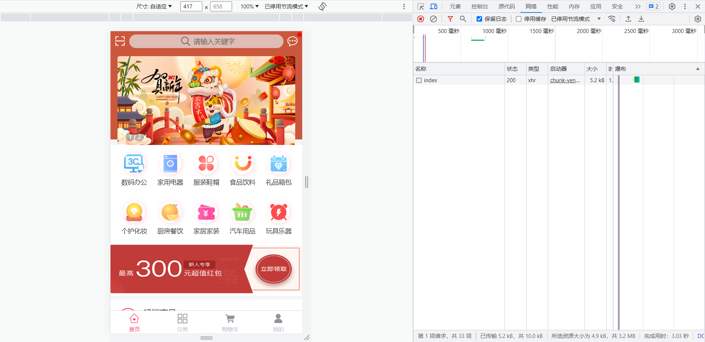
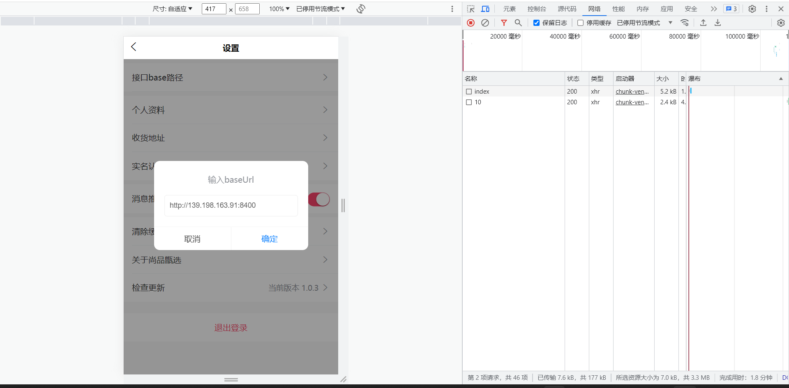
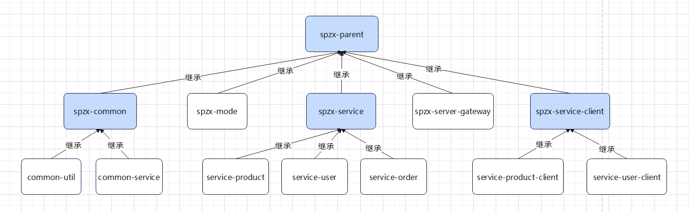
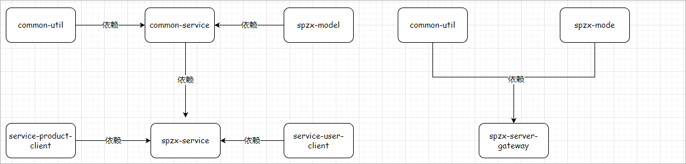

# 1 前台系统-部署前端工程

本章讲解尚品甄选H5端介绍。

## 1.1 业务功能介绍

首页、商品分类查询、关键字查询、商品详情、注册、登录、购物车模块、用户收货地址管理、订单模块、支付...

项目演示地址：http://spzx.atguigu.cn/


## 1.2 系统架构

服务器端架构：SpringBoot3 + Spring Cloud + Spring Cloud Alibaba(Nacos/Sentinel) + MyBatis + Redis

前端架构：uni-app


## 1.3 前端H5开发说明

前端H5部分我们不需要开发，我们只需要根据接口文档开发微服务接口，然后对接到写好的前端H5即可

导入课程资料：h5

**部署spzx-h5:**

1、docker部署nignx

```shell
#拉取镜像
docker pull nginx:latest

#运行nginx镜像
docker run -d -p 80:80 \
--name nginx-spzx \
-v nginx_html:/usr/share/nginx/html \
-v nginx_conf:/etc/nginx/ \
-v nginx_logs:/var/log/nginx  nginx

# nginx-spzx容器的管理命令
docker start nginx-spzx			# 启动容器
docker stop nginx-spzx			# 关闭容器
docker rm nginx-spzx			# 删除容器

#使用浏览器访问测试：http://ip
```

2、部署spzx-h5

删除/var/lib/docker/volumes/nginx_html/_data目录下的文件，将h5目录下的文件上传到该目录下。

浏览器访问：http://ip，打开手机模式



3、H5调用本地接口设置

我的 => 设置 =》 接口base路径，改为本地网关地址：http://IP:端口

注意：http://139.198.163.91:8400为云服务接口地址




# 2 前台系统-搭建后端工程

本章讲解在spzx-parent基础上搭建尚品甄选H5端微服务开发环境。

## 2.1 项目结构说明

尚品甄选H5端微服务项目结构如下所示：




模块说明：

spzx-parent： 尚品甄选项目的父工程，进行项目依赖的统一管理，打包方式为pom

​	spzx-common:  尚品甄选项目公共模块的管理模块

​		common-util:    工具类模块

​		common-service：公共服务模块

​	spzx-model:  尚品甄选项目实体类模块

​	spzx-manager： 尚品甄选项目后台管理系统的后端服务（忽略、前面已讲）

​	spzx-server-gateway： 尚品甄选项目的网关

​	spzx-service： 尚品甄选微服务模块的父工程

​		service-product：商品微服务模块

​		service-user：用户微服务模块

​		service-order：订单微服务模块

​	spzx-service-client： 尚品甄选微服务模块**远程调用接口**的父工程

​		service-product-client：商品微服务远程调用接口模块

​		service-user-client：用户微服务远程调用接口模块


## 2.2 模块依赖说明

模块之间的依赖关系如下图所示：

   

对应说明：

1、common-service依赖common-util、spzx-mode

2、spzx-service依赖common-service、service-product-client、service-user-client

3、spzx-server-gateway依赖common-util、spzx-mode


## 2.3 环境说明

本次项目开发的时候所使用的软件环境版本如下所示：

| 软件名称                    | 版本说明            |
| --------------------------- | ------------------- |
| jdk                         | jdk17               |
| spring boot                 | 3.0.5               |
| spring cloud                | 2022.0.2            |
| spring cloud alibaba        | 2022.0.0.0-RC2      |
| redis                       | 7.0.10              |
| mybaits-spring-boot-starter | 3.0.1               |
| mysql                       | 8.0.29              |
| idea                        | 2022.2.2            |
| nacos server                | 2.2.1               |
| sentinel dashboard          | 2.0.0-alpha-preview |


## 2.4 项目模块创建

### 2.4.1 spzx-parent

添加微服务依赖：

```xml
<properties>
    ...

    <cloud.version>2022.0.2</cloud.version>
    <alibaba.version>2022.0.0.0-RC2</alibaba.version>
    <alipay.version>4.8.73.ALL</alipay.version>
</properties>

<!-- 管理依赖，版本锁定 -->
<dependencyManagement>

    <dependencies>
        <dependency>
            <groupId>org.springframework.cloud</groupId>
            <artifactId>spring-cloud-dependencies</artifactId>
            <version>${cloud.version}</version>
            <type>pom</type>
            <scope>import</scope>
        </dependency>
        <dependency>
            <groupId>com.alibaba.cloud</groupId>
            <artifactId>spring-cloud-alibaba-dependencies</artifactId>
            <version>${alibaba.version}</version>
            <type>pom</type>
            <scope>import</scope>
        </dependency>
        <!--导入支付宝支付sdk-->
        <dependency>
            <groupId>com.alipay.sdk</groupId>
            <artifactId>alipay-sdk-java</artifactId>
            <version>${alipay.version}</version>
        </dependency>

        ...
    </dependencies>
</dependencyManagement>
```


### 2.4.2 spzx-service

在spzx-parent下面创建该子模块spzx-service，并导入如下依赖：

```xml
<dependencies>

    <dependency>
        <groupId>org.springframework.boot</groupId>
        <artifactId>spring-boot-starter-web</artifactId>
    </dependency>

    <dependency>
        <groupId>com.atguigu</groupId>
        <artifactId>common-service</artifactId>
        <version>1.0-SNAPSHOT</version>
    </dependency>

    <!-- mybatis的起步依赖 -->
    <dependency>
        <groupId>org.mybatis.spring.boot</groupId>
        <artifactId>mybatis-spring-boot-starter</artifactId>
    </dependency>

    <!-- mysql驱动 -->
    <dependency>
        <groupId>mysql</groupId>
        <artifactId>mysql-connector-java</artifactId>
    </dependency>

    <dependency>
        <groupId>org.springframework.boot</groupId>
        <artifactId>spring-boot-configuration-processor</artifactId>
        <optional>true</optional>
    </dependency>

    <dependency>
        <groupId>com.github.pagehelper</groupId>
        <artifactId>pagehelper-spring-boot-starter</artifactId>
        <version>1.4.3</version>
    </dependency>

    <!-- 服务注册 -->
    <dependency>
        <groupId>com.alibaba.cloud</groupId>
        <artifactId>spring-cloud-starter-alibaba-nacos-discovery</artifactId>
    </dependency>

    <!-- 流量控制 -->
    <dependency>
        <groupId>com.alibaba.cloud</groupId>
        <artifactId>spring-cloud-starter-alibaba-sentinel</artifactId>
    </dependency>

</dependencies>
```

注意：删除src目录


### 2.4.3 service-product

* 在spzx-service下面创建子模块service-product
* 在service-product下创建application.yml、application-dev.yml文件，文件的内容如下所示：

application.yml

```yml
spring:
  profiles:
    active: dev
```

application-dev.yml

```yml
server:
  port: 8511

spring:
  application:
    name: service-product
  cloud:
    nacos:
      discovery:
        server-addr: localhost:8848
  datasource:
    type: com.zaxxer.hikari.HikariDataSource
    driver-class-name: com.mysql.cj.jdbc.Driver
    url: jdbc:mysql://localhost:3306/db_spzx?characterEncoding=utf-8&useSSL=false&allowPublicKeyRetrieval=true
    username: root
    password: root

mybatis:
  config-location: classpath:mybatis-config.xml
  mapper-locations: classpath:/mapper/*/*.xml
```

* 导入课程资料中提供的：logback-spring.xml和mybatis-config.xml配置文件，
* 修改logback-spring.xml输出路径：

```xml
<property name="log.path" value="D://logs//service-product//logs" />
```

* 启动类创建

```java
package com.atguigu.spzx.product;

@SpringBootApplication
public class ProductApplication {

    public static void main(String[] args) {
        SpringApplication.run(ProductApplication.class, args);
    }

}
```

 

