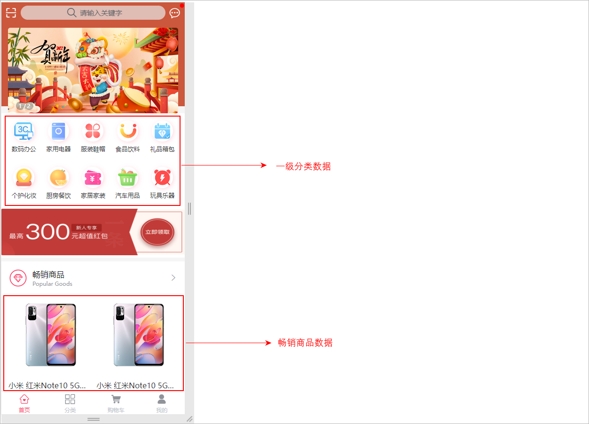
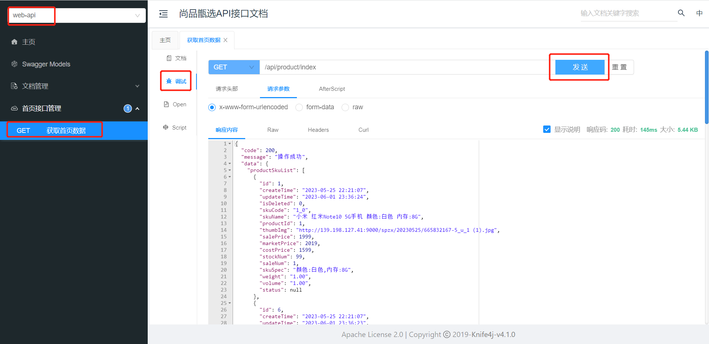
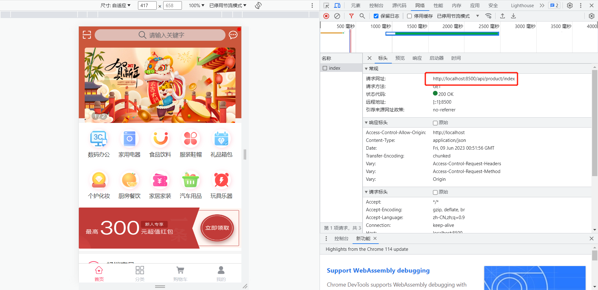
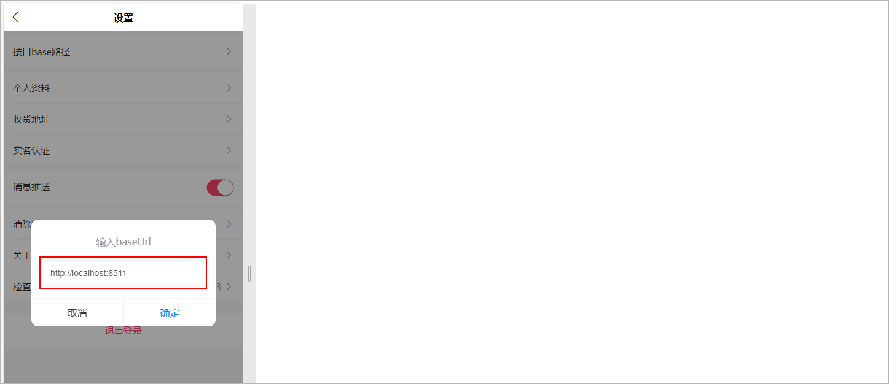
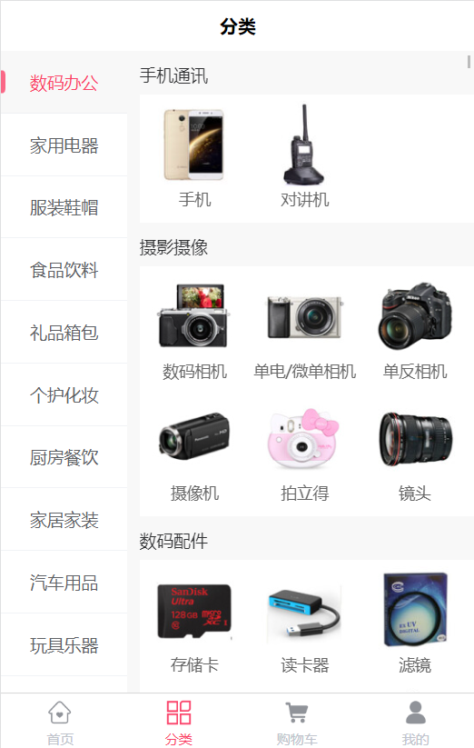
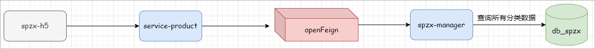
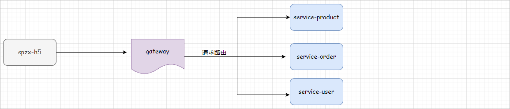
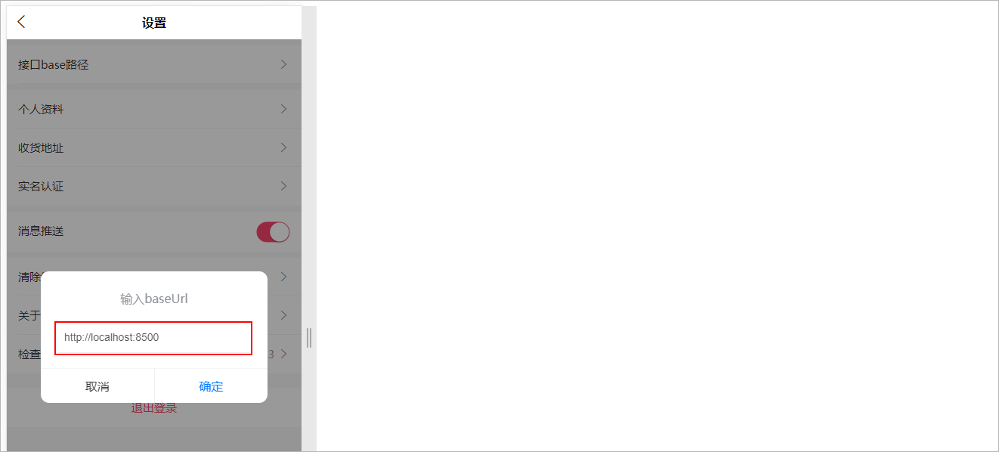

# 1 首页接口开发

## 1.1 需求分析

* 需求说明：

在前台系统首页展示商品一级分类数据以及畅销商品列表数据，如下所示：

 

* 需求分析：

1、商品一级分类：查询category表，获取parent_id="0"的数据列表

2、畅销商品列表：查询product_sku表，根据sale_num字段排序，取前20条数据列表 

* 整体的访问流程，如下所示：

  


## 1.2 接口开发

对比着接口文档进行相关接口的开发。

* **查看接口文档：**

首页接口地址及示例数据

```json
get  /api/product/index
返回结果：
{
    "code": 200,
    "message": "成功",
    "data": {
        "productSkuList": [
            {
                "id": 1,
                "createTime": "2023-05-25 22:21:07",
                "skuCode": "1_0",
                "skuName": "小米 红米Note10 5G手机 颜色:白色 内存:8G",
                "productId": 1,
                "thumbImg": "http://139.198.127.41:9000/spzx/20230525/665832167-5_u_1 (1).jpg",
                "salePrice": 1999.00,
                "marketPrice": 2019.00,
                "costPrice": 1599.00,
                "stockNum": 99,
                "saleNum": 1,
                "skuSpec": "颜色:白色,内存:8G",
                "weight": "1.00",
                "volume": "1.00",
                "status": null,
                "skuSpecList": null
            },
            ...
        ],
        "categoryList": [
            {
                "id": 1,
                "createTime": "2023-05-22 23:30:28",
                "name": "数码办公",
                "imageUrl": "https://lilishop-oss.oss-cn-beijing.aliyuncs.com/230f48f024a343c6be9be72597c2dcd0.png",
                "parentId": 0,
                "status": 1,
                "orderNum": 1,
                "hasChildren": null,
                "children": null
            },
            ...
        ]
    }
}
```


### 1.2.1 IndexVo

定义一个实体类来封装要给前端详细的数据，如下所示：

```java
// com.atguigu.spzx.model.vo.h5;
@Data
public class IndexVo {

    private List<Category> categoryList ;       // 一级分类的类别数据
    private List<ProductSku> productSkuList ;   // 畅销商品列表数据

}
```


### 1.2.2 IndexController

操作模块：service-product

表现层代码：

```java
// com.atguigu.spzx.product.controller;

@Tag(name = "首页接口管理")
@RestController
@RequestMapping(value="/api/product/index")
@SuppressWarnings({"unchecked", "rawtypes"})
public class IndexController {

   @Autowired
   private CategoryService categoryService;

   @Autowired
   private ProductService productService;

   @Operation(summary = "获取首页数据")
   @GetMapping
   public Result<IndexVo> findData(){
      List<Category> categoryList = categoryService.findOneCategory();
      List<ProductSku> productSkuList = productService.findProductSkuBySale();
      IndexVo indexVo = new IndexVo() ;
      indexVo.setCategoryList(categoryList);
      indexVo.setProductSkuList(productSkuList);
      return Result.build(indexVo , ResultCodeEnum.SUCCESS);
   }

}
```


### 1.2.3 商品一级分类接口

#### CategoryService

业务层代码实现

```java
// 业务接口
public interface CategoryService {

    List<Category> findOneCategory();

}

// 接口实现类
@Service
public class CategoryServiceImpl implements CategoryService {

	@Autowired
	private CategoryMapper categoryMapper;

    @Override
    public List<Category> findOneCategory() {
        return categoryMapper.findOneCategory();
    }
}
```

#### CategoryMapper

持久层代码实现

```java
@Mapper
public interface CategoryMapper {

    List<Category> findOneCategory();
}
```

#### CategoryMapper.xml

在映射文件中定义对应的sql语句

```xml
<?xml version="1.0" encoding="UTF-8" ?>
<!DOCTYPE mapper PUBLIC "-//mybatis.org//DTD Mapper 3.0//EN" "http://mybatis.org/dtd/mybatis-3-mapper.dtd">


<mapper namespace="com.atguigu.spzx.product.mapper.CategoryMapper">

   <resultMap id="categoryMap" type="com.atguigu.spzx.model.entity.product.Category" autoMapping="true">
   </resultMap>
   
   <!-- 用于select查询公用抽取的列 -->
   <sql id="columns">
      id,name,image_url,parent_id,status,order_num,create_time,update_time,is_deleted
   </sql>

   <select id="findOneCategory" resultMap="categoryMap">
      select <include refid="columns" />
      from category
      where
          parent_id = 0
         and status = 1
         and is_deleted = 0
      order by order_num
   </select>

</mapper>
```


### 1.2.4 畅销商品列表接口

#### ProductService

业务层代码实现

```java
// 业务接口
public interface ProductService {

    List<ProductSku> findProductSkuBySale();

}

// 接口实现类
@Service
public class ProductServiceImpl implements ProductService {

    @Autowired
    private ProductSkuMapper productSkuMapper;

    @Override
    public List<ProductSku> findProductSkuBySale() {
        return productSkuMapper.findProductSkuBySale();
    }
}
```

#### ProductSkuMapper

持久层代码实现

```java
@Mapper
public interface ProductSkuMapper {

    List<ProductSku> findProductSkuBySale();
}
```

#### ProductSkuMapper.xml

在映射文件中定义对应的sql语句

```xml
<?xml version="1.0" encoding="UTF-8" ?>
<!DOCTYPE mapper PUBLIC "-//mybatis.org//DTD Mapper 3.0//EN" "http://mybatis.org/dtd/mybatis-3-mapper.dtd">

<mapper namespace="com.atguigu.spzx.product.mapper.ProductSkuMapper">

   <resultMap id="productSkuMap" type="com.atguigu.spzx.model.entity.product.ProductSku" autoMapping="true">
   </resultMap>
   
   <!-- 用于select查询公用抽取的列 -->
   <sql id="columns">
      id,sku_code,sku_name,product_id,thumb_img,sale_price,market_price,cost_price,stock_num,sale_num,sku_spec,weight,volume,status,create_time,update_time,is_deleted
   </sql>

   <select id="findProductSkuBySale" resultMap="productSkuMap">
      select
          sku.id,sku.sku_code,sku.sku_name,sku.product_id,sku.thumb_img,sku.sale_price,sku.market_price,sku.cost_price,sku.stock_num,sku.sale_num,sku.sku_spec,sku.weight,sku.volume,sku.status,sku.create_time,sku.update_time,sku.is_deleted
      from product_sku sku
         left join product p on p.id = sku.product_id
      where
         p.status = 1
         and p.audit_status = 1
         and sku.is_deleted = 0
         and p.is_deleted = 0
         order by sku.sale_num desc
      limit 20
   </select>

</mapper>
```


### 1.2.5 Knife4j调试接口

#### 配置前端H5接口

在common-service模块Knife4jConfig类添加配置信息：

```java
@Bean
public GroupedOpenApi webApi() {      // 创建了一个api接口的分组
    return GroupedOpenApi.builder()
            .group("web-api")         // 分组名称
            .pathsToMatch("/api/**")  // 接口请求路径规则
            .build();
}
```

#### Knife4j调试首页接口



#### H5对接本地接口

启动nginx，访问：http://ip

我的 => 设置 =》 接口base路径，改为本地网关地址：http://IP:端口

请求



数据


### 1.2.6 接口测试

测试方向：

1、后端接口单独测试

2、配合前端项目测试

后端地址配置：

 

解决跨域问题：在IndexController类上添加**@CrossOrigin**注解接口跨域问题


# 2 分类接口开发

## 2.1 需求分析

需求说明：当用户点击分类导航按钮的时候，那么此时就需要将系统中所对应的所有的分类数据查询出来，如下所示：

 

展示全部商品三级联动的分类数据，查询category数据表


需求分析：分类数据是来自于category表，因此只需要查询出该表中的数据即可，要访问该表就需要通过spzx-manager服务进行访问，因此整体的调

用流程如下所示：

 


**查看接口文档：**

分类数据接口地址及示例数据

```json
get  /api/product/category/findCategoryTree
返回结果：
{
    "code": 200,
    "message": "成功",
    "data": [
        {
            "id": 1,
            "createTime": "2023-05-22 23:30:28",
            "name": "数码办公",
            "imageUrl": "https://lilishop-oss.oss-cn-beijing.aliyuncs.com/230f48f024a343c6be9be72597c2dcd0.png",
            "parentId": 0,
            "status": 1,
            "orderNum": 1,
            "hasChildren": null,
            "children": [
                {
                    "id": 2,
                    "createTime": "2023-05-22 23:30:28",
                    "name": "手机通讯",
                    "imageUrl": "",
                    "parentId": 1,
                    "status": 1,
                    "orderNum": 0,
                    "hasChildren": null,
                    "children": [
                        {
                            "id": 3,
                            "createTime": "2023-05-22 23:30:28",
                            "name": "手机",
                            "imageUrl": "https://lilishop-oss.oss-cn-beijing.aliyuncs.com/1348576427264204943.png",
                            "parentId": 2,
                            "status": 1,
                            "orderNum": 0,
                            "hasChildren": null,
                            "children": null
                        },
                        {
                            "id": 4,
                            "createTime": "2023-05-22 23:30:28",
                            "name": "对讲机",
                            "imageUrl": "https://lilishop-oss.oss-cn-beijing.aliyuncs.com/1348576427264204944.png",
                            "parentId": 2,
                            "status": 1,
                            "orderNum": 0,
                            "hasChildren": null,
                            "children": null
                        },
                        ...
                    ]
                },
                ...
            ]
        },
        ...
    ]
}
```


## 2.2 接口开发

操作模块：service-product

### 2.2.1 CategoryController

表现层代码：

```java
@Tag(name = "分类接口管理")
@RestController
@RequestMapping(value="/api/product/category")
@SuppressWarnings({"unchecked", "rawtypes"})
public class CategoryController {
   
   @Autowired
   private CategoryService categoryService;

   @Operation(summary = "获取分类树形数据")
   @GetMapping("findCategoryTree")
   public Result<List<Category>> findCategoryTree(){
      List<Category> list = categoryService.findCategoryTree();
      return Result.build(list,  ResultCodeEnum.SUCCESS);
   }

}
```


### 2.2.2 CategoryService

业务层代码实现

```java
// 业务接口
List<Category> findCategoryTree();

// 接口实现类
@Override
public List<Category> findCategoryTree() {
    List<Category> categoryList = categoryMapper.findAll();
    //全部一级分类
    List<Category> oneCategoryList = categoryList.stream().filter(item -> item.getParentId().longValue() == 0).collect(Collectors.toList());
    
    if(!CollectionUtils.isEmpty(oneCategoryList)) {
        oneCategoryList.forEach(oneCategory -> {
            List<Category> twoCategoryList = categoryList.stream().filter(item -> item.getParentId().longValue() == oneCategory.getId().longValue()).collect(Collectors.toList());
            oneCategory.setChildren(twoCategoryList);
            
            if(!CollectionUtils.isEmpty(twoCategoryList)) {
                twoCategoryList.forEach(twoCategory -> {
                    List<Category> threeCategoryList = categoryList.stream().filter(item -> item.getParentId().longValue() == twoCategory.getId().longValue()).collect(Collectors.toList());
                    twoCategory.setChildren(threeCategoryList);
                });
            }
        });
    }
    return oneCategoryList;
}
```


### 2.2.3 CategoryMapper

持久层代码实现

```java
List<Category> findAll();
```


### 2.2.4 CategoryMapper.xml

在映射文件中定义对应的sql语句

```xml
<select id="findAll" resultMap="categoryMap">
   select <include refid="columns" />
   from category
   where
   status = 1
   and is_deleted = 0
   order by order_num
</select>
```


### 2.2.5 接口测试

测试方向：

1、后端接口单独测试

2、配合前端项目测试


# 3 Nacos注册中心

## 3.1 注册中心简介

* 通过注册中心可以对服务提供方和服务消费方进行解耦。具体的工作模式如下图所示：

 


* 工作流程说明：

1、服务提供方在启动的时候，会向注册中心注册自己服务的详情信息(ip、端口号等)。在注册中心中会维护一张服务清单，保存这些注册信息，注册中心需要以心跳的方式去监测清单中的服务是否可用，如果不可用，需要在服务清单中剔除不可用的服务。

2、服务消费方向服务注册中心咨询服务，并获取所有服务的实例清单，然后按照指定的负载均衡算法从服务清单中选择一个服务实例进行访问。


* Nacos官网地址：https://nacos.io/zh-cn/

 

Nacos是 Dynamic Naming and Configuration Service的首字母简称，一个更易于构建云原生应用的动态服务发现、配置管理和服务管理平台。

Nacos 致力于帮助您发现、配置和管理微服务。Nacos 提供了一组简单易用的特性集，帮助您快速实现动态服务发现、服务配置、服务元数据及流量管理。


* Nacos的优点包括：

1、高可用性：Nacos支持多节点部署，通过选举算法实现了高可用和故障转移能力，在节点宕机或网络异常情况下仍能保证整个系统的稳定运行。

2、动态扩展性：Nacos可以根据实际需求进行快速扩展和缩容，支持集群、多数据中心、地域感知等特性。

3、完备的功能支持：Nacos支持服务注册与发现、配置管理、流量管理、DNS解析、存储KV对等功能，并且提供了Web界面和RESTful API等多种方式来使用这些功能。

4、易于集成：Nacos提供了多种语言和框架的集成方案，并且支持Spring Cloud等流行的微服务框架。

总的来说，Nacos是一个功能齐全、易于使用和高可用的分布式服务治理平台，可以为分布式系统提供高效、稳定的运行环境。


## 3.3 Nacos安装

### 3.3.1 使用docker安装Nacos

本章节主要给搭建演示一下如下使用Docker来部署Nacos Server。Docker部署Nacos的项目命令如下所示：

```shell
# 拉取镜像
docker pull nacos/nacos-server:v2.2.2

# 创建容器
docker run --name nacos -e MODE=standalone -p 8848:8848 -p 9848:9848 -d nacos/nacos-server:v2.2.2

# nacos2.x的版本新增了一个客户端与服务端的gRpc的通讯端口号9848
```

打开浏览器访问nacos的所提供的后端管理界面：http://192.168.136.142:8848/nacos

登录成功以后会进入到nacos的主页面：

  

如果可以看到上述界面，就说明nacos的环境搭建好了


### 3.3.2 Windows环境安装Nacos

* 下载Nacos安装文件


* 解压Nacos安装文件到没有中文和空格目录

* 进入bin目录，使用cmd打开，通过命令启动Nacos服务

**startup.cmd -m standalone**


* 打开浏览器访问nacos的所提供的后端管理界面：http://localhost:8848/nacos

用户名和密码：nacos/nacos，登录成功以后会进入到nacos的主页面


## 3.4 微服务集成naocs

需求：将service-product微服务注册到nacos中

实现步骤：

1、引入如下依赖

```xml
<!-- nacos作为注册中心的依赖 -->
<dependency>
    <groupId>com.alibaba.cloud</groupId>
    <artifactId>spring-cloud-starter-alibaba-nacos-discovery</artifactId>
</dependency>
```

2、在application.yml文件中添加如下配置

```yaml
spring:
  application:
    name: service-product
  cloud:
    nacos:
      discovery:
        server-addr: localhost:8848
```

3、启动微服务：就可以在nacos的后台管理系统中，看到如下的注册信息：


# 4 Gateway组件

## 4.1 Gateway简介

### 4.1.1 官网

* https://docs.spring.io/spring-cloud-gateway/docs/4.0.x/reference/html/


### 4.1.2 概述

* Gateway是在spring生态系统之上构建的API网关服务，基于Spring5，SpringBoot2和Project Reactor等技术。Gateway旨在提供一种简单而有效的方式来对API进行路由，以及提供一些强大的过滤器功能，例如：熔断、限流、重试等
* SpringCloud Gateway是SpringCloud的一个全新项目，基于Spring5.X+SpringBoot2.X和Project Reactor等技术开发的网关，它旨在为微服务架构提供一种简单有效的统一的API路由管理方式。
* 为了提升网关的性能，SpringCloud Gatway是基于WebFlux框架实现的，而WebFlux框架底层则使用了高性能的Reactor模式通讯框架Netty。
* SpringCloud Gateway的目标提供统一的路由方式且基于Filter链的方式提供了网关基本的功能，例如：安全、监控/指标、和限流。


### 4.1.3 架构图

 


## 4.2 三大核心概念

### 4.2.1 Route(路由)

路由是构建网关的基本模块，它由ID，目标URI，一系列的断言和过滤器组成，如果断言为true则匹配该路由


### 4.2.2 Predicate（断言）

参考的是java8的java.util.function.Predicate开发人员可以匹配HTTP请求中的所有内容（例如请求头或请求参数）.


### 4.2.3 Filter（过滤）

指的是Spring框架中GatewayFilter的实例，使用过滤器，可以在请求被路由前或者之后对请求进行修改。


在gateway中要实现其他的功能：权限控制、流量监控、统一日志处理等。就需要使用到gateway中所提供的过滤器了。过滤器，可以对进入网关的请求和微服务返回的响应做处理：


## 4.3 工作流程


* 客户端向Spring Cloud Gateway发出请求。然后在Gateway Handler Mapping中找到与请求匹配的路由，将其发送到Gateway Web Handler.
* Handler再通过指定的过滤器链来将请求发送给我们实际的服务执行业务逻辑，然后返回。
* 过滤器之间用虚线分开是因为过滤器可能会在发送代理请求之前（"pre"）或之后("post")执行业务逻辑。
* Filter在"pre"类型的过滤器可以做参数校验、权限校验、流量监控、日志输出、协议转换等，在"post"类型的过滤器中可以做响应内容、响应头的修改，日志的输出，流量控制等有着非常重要的作用


# 3 网关服务搭建

## 3.1 网关服务说明

后期针对前台系统会创建很多个后端微服务，前端在访问后端微服务的时候需要通过服务网关进行访问，如下图所示：

 


## 3.2 服务网关搭建

实现步骤：

* 1、在spzx-parent项目下创建一个spzx-server-gateway模块，并加入依赖

```xml
<dependencies>

    <dependency>
        <groupId>com.atguigu.spzx</groupId>
        <artifactId>common-util</artifactId>
        <version>1.0-SNAPSHOT</version>
    </dependency>

    <dependency>
        <groupId>com.atguigu.spzx</groupId>
        <artifactId>spzx-model</artifactId>
        <version>1.0-SNAPSHOT</version>
    </dependency>

    <dependency>
        <groupId>org.springframework.cloud</groupId>
        <artifactId>spring-cloud-starter-gateway</artifactId>
    </dependency>

    <!-- loadbalancer依赖 -->
    <dependency>
        <groupId>org.springframework.cloud</groupId>
        <artifactId>spring-cloud-loadbalancer</artifactId>
    </dependency>

    <!-- 服务注册 -->
    <dependency>
        <groupId>com.alibaba.cloud</groupId>
        <artifactId>spring-cloud-starter-alibaba-nacos-discovery</artifactId>
    </dependency>

    <!-- 服务保护组件 -->
    <dependency>
        <groupId>com.alibaba.cloud</groupId>
        <artifactId>spring-cloud-starter-alibaba-sentinel</artifactId>
    </dependency>

</dependencies>
```

* 2、编写两个配置文件：application.yml、application-dev.yml，文件内容分别如下所示：

application.yml文件内容：

```yml
spring:
  profiles:
    active: dev
```

application-dev.yml文件内容：

```yml
server:
  port: 8500
spring:
  application:
    name: spzx-server-gateway
  cloud:
    nacos:
      discovery:
        server-addr: localhost:8848
    gateway:
      discovery:
        locator:
          enabled: true
      globalcors:
        cors-configurations:
          '[/**]':
            allowedOriginPatterns: "*"
            # 允许请求中携带的头信息
            allowedHeaders: "*"
            # 运行跨域的请求方式
            allowedMethods: "*"
            # 跨域检测的有效期,单位s
            maxAge: 36000
      routes:
        - id: service-product
          uri: lb://service-product
          predicates:
            - Path=/*/product/**
```

* 3、编写启动类

```java
// com.atguigu.spzx.gateway;
@SpringBootApplication
public class GatewayApplication {

    public static void main(String[] args) {
        SpringApplication.run(GatewayApplication.class , args) ;
    }

}
```

* 4、导入课程资料中提供的：logback-spring.xml配置文件，修改输出路径：

```xml
<property name="log.path" value="D://logs//spzx-server-gateway//logs" />
```


## 3.3 服务网关测试

具体步骤：  

1、注释掉service-product微服务两个controller上的@CrossOrigin注解

2、后端地址配置

 


# 4 Redis缓存

分类数据一般情况下不会做过多的修改，因此可以将分类数据进行缓存，以提高页面的加载速度。

## 4.1 使用缓存

先将首页接口获取一级分类数据缓存

步骤：

1、在service-product微服务中集成Spring Data Redis，如下所示：

在service-product的pom.xml文件中添加如下依赖：

```xml
<!-- redis的起步依赖 -->
<dependency>
    <groupId>org.springframework.boot</groupId>
    <artifactId>spring-boot-starter-data-redis</artifactId>
</dependency>
```

在application-dev.yml文件中添加如下Redis的相关配置：

```yaml
spring:
  # Redis的相关配置
  data:
    redis:
      host: localhost
      port: 6379
```

2、对CategoryServiceImpl的findOneCategory方法进行改造，如下所示：

```java
@Autowired
private RedisTemplate<String , String> redisTemplate ;

@Override
public List<Category> findOneCategory() {

    // 从Redis缓存中查询所有的一级分类数据
    String categoryListJSON = redisTemplate.opsForValue().get("category:one");
    if(!StringUtils.isEmpty(categoryListJSON)) {
        List<Category> categoryList = JSON.parseArray(categoryListJSON, Category.class);
        log.info("从Redis缓存中查询到了所有的一级分类数据");
        return categoryList ;
    }

    List<Category> categoryList = categoryMapper.findOneCategory();
    log.info("从数据库中查询到了所有的一级分类数据");
    redisTemplate.opsForValue().set("category:one" , JSON.toJSONString(categoryList) , 7 , TimeUnit.DAYS);
    return categoryList ;
}
```

3、启动程序进行测试：第一次查询从MySQL数据库获取，第二次查询从Redis获取

**说明**：针对查询所有分类的接口，也可以使用上述思想对分类数据进行缓存。


## 4.2 Spring Cache

### 4.2.1 介绍

**Spring Cache**是一个框架，实现了基于注解的缓存功能，只需要简单地加一个注解，就能实现缓存功能，**大大简化我们在业务中操作缓存的代码**。

Spring Cache只是提供了一层抽象，底层可以切换不同的cache实现。具体就是通过**CacheManager**接口来统一不同的缓存技术。CacheManager是Spring提供的各种缓存技术抽象接口。

针对不同的缓存技术需要实现不同的CacheManager：

| **CacheManager**    | **描述**                           |
| ------------------- | ---------------------------------- |
| EhCacheCacheManager | 使用EhCache作为缓存技术            |
| GuavaCacheManager   | 使用Google的GuavaCache作为缓存技术 |
| RedisCacheManager   | 使用Redis作为缓存技术              |


### 4.2.2 注解

在SpringCache中提供了很多缓存操作的注解，常见的是以下的几个：

| **注解**       | **说明**                                                     |
| -------------- | ------------------------------------------------------------ |
| @EnableCaching | 开启缓存注解功能                                             |
| @Cacheable     | 在方法执行前spring先查看缓存中是否有数据，如果有数据，则直接返回缓存数据；若没有数据，调用方法并将方法返回值放到缓存中 |
| @CachePut      | 将方法的返回值放到缓存中                                     |
| @CacheEvict    | 将一条或多条数据从缓存中删除                                 |

在spring boot项目中，使用缓存技术只需在项目中导入相关缓存技术的依赖包，并在启动类上使用**@EnableCaching**开启缓存支持即可。使用Redis作为缓存技术，只需要导入Spring data Redis的maven坐标即可。


#### @Cacheable

1、作用: 在方法执行前，spring先查看缓存中是否有数据，如果有数据，则直接返回缓存数据；若没有数据，调用方法并将方法返回值放到缓存中

2、value: 缓存的名称，每个缓存名称下面可以有多个key

3、key: 缓存的key  ----------> 支持Spring的表达式语言SPEL语法

```java
@Override
@Cacheable(value = "userCache" , key = "#userId")
public User findById(Long userId) {
    log.info("用户数据查询成功...");
    User user = new User() ;
    user.setAge(23);
    user.setUserName("尚硅谷");
    return user;
}
```


#### @CachePut

作用: 将方法返回值，放入缓存

value: 缓存的名称, 每个缓存名称下面可以有很多key

key: 缓存的key  ----------> 支持Spring的表达式语言SPEL语法

当前UserController的save方法是用来保存用户信息的，我们希望在该用户信息保存到数据库的同时，也往缓存中缓存一份数据，我们可以在save方法上加上注解 @CachePut，用法如下： 

```java
@CachePut(value = "userCache", key = "#user.userName")
public User saveUser(User user) {
    log.info("用户数据保存成功...");
    return user ;
}
```

**key的写法如下**： 

#user.id : #user指的是方法形参的名称, id指的是user的id属性 , 也就是使用user的id属性作为key ;

#user.userName: #user指的是方法形参的名称, name指的是user的name属性 ,也就是使用user的name属性作为key ;

#result.id : #result代表方法返回值，该表达式 代表以返回对象的id属性作为key ；

#result.userName: #result代表方法返回值，该表达式 代表以返回对象的name属性作为key ；


#### @CacheEvict

作用: 清理指定缓存

value: 缓存的名称，每个缓存名称下面可以有多个key

key: 缓存的key  ----------> 支持Spring的表达式语言SPEL语法

当我们在删除数据库user表的数据的时候,我们需要删除缓存中对应的数据,此时就可以使用**@CacheEvict**注解, 具体的使用方式如下: 

```java
@CacheEvict(value = "userCache" , key = "#userId")
public void deleteById(Long userId) {
    log.info("用户数据删除成功...");
}
```


## 4.3 缓存所有分类数据

需求：给查询所有的分类数据添加查询缓存，使用Spring Cache框架

步骤：

1、在service-product服务中的pom.xml文件中添加依赖

```xml
<dependency>
    <groupId>org.springframework.boot</groupId>
    <artifactId>spring-boot-starter-cache</artifactId>
</dependency>
```

2、配置Redis的key的序列化器

```java
// com.atguigu.spzx.cache.config;
@Configuration
public class RedisConfig {

    @Bean
    public CacheManager cacheManager(LettuceConnectionFactory connectionFactory) {

        //定义序列化器
        GenericJackson2JsonRedisSerializer genericJackson2JsonRedisSerializer = new GenericJackson2JsonRedisSerializer();
        StringRedisSerializer stringRedisSerializer = new StringRedisSerializer();


        RedisCacheConfiguration config = RedisCacheConfiguration.defaultCacheConfig()
                //过期时间600秒
                .entryTtl(Duration.ofSeconds(600))
                // 配置序列化
                .serializeKeysWith(RedisSerializationContext.SerializationPair.fromSerializer(stringRedisSerializer))
                .serializeValuesWith(RedisSerializationContext.SerializationPair.fromSerializer(genericJackson2JsonRedisSerializer));

        RedisCacheManager cacheManager = RedisCacheManager.builder(connectionFactory)
                .cacheDefaults(config)
                .build();

        return cacheManager;
    }

}
```

3、在启动类上添加**@EnableCaching**注解

4、在CategoryServiceImpl类中的findCategoryTree方法上添加**@Cacheable**注解

```java
@Cacheable(value = "category" , key = "'all'")
public List<Category> findAllCategory() {
..
    return oneCategoryList;
}
```

5、启动程序进行测试


# 5 商品列表

## 5.1 需求说明

进入商品列表有四个入口：

1、点击首页一级分类

2、点击首页关键字搜索

3、分类频道，点击三级分类

4、点击首页畅销商品（商品列表按销量排序展示）

**搜索条件**：关键字、一级分类、三级分类、品牌（获取全部品牌）

**排序**：销量降序、价格升序与降序

效果图如下所示：

 

要完成上述搜索功能需要完成两个接口：

1、查询所有品牌(用于商品列表页面)

2、商品列表搜索


## 5.2 查询所有品牌

### 5.2.1 需求分析

整体的访问流程如下所示：

  

**查看接口文档：**

查询所有品牌数据接口以及示例数据：

```json
get  /api/product/brand/findAll
返回结果：
{
	"code": 200,
	"message": "操作成功",
	"data": [
		{
			"id": 2,
			"createTime": "2023-05-06 01:31:19",
			"updateTime": "2023-06-04 00:37:16",
			"isDeleted": 0,
			"name": "华为",
			"logo": "http://139.198.127.41:9000/sph/20230506/华为.png"
		}
	]
}
```


### 5.2.2 接口开发

#### BrandController

表现层代码：

```java
// com.atguigu.spzx.product.controller;
@Tag(name = "品牌管理")
@RestController
@RequestMapping(value="/api/product/brand")
@SuppressWarnings({"unchecked", "rawtypes"})
public class BrandController {
   
   @Autowired
   private BrandService brandService;
   
   @Operation(summary = "获取全部品牌")
   @GetMapping("findAll")
   public Result<List<Brand>> findAll() {
      List<Brand> list = brandService.findAll();
      return Result.build(list, ResultCodeEnum.SUCCESS);
   }

}
```

#### BrandService

业务层代码实现

```java
// com.atguigu.spzx.product.service;
// 业务接口
public interface BrandService {

    List<Brand> findAll();

}

// 接口实现类
@Service
public class BrandServiceImpl implements BrandService {
    
	@Autowired
	private BrandMapper brandMapper;

	@Cacheable(value = "brandList", unless="#result.size() == 0")
    @Override
    public List<Brand> findAll() {
        return brandMapper.findAll();
    }

}
```

#### BrandMapper

持久层代码实现

```java
// com.atguigu.spzx.product.mapper;
@Mapper
public interface BrandMapper {

    List<Brand> findAll();

}
```

#### BrandMapper.xml

在映射文件中定义对应的sql语句

```xml
<?xml version="1.0" encoding="UTF-8" ?>
<!DOCTYPE mapper PUBLIC "-//mybatis.org//DTD Mapper 3.0//EN" "http://mybatis.org/dtd/mybatis-3-mapper.dtd">


<mapper namespace="com.atguigu.spzx.product.mapper.BrandMapper">

   <resultMap id="brandMap" type="com.atguigu.spzx.model.entity.product.Brand" autoMapping="true">
   </resultMap>
   
   <!-- 用于select查询公用抽取的列 -->
   <sql id="columns">
      id,name,logo,create_time,update_time,is_deleted
   </sql>

   <select id="findAll" resultMap="brandMap">
      select <include refid="columns" />
      from brand
      where is_deleted = 0
      order by id desc
   </select>

</mapper>
```


## 5.3 商品列表搜索

### 5.3.1 需求分析

整体的访问流程如下所示：

  

**查看接口文档：**

请求方式和请求地址：

```json
get  /api/product/{page}/{limit}
```

请求参数：

 

响应结果示例数据：

```json
{
    "code": 200,
    "message": "成功",
    "data": {
        "total": 6,
        "list": [
            {
                "id": 1,
                "createTime": "2023-05-25 22:21:07",
                "skuCode": "1_0",
                "skuName": "小米 红米Note10 5G手机 颜色:白色 内存:8G",
                "productId": 1,
                "thumbImg": "http://139.198.127.41:9000/spzx/20230525/665832167-5_u_1 (1).jpg",
                "salePrice": 1999.00,
                "marketPrice": 2019.00,
                "costPrice": 1599.00,
                "stockNum": 99,
                "saleNum": 1,
                "skuSpec": "颜色:白色,内存:8G",
                "weight": "1.00",
                "volume": "1.00",
                "status": null,
                "skuSpecList": null
            },
            ...
        ],
        "pageNum": 1,
        "pageSize": 10,
        "size": 6,
        "startRow": 1,
        "endRow": 6,
        "pages": 1,
        "prePage": 0,
        "nextPage": 0,
        "isFirstPage": true,
        "isLastPage": true,
        "hasPreviousPage": false,
        "hasNextPage": false,
        "navigatePages": 10,
        "navigatepageNums": [
            1
        ],
        "navigateFirstPage": 1,
        "navigateLastPage": 1
    }
}
```


### 5.3.2 接口开发

#### ProductSkuDto

定义一个实体类用来封装前端所传递过来的查询参数，具体定义如下所示：

```java
@Data
@Schema(description = "商品列表搜索条件实体类")
public class ProductSkuDto {

    @Schema(description = "关键字")
    private String keyword;

    @Schema(description = "品牌id")
    private Long brandId;

    @Schema(description = "一级分类id")
    private Long category1Id;

    @Schema(description = "二级分类id")
    private Long category2Id;

    @Schema(description = "三级分类id")
    private Long category3Id;

    @Schema(description = "排序（综合排序:1 价格升序:2 价格降序:3）")
    private Integer order = 1;

}
```

#### ProductController

表现层代码：

```java
@Tag(name = "商品列表管理")
@RestController
@RequestMapping(value="/api/product")
@SuppressWarnings({"unchecked", "rawtypes"})
public class ProductController {
	
	@Autowired
	private ProductService productService;

	@Operation(summary = "分页查询")
	@GetMapping(value = "/{page}/{limit}")
	public Result<PageInfo<ProductSku>> findByPage(@Parameter(name = "page", description = "当前页码", required = true) @PathVariable Integer page,
												   @Parameter(name = "limit", description = "每页记录数", required = true) @PathVariable Integer limit,
												   @Parameter(name = "productSkuDto", description = "搜索条件对象", required = false) ProductSkuDto productSkuDto) {
		PageInfo<ProductSku> pageInfo = productService.findByPage(page, limit, productSkuDto);
		return Result.build(pageInfo , ResultCodeEnum.SUCCESS) ;
	}

}
```

#### ProductService

业务层代码实现

```java
// 业务接口
PageInfo<ProductSku> findByPage(Integer page, Integer limit, ProductSkuDto productSkuDto);

// 接口实现类
@Override
public PageInfo<ProductSku> findByPage(Integer page, Integer limit, ProductSkuDto productSkuDto) {
    PageHelper.startPage(page, limit);
    List<ProductSku> productSkuList = productSkuMapper.findByPage(productSkuDto);
    return new PageInfo<>(productSkuList);
}
```

#### ProductSkuMapper

持久层代码实现

```java
List<ProductSku> findByPage(ProductSkuDto productSkuDto);
```

#### ProductSkuMapper.xml

在映射文件中定义对应的sql语句

```xml
<select id="findByPage" resultMap="productSkuMap">
   select
   sku.id,sku.sku_code,sku.sku_name,sku.product_id,sku.thumb_img,sku.sale_price,sku.market_price,sku.cost_price,sku.stock_num,sku.sale_num,sku.sku_spec,sku.weight,sku.volume,sku.status,sku.create_time,sku.update_time,sku.is_deleted
   from product_sku sku
   left join product p on p.id = sku.product_id
   <where>
      <if test="keyword != null and keyword != ''">
         and sku.sku_name like CONCAT('%',#{keyword},'%')
      </if>
      <if test="brandId != null">
         and p.brand_id = #{brandId}
      </if>
      <if test="category1Id != null">
         and p.category1_id = #{category1Id}
      </if>
      <if test="category2Id != null">
         and p.category2_id = #{category2Id}
      </if>
      <if test="category3Id != null">
         and p.category3_id = #{category3Id}
      </if>
      and p.status = 1
      and p.audit_status = 1
      and sku.is_deleted = 0
      and p.is_deleted = 0
   </where>
   <if test="order == 1">
      order by sku.sale_num desc
   </if>
   <if test="order == 2">
      order by sku.sale_price asc
   </if>
   <if test="order == 3">
      order by sku.sale_price desc
   </if>
</select>
```

