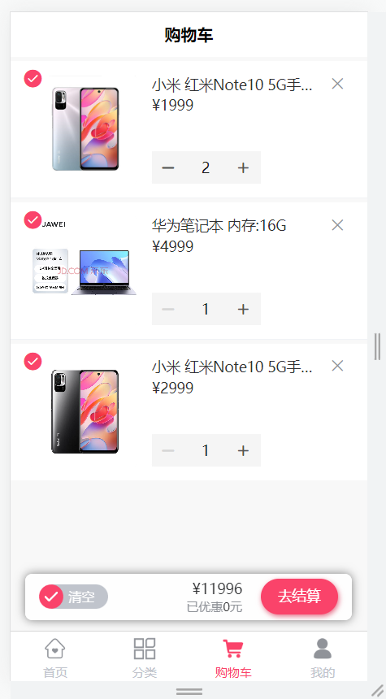
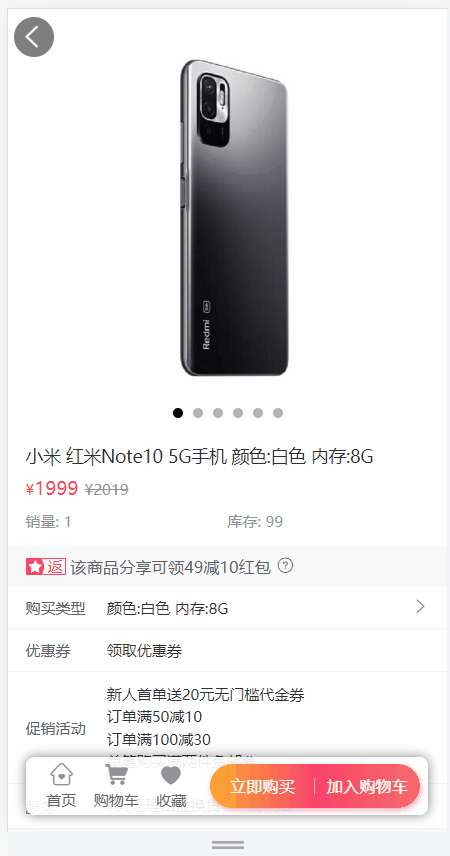
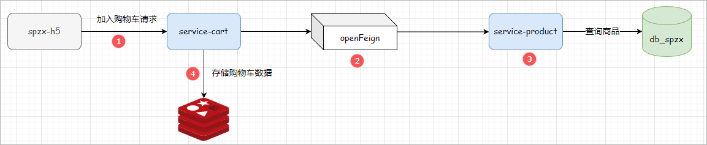
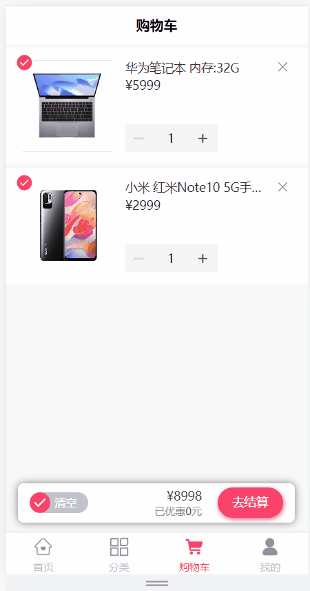
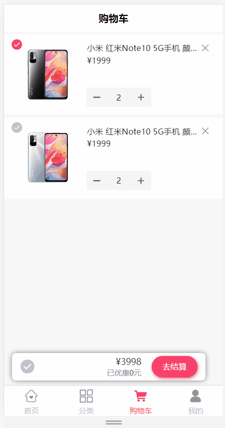
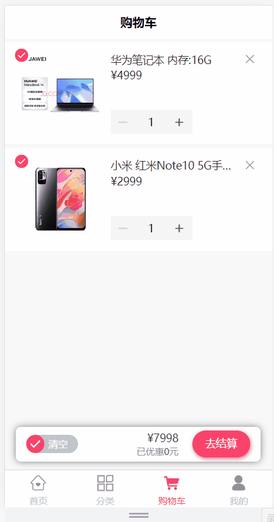
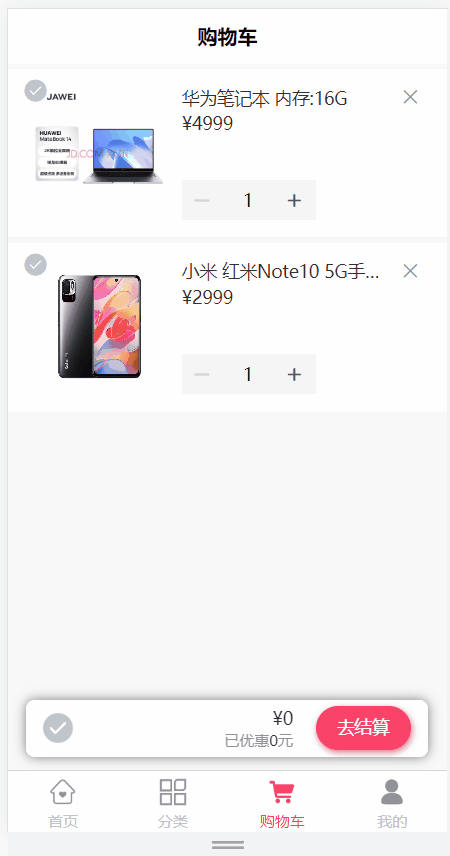

# 一、购物车模块

## 1 需求说明

购物车模块存储顾客所选的的商品，记录下所选商品，当用户决定购买时，用户可以选择决定购买的商品进入结算页面。

购物车模块功能说明：

1、添加商品到购物车

2、查询购物车列表数据

3、删除购物车商品数据

4、更新选中商品状态

5、完成购物车商品的全选

6、清空购物车商品数据

数据存储：为了提高对购物车数据操作的性能，可以使用Redis【HASH】存储购物车数据。

页面效果：

 


## 2 环境搭建

创建一个独立模块(service-cart)来完成购物车的相关功能。

步骤如下：

* 1、在spzx-service模块下创建一个service-cart模块
* 2、准备application.yml、application-dev.yml、logback-spring.xml文件。文件内容如下所示：

```yml
# application.yml
spring:
  profiles:
    active: dev
    
# application-dev.yml
server:
  port: 8513

spring:
  application:
    name: service-cart
  cloud:
    nacos:
      discovery:
        server-addr: localhost:8848
  data:
    redis:
      host: localhost
      port: 6379
```

logback-spring.xml修改输出路径：

```xml
<property name="log.path" value="D://work//service-cart//logs" />
```

* 3、创建启动类

```java
// com.atguigu.spzx.cart;
@SpringBootApplication(exclude = DataSourceAutoConfiguration.class)  // 排除数据库的自动化配置，Cart微服务不需要访问数据库
public class CartApplication {

    public static void main(String[] args) {
        SpringApplication.run(CartApplication.class , args) ;
    }

}
```


## 3 添加购物车

### 3.1 需求说明

需求如下所示：

1、商品详情页加入购物车

2、加入购物车必须登录

加入购物车功能如图所示：

 

**查看接口文档：**

添加购物车接口地址及返回结果

```json
get api/order/cart/auth/addToCart/{skuId}/{skuNum}
返回结果：
{
    "code": 200,
    "message": "操作成功",
    "data": null
}
```

注意：购物车页面加减商品数量与商品详情页加入购物车是同一个接口


请求响应流程如下所示：

 


### 3.2 远程调用接口开发

在service-product微服务中提供一个远程调用接口，根据skuId查询ProductSku数据，操作模块：service-product。

#### 3.2.1 ProductController

表现层代码：

```java
@Operation(summary = "获取商品sku信息")
@GetMapping("getBySkuId/{skuId}")
public ProductSku getBySkuId(@Parameter(name = "skuId", description = "商品skuId", required = true) @PathVariable Long skuId) {
    ProductSku productSku = productService.getBySkuId(skuId);
    return productSku;
}
```


#### 3.2.2 ProductService

业务层代码实现：

```java
//业务接口
ProductSku getBySkuId(Long skuId);

//业务接口实现
@Override
public ProductSku getBySkuId(Long skuId) {
    return productSkuMapper.getById(skuId);
}
```

启动service-product微服务进行测试。


### 3.3 openFeign接口定义

#### 3.3.1 环境搭建

步骤如下所示：

1、spzx-service-client模块创建：在spzx-parent下面创建该子模块spzx-service-client，并导入如下依赖：

```xml
<dependencies>

    <dependency>
        <groupId>com.atguigu.spzx</groupId>
        <artifactId>common-util</artifactId>
        <version>1.0-SNAPSHOT</version>
        <scope>provided </scope>
    </dependency>

    <dependency>
        <groupId>com.atguigu.spzx</groupId>
        <artifactId>spzx-model</artifactId>
        <version>1.0-SNAPSHOT</version>
        <scope>provided </scope>
    </dependency>

    <!-- openfeign依赖 -->
    <dependency>
        <groupId>org.springframework.cloud</groupId>
        <artifactId>spring-cloud-starter-openfeign</artifactId>
    </dependency>

    <!-- loadbalancer依赖 -->
    <dependency>
        <groupId>org.springframework.cloud</groupId>
        <artifactId>spring-cloud-loadbalancer</artifactId>
    </dependency>

</dependencies>
```

注意：删除src目录

2、service-product-client模块创建：在spzx-service-client下面创建该子模块


#### 3.3.2 接口定义

在service-product-client定义针对service-product微服务的远程调用接口，如下所示：

```java
// com.atguigu.spzx.feign.product;
@FeignClient(value = "service-product")
public interface ProductFeignClient {

    @GetMapping("/api/product/getBySkuId/{skuId}")
    public abstract ProductSku getBySkuId(@PathVariable Long skuId) ;

}
```


### 3.4 业务后端接口开发

操作模块：service-cart

#### 3.4.1 添加依赖

在service-cart微服务中添加service-product-client接口的依赖：

```xml
<dependency>
    <groupId>com.atguigu.spzx</groupId>
    <artifactId>service-product-client</artifactId>
    <version>1.0-SNAPSHOT</version>
</dependency>
```


#### 3.4.2 修改启动类

在启动类上添加对应的注解

```java
@SpringBootApplication(exclude = DataSourceAutoConfiguration.class)
@EnableFeignClients(basePackages = {
        "com.atguigu.spzx.feign.product"
})
@EnableUserWebMvcConfiguration
public class CartApplication {

    public static void main(String[] args) {
        SpringApplication.run(CartApplication.class , args) ;
    }

}
```


#### 3.4.3 CartInfo

定义一个实体类来封装购物车中的商品数据(购物项数据)，该实体类的定义依据：购物车列表页面需要展示的数据。如下所示：

```java
// com.atguigu.spzx.model.entity.h5;
@Data
@Schema(description = "购物车实体类")
public class CartInfo extends BaseEntity {
   
   private static final long serialVersionUID = 1L;

   @Schema(description = "用户id")
   private Long userId;

   @Schema(description = "skuid")
   private Long skuId;

   @Schema(description = "放入购物车时价格")
   private BigDecimal cartPrice;

   @Schema(description = "数量")
   private Integer skuNum;

   @Schema(description = "图片文件")
   private String imgUrl;

   @Schema(description = "sku名称 (冗余)")
   private String skuName;

   @Schema(description = "isChecked")
   private Integer isChecked;
    
}
```


#### 3.4.4 CartController

表现层代码：

```java
@Tag(name = "购物车接口")
@RestController
@RequestMapping("api/order/cart")
public class CartController {

    @Autowired
    private CartService cartService;

    @Operation(summary = "添加购物车")
    @GetMapping("auth/addToCart/{skuId}/{skuNum}")
    public Result addToCart(@Parameter(name = "skuId", description = "商品skuId", required = true) @PathVariable("skuId") Long skuId,
                            @Parameter(name = "skuNum", description = "数量", required = true) @PathVariable("skuNum") Integer skuNum) {
        cartService.addToCart(skuId, skuNum);
        return Result.build(null, ResultCodeEnum.SUCCESS);
    }
}
```


#### 3.4.5 CartService

业务层代码实现：

```java
//业务接口
public interface CartService {
    void addToCart(Long skuId, Integer skuNum);
}

//业务接口实现
// com.atguigu.spzx.cart.service.impl;
//业务接口实现
@Service
public class CartServiceImpl implements CartService {

    @Autowired
    private RedisTemplate<String , String> redisTemplate;

    @Autowired
    private ProductFeignClient productFeignClient;

    private String getCartKey(Long userId) {
        //定义key user:cart:userId
        return "user:cart:" + userId;
    }

    @Override
    public void addToCart(Long skuId, Integer skuNum) {

        // 获取当前登录用户的id
        Long userId = AuthContextUtil.getUserInfo().getId();
        String cartKey = getCartKey(userId);

        //获取缓存对象
        Object cartInfoObj = redisTemplate.opsForHash().get(cartKey, String.valueOf(skuId));
        CartInfo cartInfo = null ;
        if(cartInfoObj != null) {       //  如果购物车中有该商品，则商品数量 相加！
            cartInfo = JSON.parseObject(cartInfoObj.toString() , CartInfo.class) ;
            cartInfo.setSkuNum(cartInfo.getSkuNum() + skuNum);
            cartInfo.setIsChecked(1);
            cartInfo.setUpdateTime(new Date());
        }else {

            // 当购物车中没用该商品的时候，则直接添加到购物车！
            cartInfo = new CartInfo();

            // 购物车数据是从商品详情得到 {skuInfo}
            ProductSku productSku = productFeignClient.getBySkuId(skuId).getData() ;
            cartInfo.setCartPrice(productSku.getSalePrice());
            cartInfo.setSkuNum(skuNum);
            cartInfo.setSkuId(skuId);
            cartInfo.setUserId(userId);
            cartInfo.setImgUrl(productSku.getThumbImg());
            cartInfo.setSkuName(productSku.getSkuName());
            cartInfo.setIsChecked(1);
            cartInfo.setCreateTime(new Date());
            cartInfo.setUpdateTime(new Date());

        }

        // 将商品数据存储到购物车中
        redisTemplate.opsForHash().put(cartKey , String.valueOf(skuId) , JSON.toJSONString(cartInfo));
    }

}
```


#### 3.4.6 服务网关配置

在spzx-server-gateway微服务网关中配置service-cart微服务的路由规则：

```yml
spring:
  cloud:
    gateway:
      routes:
        - id: service-cart
          uri: lb://service-cart
          predicates:
            - Path=/api/order/cart/**
```

启动服务进行测试。


## 4 购物车列表查询

### 4.1 需求说明

当用户在商品详情页面点击**购物车**按钮的时候，那么此时就需要将当前登录用户的所对应的所有的购物车数据在购物车页面展出出来。如下图所示：

  

**查看接口文档：**

购物车列表接口地址及返回结果

```json
get api/order/cart/auth/cartList
返回结果：
{
    "code": 200,
    "message": "操作成功",
    "data": [
        {
            "id": null,
            "createTime": "2023-06-13 10:27:30",
            "updateTime": "2023-06-13 11:21:23",
            "isDeleted": null,
            "userId": 1,
            "skuId": 5,
            "cartPrice": 1999.00,
            "skuNum": 2,
            "imgUrl": "http://139.198.127.41:9000/spzx/20230525/665832167-1_u_1.jpg",
            "skuName": "小米 红米Note10 5G手机 颜色:黑色 内存:8G",
            "isChecked": 1
        },
        ...
    ]
}
```


### 4.2 后端接口

#### 4.2.1 CartController

表现层代码：

```java
@Operation(summary = "查询购物车")
@GetMapping("auth/cartList")
public Result<List<CartInfo>> cartList() {
    List<CartInfo> cartInfoList = cartService.getCartList();
    return Result.build(cartInfoList, ResultCodeEnum.SUCCESS);
}
```


#### 4.2.2 CartService

业务层代码实现：

```java
//业务接口
List<CartInfo> getCartList();

//业务接口实现
@Override
public List<CartInfo> getCartList() {

        // 获取当前登录的用户信息
        Long userId = AuthContextUtil.getUserInfo().getId();
        String cartKey = this.getCartKey(userId);

        // 获取数据
        List<Object> cartInfoList = redisTemplate.opsForHash().values(cartKey);

        if (!CollectionUtils.isEmpty(cartInfoList)) {
            List<CartInfo> infoList = cartInfoList.stream().map(cartInfoJSON -> JSON.parseObject(cartInfoJSON.toString(), CartInfo.class))
                    .sorted((o1, o2) -> o2.getCreateTime().compareTo(o1.getCreateTime()))
                    .collect(Collectors.toList());
            return infoList ;
        }

        return new ArrayList<>() ;
    }
```


## 5 删除购物车商品

### 5.1 需求说明

删除功能如图所示：

 

**查看接口文档：**

删除购物车商品接口地址及返回结果

```json
get api/order/cart/auth/deleteCart/{skuId}
返回结果：
{
    "code": 200,
    "message": "操作成功",
    "data": null
}
```


### 5.2 后端接口

#### 5.2.1 CartController

表现层代码：

```java
@Operation(summary = "删除购物车商品")
@DeleteMapping("auth/deleteCart/{skuId}")
public Result deleteCart(@Parameter(name = "skuId", description = "商品skuId", required = true) @PathVariable("skuId") Long skuId) {
    cartService.deleteCart(skuId);
    return Result.build(null, ResultCodeEnum.SUCCESS);
}
```


#### 5.2.2 CartService

业务层代码实现：

```java
//业务接口
void deleteCart(Long skuId);

//业务接口实现
@Override
public void deleteCart(Long skuId) {

    // 获取当前登录的用户数据
    Long userId = AuthContextUtil.getUserInfo().getId();
    String cartKey = getCartKey(userId);

    //获取缓存对象
    redisTemplate.opsForHash().delete(cartKey  ,String.valueOf(skuId)) ;
}
```


## 6 更新选中商品状态

### 6.1 需求说明

更新选中商品状态功能如图所示：

 

**查看接口文档：**

更新选中商品状态接口地址及返回结果

```json
get api/order/cart/auth/checkCart/{skuId}/{isChecked}
返回结果：
{
    "code": 200,
    "message": "操作成功",
    "data": null
}
```


### 6.2 后端接口

#### 6.2.1 CartController

表现层代码：

```java
@Operation(summary="更新购物车商品选中状态")
@GetMapping("/auth/checkCart/{skuId}/{isChecked}")
public Result checkCart(@Parameter(name = "skuId", description = "商品skuId", required = true) @PathVariable(value = "skuId") Long skuId,
                        @Parameter(name = "isChecked", description = "是否选中 1:选中 0:取消选中", required = true) @PathVariable(value = "isChecked") Integer isChecked) {
    cartService.checkCart(skuId, isChecked);
    return Result.build(null, ResultCodeEnum.SUCCESS);
}
```


#### 6.2.2 CartService

业务层代码实现：

```java
//业务接口
void checkCart(Long skuId, Integer isChecked);

//业务接口实现
@Override
public void checkCart(Long skuId, Integer isChecked) {

    // 获取当前登录的用户数据
    Long userId = AuthContextUtil.getUserInfo().getId();
    String cartKey = this.getCartKey(userId);

    Boolean hasKey = redisTemplate.opsForHash().hasKey(cartKey, String.valueOf(skuId));
    if(hasKey) {
        String cartInfoJSON = redisTemplate.opsForHash().get(cartKey, String.valueOf(skuId)).toString();
        CartInfo cartInfo = JSON.parseObject(cartInfoJSON, CartInfo.class);
        cartInfo.setIsChecked(isChecked);
        redisTemplate.opsForHash().put(cartKey , String.valueOf(skuId) , JSON.toJSONString(cartInfo));
    }

}
```


## 7 完成购物车商品的全选

### 7.1 需求说明

更新购物车商品全部选中状态功能如图所示：

 

**查看接口文档：**

更新购物车商品全部选中状态接口地址及返回结果

```json
get api/order/cart/auth/allCheckCart/{isChecked}
返回结果：
{
    "code": 200,
    "message": "操作成功",
    "data": null
}
```


### 7.2 后端接口

#### 7.2.1 CartController

表现层代码：

```java
@Operation(summary="更新购物车商品全部选中状态")
@GetMapping("/auth/allCheckCart/{isChecked}")
public Result allCheckCart(@Parameter(name = "isChecked", description = "是否选中 1:选中 0:取消选中", required = true) @PathVariable(value = "isChecked") Integer isChecked){
    cartService.allCheckCart(isChecked);
    return Result.build(null, ResultCodeEnum.SUCCESS);
}
```

#### 7.2.2 CartService

业务层代码实现：

```java
//业务接口
void allCheckCart(Integer isChecked);

//业务接口实现
public void allCheckCart(Integer isChecked) {

    // 获取当前登录的用户数据
    Long userId = AuthContextUtil.getUserInfo().getId();
    String cartKey = getCartKey(userId);

    // 获取所有的购物项数据
    List<Object> objectList = redisTemplate.opsForHash().values(cartKey);
    if(!CollectionUtils.isEmpty(objectList)) {
        objectList.stream().map(cartInfoJSON -> {
            CartInfo cartInfo = JSON.parseObject(cartInfoJSON.toString(), CartInfo.class);
            cartInfo.setIsChecked(isChecked);
            return cartInfo ;
        }).forEach(cartInfo -> redisTemplate.opsForHash().put(cartKey , String.valueOf(cartInfo.getSkuId()) , JSON.toJSONString(cartInfo)));

    }
}
```


## 8 清空购物车

### 8.1 需求说明

清空购物车功能如图所示：

 

**查看接口文档：**

清空购物车接口地址及返回结果

```json
get api/order/cart/auth/clearCart
返回结果：
{
    "code": 200,
    "message": "操作成功",
    "data": null
}
```


### 8.2 后端接口

#### 8.2.1 CartController

表现层代码：

```java
@Operation(summary="清空购物车")
@GetMapping("/auth/clearCart")
public Result clearCart(){
    cartService.clearCart();
    return Result.build(null, ResultCodeEnum.SUCCESS);
}
```


#### 8.2.2 CartService

业务层代码实现：

```java
//业务接口
void clearCart();

//业务接口实现
@Override
public void clearCart() {
    Long userId = AuthContextUtil.getUserInfo().getId();
    String cartKey = getCartKey(userId);
    redisTemplate.delete(cartKey);
}
```


# 二、订单模块

## 1 结算

### 1.1 需求说明

入口：购物车点击去结算按钮 ，进入结算页面(订单确认页面)，如图所示：

 

分析页面需要的数据：

1、 用户地址信息列表，结算页选中默认地址

2、 购物车中选择的商品列表，及商品的总金额


**查看接口文档：**

获取用户地址信息列表接口地址及返回结果：

```json
get /api/user/userAddress/auth/findUserAddressList
返回结果：
{
    "code": 200,
    "message": "操作成功",
    "data": [
        {
            "id": 1,
            "createTime": "2023-05-12 17:50:41",
            "updateTime": "2023-06-02 19:15:17",
            "isDeleted": 0,
            "userId": 1,
            "name": "晴天",
            "phone": "15014526352",
            "tagName": "家",
            "provinceCode": "110000",
            "cityCode": "110100",
            "districtCode": "110114",
            "address": "天通苑大街1号",
            "fullAddress": "北京市北京市昌平区天通苑大街1号",
            "isDefault": 0
        },
        ...
    ]
}
```

结算接口地址及返回结果：

```json
get api/order/orderInfo/auth/trade
返回结果：
{
    "code": 200,
    "message": "操作成功",
    "data": {
        "totalAmount": 6997.00,
        "orderItemList": [
            {
                "skuId": 1,
                "skuName": "小米 红米Note10 5G手机 颜色:白色 内存:8G",
                "thumbImg": "http://139.198.127.41:9000/spzx/20230525/665832167-5_u_1 (1).jpg",
                "skuPrice": 1999.00,
                "skuNum": 2
            },
            ...
        ]
    }
} 
```

获取用户地址列表调用流程如下所示：

 


获取购物车中选中的商品列表调用流程如下所示：

 


### 1.2 获取用户地址

在service-user模块中开发一个获取地址列表接口，供service-order微服务进行调用。

#### 1.2.1 UserAddress

针对当前要操作的数据定义一个与之对应的实体类：

```java
//com.atguigu.spzx.model.entity.user;
@Data
@Schema(description = "用户地址实体类")
public class UserAddress extends BaseEntity {

   private static final long serialVersionUID = 1L;

   @Schema(description = "用户ID")
   private Long userId;

   @Schema(description = "name")
   private String name;

   @Schema(description = "电话")
   private String phone;

   @Schema(description = "标签名称")
   private String tagName;

   @Schema(description = "provinceCode")
   private String provinceCode;

   @Schema(description = "cityCode")
   private String cityCode;

   @Schema(description = "districtCode")
   private String districtCode;

   @Schema(description = "详细地址")
   private String address;

   @Schema(description = "完整地址")
   private String fullAddress;

   @Schema(description = "是否默认地址（0：否 1：是）")
   private Integer isDefault;

}
```

#### 1.2.2 UserAddressController

表现层代码：

```java
// com.atguigu.spzx.user.controller;
@Tag(name = "用户地址接口")
@RestController
@RequestMapping(value="/api/user/userAddress")
@SuppressWarnings({"unchecked", "rawtypes"})
public class UserAddressController {
   
   @Autowired
   private UserAddressService userAddressService;

   @Operation(summary = "获取用户地址列表")
   @GetMapping("auth/findUserAddressList")
   public Result<List<UserAddress>> findUserAddressList() {
      List<UserAddress> list = userAddressService.findUserAddressList();
      return Result.build(list , ResultCodeEnum.SUCCESS) ;
   }
}
```

#### 1.2.3 UserAddressService

业务层代码实现：

```java
//业务接口
public interface UserAddressService {

    List<UserAddress> findUserAddressList();
}

//业务接口实现
@Service
@SuppressWarnings({"unchecked", "rawtypes"})
public class UserAddressServiceImpl implements UserAddressService {

   @Autowired
   private UserAddressMapper userAddressMapper;

   @Override
   public List<UserAddress> findUserAddressList() {
      Long userId = AuthContextUtil.getUserInfo().getId();
      return userAddressMapper.findByUserId(userId);
   }
}
```

#### 1.2.4 UserAddressMapper

持久层代码实现：

```java
@Mapper
public interface UserAddressMapper {

    List<UserAddress> findByUserId(Long userId);
}
```

#### 1.2.5 UserAddressMapper.xml

在映射文件中定义对应的sql语句：

```xml
<?xml version="1.0" encoding="UTF-8" ?>
<!DOCTYPE mapper PUBLIC "-//mybatis.org//DTD Mapper 3.0//EN" "http://mybatis.org/dtd/mybatis-3-mapper.dtd">


<mapper namespace="com.atguigu.spzx.user.mapper.UserAddressMapper">

   <resultMap id="userAddressMap" type="com.atguigu.spzx.model.entity.user.UserAddress" autoMapping="true">
   </resultMap>
   
   <!-- 用于select查询公用抽取的列 -->
   <sql id="columns">
      id,user_id,name,phone,tag_name,province_code,city_code,district_code,address,full_address,is_default,create_time,update_time,is_deleted
   </sql>

   <select id="findByUserId" resultMap="userAddressMap">
      select <include refid="columns" />
      from user_address
      where
      user_id = #{userId}
   </select>
</mapper>
```

启动服务进行测试。


### 1.3 获取购物项数据

在service-cart微服务中开发一个接口，获取当前登录用户选中的购物项列表数据，如下所示：

#### 1.3.1 CartController

表现层接口：

```java
@Operation(summary="选中的购物车")
@GetMapping(value = "/auth/getAllCkecked")
public List<CartInfo> getAllCkecked() {
    List<CartInfo> cartInfoList = cartService.getAllCkecked() ;
    return cartInfoList;
}
```

#### 1.3.2 CartService

业务层接口：

```java
// 业务接口
List<CartInfo> getAllCkecked();

// 业务接口实现类
@Override
public List<CartInfo> getAllCkecked() {
    Long userId = AuthContextUtil.getUserInfo().getId();
    String cartKey = getCartKey(userId);
    List<Object> objectList = redisTemplate.opsForHash().values(cartKey);       // 获取所有的购物项数据
    if(!CollectionUtils.isEmpty(objectList)) {
        List<CartInfo> cartInfoList = objectList.stream().map(cartInfoJSON -> JSON.parseObject(cartInfoJSON.toString(), CartInfo.class))
            .filter(cartInfo -> cartInfo.getIsChecked() == 1)
            .collect(Collectors.toList());
        return cartInfoList ;
    }
    return new ArrayList<>() ;
}
```

#### 1.3.3 openFeign接口定义

步骤：

* 1、在spzx-service-client模块下创建一个service-cart-client的子模块

* 2、在service-cart-client模块下定义远程openFeign接口

```java
// com.atguigu.spzx.feign.cart;
@FeignClient(value = "service-cart")
public interface CartFeignClient {

    @GetMapping(value = "/api/order/cart/auth/getAllCkecked")
    public abstract List<CartInfo> getAllCkecked() ;

}
```


### 1.4 环境搭建(service-order)

步骤：

* 1、在spzx-service模块下创建一个service-order微服务,并加入如下依赖：

```xml
<dependencies>
    <dependency>
        <groupId>com.atguigu</groupId>
        <artifactId>service-cart-client</artifactId>
        <version>1.0-SNAPSHOT</version>
    </dependency>
</dependencies>
```

* 2、准备application.yml、application-dev.yml、logback-spring.xml、mybatis-config.xml文件。文件内容如下所示：

```yml
# application.yml
spring:
  profiles:
    active: dev

# application-dev.yml
server:
  port: 8514

spring:
  application:
    name: service-order
  cloud:
    nacos:
      discovery:
        server-addr: localhost:8848
  datasource:
    type: com.zaxxer.hikari.HikariDataSource
    driver-class-name: com.mysql.cj.jdbc.Driver
    url: jdbc:mysql://localhost:3306/db_spzx?serverTimezone=UTC&characterEncoding=utf8&useUnicode=true&useSSL=true
    username: root
    password: root
  data:
    redis:
      host: localhost
      port: 6379

mybatis:
  config-location: classpath:mybatis-config.xml
  mapper-locations: classpath:mapper/*/*.xml
```

logback-spring.xml修改输出路径：

```xml
<property name="log.path" value="D://work//service-order//logs" />
```

mybatis-config.xml：从之前的模块中进行复制

* 3、创建启动类

```java
//  com.atguigu.spzx.order;
@SpringBootApplication
@EnableFeignClients(basePackages = {
        "com.atguigu.spzx.feign.cart"
})
public class OrderApplication {

    public static void main(String[] args) {
        SpringApplication.run(OrderApplication.class , args) ;
    }

}
```


### 1.5 后端业务接口开发

操作模块：service-order

#### 1.5.1 TradeVo

定义一个实体类用来封装结算的参数(根据接口文档进行定义)，具体定义如下所示

```java
// com.atguigu.spzx.model.vo.h5
@Data
@Schema(description = "结算实体类")
public class TradeVo {

    @Schema(description = "结算总金额")
    private BigDecimal totalAmount;

    @Schema(description = "结算商品列表")
    private List<OrderItem> orderItemList;

}
```

#### 1.5.2 OrderItem

定义一个与数据库表相对应的实体类，封装订单明细数据：

```java
 // com.atguigu.spzx.model.entity.order
@Data
@Schema(description = "订单项实体类")
public class OrderItem extends BaseEntity {

   private static final long serialVersionUID = 1L;

   @Schema(description = "订单id")
   private Long orderId;

   @Schema(description = "商品sku编号")
   private Long skuId;

   @Schema(description = "商品sku名字")
   private String skuName;

   @Schema(description = "商品sku图片")
   private String thumbImg;

   @Schema(description = "商品sku价格")
   private BigDecimal skuPrice;

   @Schema(description = "商品购买的数量")
   private Integer skuNum;

}
```

#### 1.5.3 OrderInfoController

业务层代码实现：

```java
@Tag(name = "订单管理")
@RestController
@RequestMapping(value="/api/order/orderInfo")
@SuppressWarnings({"unchecked", "rawtypes"})
public class OrderInfoController {
   
   @Autowired
   private OrderInfoService orderInfoService;

   @Operation(summary = "确认下单")
   @GetMapping("auth/trade")
   public Result<TradeVo> trade() {
      TradeVo tradeVo = orderInfoService.getTrade();
      return Result.build(tradeVo, ResultCodeEnum.SUCCESS);
   }

}
```

#### 1.5.4 OrderInfoService

业务层代码实现：

```java
//业务接口
public interface OrderInfoService {
    TradeVo getTrade();
}

//业务接口实现
// com.atguigu.spzx.order.service.impl;
@Service
public class OrderInfoServiceImpl implements OrderInfoService {

    @Autowired
    private CartFeignClient cartFeignClient ;

    @Override
    public TradeVo getTrade() {

        // 获取当前登录的用户的id
        //Long userId = AuthContextUtil.getUserInfo().getId();

        // 获取选中的购物项列表数据
        List<CartInfo> cartInfoList = cartFeignClient.getAllCkecked() ;
        List<OrderItem> orderItemList = new ArrayList<>();
        for (CartInfo cartInfo : cartInfoList) {        // 将购物项数据转换成功订单明细数据
            OrderItem orderItem = new OrderItem();
            orderItem.setSkuId(cartInfo.getSkuId());
            orderItem.setSkuName(cartInfo.getSkuName());
            orderItem.setSkuNum(cartInfo.getSkuNum());
            orderItem.setSkuPrice(cartInfo.getCartPrice());
            orderItem.setThumbImg(cartInfo.getImgUrl());
            orderItemList.add(orderItem);
        }

        // 计算总金额
        BigDecimal totalAmount = new BigDecimal(0);
        for(OrderItem orderItem : orderItemList) {
            totalAmount = totalAmount.add(orderItem.getSkuPrice().multiply(new BigDecimal(orderItem.getSkuNum())));
        }
        TradeVo tradeVo = new TradeVo();
        tradeVo.setTotalAmount(totalAmount);
        tradeVo.setOrderItemList(orderItemList);
        return tradeVo;
        
    }

}
```

#### 1.5.5 服务网关

服务网关中配置service-order微服务的路由规则：

```yml
spring:
  cloud:
    gateway:
      routes:
        - id: service-order
          uri: lb://service-order
          predicates:
            - Path=/api/order/orderInfo/**
```

启动服务进行测试。


### 1.6 openFeign拦截器使用

#### 1.6.1 问题说明

在测试的时候，那么service-cart微服务会报错，如下所示：

```java
java.lang.NullPointerException: Cannot invoke "com.atguigu.spzx.model.entity.user.UserInfo.getId()" because the return value of "com.atguigu.spzx.common.util.AuthContextUtil.getUserInfo()" is null
	at com.atguigu.spzx.cart.service.impl.CartServiceImpl.getAllCkecked(CartServiceImpl.java:147)
```

针对service-cart微服务是获取不到当前登录用户的信息。

原因：service-order微服务调用service-cart微服务的时候，是通过openFeign进行调用，openFeign在调用的时候会丢失请求头

#### 1.6.2 问题解决

解决方案：使用feign拦截器拦截请求，获取token，重新传递token

 

注意：为了让feign拦截器更加通用，那么此时可以将拦截器定义到common-service模块中


feign拦截器开发：

* 1、在common-service模块中加入openFeign的依赖

```xml
<!-- openfeign依赖 -->
<dependency>
    <groupId>org.springframework.cloud</groupId>
    <artifactId>spring-cloud-starter-openfeign</artifactId>
    <scope>provided</scope>
</dependency>
```

* 2、定义feign拦截器

```java
// com.atguigu.spzx.common.feign;
public class UserTokenFeignInterceptor implements RequestInterceptor {

    @Override
    public void apply(RequestTemplate requestTemplate) {
        ServletRequestAttributes requestAttributes = (ServletRequestAttributes) RequestContextHolder.getRequestAttributes();
        HttpServletRequest request = requestAttributes.getRequest();
        String token = request.getHeader("token");
        requestTemplate.header("token" , token) ;
    }

}
```

* 3、定义使用该拦截器的注解

```java
// com.atguigu.spzx.common.anno;
@Retention(value = RetentionPolicy.RUNTIME)
@Target(value = ElementType.TYPE)
@Import(value = UserTokenFeignInterceptor.class)
public @interface EnableUserTokenFeignInterceptor {
    
}
```

* 4、service-order微服务启动类上使用**@EnableUserTokenFeignInterceptor**注解
