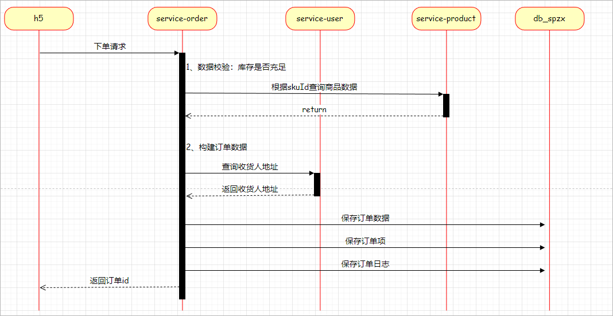
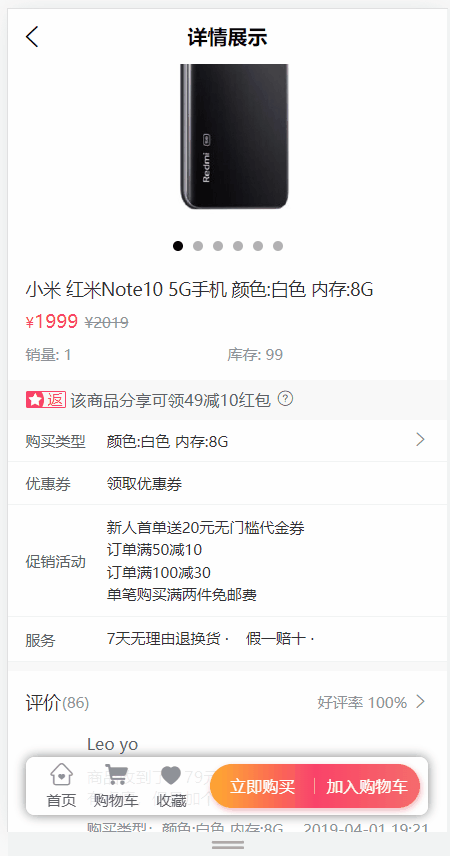
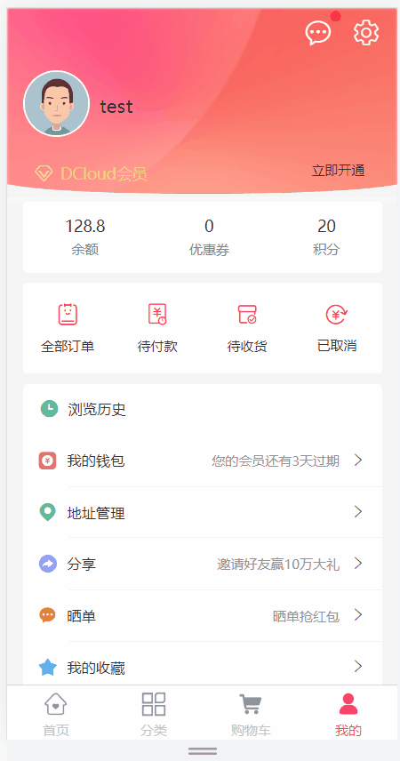

# 订单模块

# 1 下单

## 1.1 需求说明

需求说明：用户在结算页面点击提交订单按钮，那么此时就需要保存订单信息(order_info)、订单项信息(order_item)及记录订单日志(order_log)，下单成功重定向到订单支付页面

**查看接口文档：**

下单接口地址及返回结果：

```json
post /api/order/orderInfo/auth/submitOrder
参数：
{
    "orderItemList": [
        {
            "skuId": 6,
            "skuName": "小米 红米Note10 5G手机 颜色:黑色 内存:18G",
            "thumbImg": "http://139.198.127.41:9000/spzx/20230525/665832167-1_u_1.jpg",
            "skuPrice": 2999,
            "skuNum": 1
        },
        ...
    ],
    "userAddressId": 2,
    "feightFee": 0,
    "remark": "赶快发货"
}
返回结果(订单id)：
{
    "code": 200,
    "message": "操作成功",
    "data": 1
}
```

调用流程如下所示：

 


## 1.2 后端接口

### 1.2.1 查询用户地址

#### 业务接口开发

操作模块：service-user

##### UserAddressController

表现层代码：

```java
@Operation(summary = "获取地址信息")
@GetMapping("getUserAddress/{id}")
public UserAddress getUserAddress(@PathVariable Long id) {
   return userAddressService.getById(id);
}
```

##### UserAddressService

业务层代码实现：

```java
//业务接口
UserAddress getById(Long id);

//业务接口实现
@Override
public UserAddress getById(Long id) {
   return userAddressMapper.getById(id);
}
```

##### UserAddressMapper

持久层代码实现：

```java
UserAddress getById(Long id);
```

##### UserAddressMapper.xml

在映射文件中定义对应的sql语句：

```xml
<select id="getById" resultMap="userAddressMap">
   select <include refid="columns" />
   from user_address
   where
   id = #{id}
</select>
```

启动程序进行测试。


#### openFeign接口开发

步骤如下：

步骤：

1、在spzx-service-client模块下创建一个service-user-client的子模块

2、在service-user-client模块下定义远程openFeign接口

```java
// com.atguigu.spzx.feign.user;
@FeignClient(value = "service-user")
public interface UserFeignClient {

    @GetMapping("/api/user/userAddress/getUserAddress/{id}")
    public abstract UserAddress getUserAddress(@PathVariable Long id) ;

}
```

3、修改service-order微服务

pom.xml文件中加入依赖：

```xml
<dependency>
    <groupId>com.atguigu.spzx</groupId>
    <artifactId>service-user-client</artifactId>
    <version>1.0-SNAPSHOT</version>
</dependency>
```

启动类修改：

```java
@EnableFeignClients(basePackages = {
        "com.atguigu.spzx.feign.cart",
        "com.atguigu.spzx.feign.user"
})
```


### 1.2.2 业务接口开发

操作模块：service-order

#### OrderInfoDto

定义一个实体类用来封装下单的参数，具体定义如下所示

```java
@Data
public class OrderInfoDto {

    //送货地址id
    private Long userAddressId;
    //运费
    private BigDecimal feightFee;
    //备注
    private String remark;
    //订单明细
    private List<OrderItem> orderItemList;
    
}
```

#### OrderLog

订单日志体类定义：

```java
@Data
@Schema(description = "订单日志实体对象")
public class OrderLog extends BaseEntity {

   private static final long serialVersionUID = 1L;

   @Schema(description = "订单id")
   private Long orderId;

   @Schema(description = "操作人：用户；系统；后台管理员")
   private String operateUser;

   @Schema(description = "订单状态")
   private Integer processStatus;

   @Schema(description = "备注")
   private String note;

}
```

#### service-order引入依赖

```xml
<dependencies>
    <dependency>
        <groupId>org.springframework.boot</groupId>
        <artifactId>spring-boot-starter-data-redis</artifactId>
    </dependency>

    <dependency>
        <groupId>com.atguigu</groupId>
        <artifactId>service-cart-client</artifactId>
        <version>1.0-SNAPSHOT</version>
    </dependency>

    <dependency>
        <groupId>com.atguigu</groupId>
        <artifactId>service-user-client</artifactId>
        <version>1.0-SNAPSHOT</version>
    </dependency>

    <dependency>
        <groupId>com.atguigu</groupId>
        <artifactId>service-product-client</artifactId>
        <version>1.0-SNAPSHOT</version>
    </dependency>
</dependencies>
```

#### OrderInfoController

表现层代码：

```java
@Operation(summary = "提交订单")
@PostMapping("auth/submitOrder")
public Result<Long> submitOrder(@Parameter(name = "orderInfoDto", description = "请求参数实体类", required = true) @RequestBody OrderInfoDto orderInfoDto) {
   Long orderId = orderInfoService.submitOrder(orderInfoDto);
   return Result.build(orderId, ResultCodeEnum.SUCCESS);
}
```

#### OrderInfoService

业务层代码实现：

```java
//业务接口
Long submitOrder(OrderInfoDto orderInfoDto);

//业务接口实现
@Service
public class OrderInfoServiceImpl implements OrderInfoService {
    @Autowired
    private CartFeignClient cartFeignClient ;

    @Autowired
    private ProductFeignClient productFeignClient;

    @Autowired
    private UserFeignClient userFeignClient;

    @Autowired
    private OrderInfoMapper orderInfoMapper;

    @Autowired
    private OrderItemMapper orderItemMapper;
    
    @Autowired
    private OrderLogMapper orderLogMapper;

   //业务接口实现
    @Transactional
    @Override
    public Long submitOrder(OrderInfoDto orderInfoDto) {
        // 数据校验
        List<OrderItem> orderItemList = orderInfoDto.getOrderItemList();
        if (CollectionUtils.isEmpty(orderItemList)) {
            throw new GuiguException(ResultCodeEnum.DATA_ERROR);
        }

        for (OrderItem orderItem : orderItemList) {
            ProductSku productSku = productFeignClient.getBySkuId(orderItem.getSkuId());
            if(null == productSku) {
                throw new GuiguException(ResultCodeEnum.DATA_ERROR);
            }
            //校验库存
            if(orderItem.getSkuNum().intValue() > productSku.getStockNum().intValue()) {
                throw new GuiguException(ResultCodeEnum.STOCK_LESS);
            }
        }

        // 构建订单数据，保存订单
        UserInfo userInfo = AuthContextUtil.getUserInfo();
        OrderInfo orderInfo = new OrderInfo();
        //订单编号
        orderInfo.setOrderNo(String.valueOf(System.currentTimeMillis()));
        //用户id
        orderInfo.setUserId(userInfo.getId());
        //用户昵称
        orderInfo.setNickName(userInfo.getNickName());
        //用户收货地址信息
        UserAddress userAddress = userFeignClient.getUserAddress(orderInfoDto.getUserAddressId());
        orderInfo.setReceiverName(userAddress.getName());
        orderInfo.setReceiverPhone(userAddress.getPhone());
        orderInfo.setReceiverTagName(userAddress.getTagName());
        orderInfo.setReceiverProvince(userAddress.getProvinceCode());
        orderInfo.setReceiverCity(userAddress.getCityCode());
        orderInfo.setReceiverDistrict(userAddress.getDistrictCode());
        orderInfo.setReceiverAddress(userAddress.getFullAddress());
        //订单金额
        BigDecimal totalAmount = new BigDecimal(0);
        for (OrderItem orderItem : orderItemList) {
            totalAmount = totalAmount.add(orderItem.getSkuPrice().multiply(new BigDecimal(orderItem.getSkuNum())));
        }
        orderInfo.setTotalAmount(totalAmount);
        orderInfo.setCouponAmount(new BigDecimal(0));
        orderInfo.setOriginalTotalAmount(totalAmount);
        orderInfo.setFeightFee(orderInfoDto.getFeightFee());
        orderInfo.setPayType(2);
        orderInfo.setOrderStatus(0);
        orderInfoMapper.save(orderInfo);

        //保存订单明细
        for (OrderItem orderItem : orderItemList) {
            orderItem.setOrderId(orderInfo.getId());
            orderItemMapper.save(orderItem);
        }

        //记录日志
        OrderLog orderLog = new OrderLog();
        orderLog.setOrderId(orderInfo.getId());
        orderLog.setProcessStatus(0);
        orderLog.setNote("提交订单");
        orderLogMapper.save(orderLog);

        // TODO 远程调用service-cart微服务接口清空购物车数据

        return orderInfo.getId();
    }
}
```

在ResultCodeEnum类添加枚举

```java
STOCK_LESS( 219, "库存不足"),
```

#### Mapper接口

持久层代码实现：

##### OrderInfoMapper

```java
@Mapper
public interface OrderInfoMapper {

    void save(OrderInfo orderInfo);
}
```

##### OrderItemMapper

```java
@Mapper
public interface OrderItemMapper {
    void save(OrderItem orderItem);
}
```

##### OrderLogMapper

```java
@Mapper
public interface OrderLogMapper {
    void save(OrderLog orderLog);
}
```

#### XML映射文件

在映射文件中定义对应的sql语句

##### OrderInfoMapper.xml

```xml
<?xml version="1.0" encoding="UTF-8" ?>
<!DOCTYPE mapper PUBLIC "-//mybatis.org//DTD Mapper 3.0//EN" "http://mybatis.org/dtd/mybatis-3-mapper.dtd">

<mapper namespace="com.atguigu.spzx.order.mapper.OrderInfoMapper">

   <resultMap id="orderInfoMap" type="com.atguigu.spzx.model.entity.order.OrderInfo" autoMapping="true">
   </resultMap>
   
   <!-- 用于select查询公用抽取的列 -->
   <sql id="columns">
      id,user_id,nick_name,order_no,coupon_id,total_amount,coupon_amount,original_total_amount,feight_fee,pay_type,order_status,receiver_name,receiver_phone,receiver_tag_name,receiver_province,receiver_city,receiver_district,receiver_address,payment_time,delivery_time,receive_time,remark,cancel_time,cancel_reason,create_time,update_time,is_deleted
   </sql>

   <insert id="save" useGeneratedKeys="true" keyProperty="id">
      insert into order_info (
         id,
         user_id,
         nick_name,
         order_no,
         coupon_id,
         total_amount,
         coupon_amount,
         original_total_amount,
         feight_fee,
         pay_type,
         order_status,
         receiver_name,
         receiver_phone,
         receiver_tag_name,
         receiver_province,
         receiver_city,
         receiver_district,
         receiver_address,
         payment_time,
         delivery_time,
         receive_time,
         remark,
         cancel_time,
         cancel_reason
      ) values (
         #{id},
         #{userId},
         #{nickName},
         #{orderNo},
         #{couponId},
         #{totalAmount},
         #{couponAmount},
         #{originalTotalAmount},
         #{feightFee},
         #{payType},
         #{orderStatus},
         #{receiverName},
         #{receiverPhone},
         #{receiverTagName},
         #{receiverProvince},
         #{receiverCity},
         #{receiverDistrict},
         #{receiverAddress},
         #{paymentTime},
         #{deliveryTime},
         #{receiveTime},
         #{remark},
         #{cancelTime},
         #{cancelReason}
      )
   </insert>
</mapper>
```

##### OrderItemMapper.xml

```xml
<?xml version="1.0" encoding="UTF-8" ?>
<!DOCTYPE mapper PUBLIC "-//mybatis.org//DTD Mapper 3.0//EN" "http://mybatis.org/dtd/mybatis-3-mapper.dtd">

<mapper namespace="com.atguigu.spzx.order.mapper.OrderItemMapper">

   <resultMap id="orderItemMap" type="com.atguigu.spzx.model.entity.order.OrderItem" autoMapping="true">
   </resultMap>
   
   <!-- 用于select查询公用抽取的列 -->
   <sql id="columns">
      id,order_id,sku_id,sku_name,thumb_img,sku_price,sku_num,create_time,update_time,is_deleted
   </sql>

   <insert id="save" useGeneratedKeys="true" keyProperty="id">
      insert into order_item (
         id,
         order_id,
         sku_id,
         sku_name,
         thumb_img,
         sku_price,
         sku_num
      ) values (
         #{id},
         #{orderId},
         #{skuId},
         #{skuName},
         #{thumbImg},
         #{skuPrice},
         #{skuNum}
      )
   </insert>
</mapper>
```

##### OrderLogMapper.xml

```xml
<?xml version="1.0" encoding="UTF-8" ?>
<!DOCTYPE mapper PUBLIC "-//mybatis.org//DTD Mapper 3.0//EN" "http://mybatis.org/dtd/mybatis-3-mapper.dtd">

<mapper namespace="com.atguigu.spzx.order.mapper.OrderLogMapper">

   <resultMap id="orderLogMap" type="com.atguigu.spzx.model.entity.order.OrderLog" autoMapping="true">
   </resultMap>
   
   <!-- 用于select查询公用抽取的列 -->
   <sql id="columns">
      id,order_id,operate_user,process_status,note,create_time,update_time,is_deleted
   </sql>

   <insert id="save" useGeneratedKeys="true" keyProperty="id">
      insert into order_log (
         id,
         order_id,
         operate_user,
         process_status,
         note
      ) values (
         #{id},
         #{orderId},
         #{operateUser},
         #{processStatus},
         #{note}
      )
   </insert>

</mapper>
```


### 1.2.3 清空购物车

需求说明：订单生成成功以后，需要调用service-cart微服务的接口清空选中的购物车数据。

#### service-cart

在service-cart微服务中开发一个清空购物车的接口供service-order微服务进行调用：

##### CartController

```java
// com.atguigu.spzx.cart.controller.CartController
@GetMapping(value = "/auth/deleteChecked")
public Result deleteChecked() {
    cartService.deleteChecked() ;
    return Result.build(null , ResultCodeEnum.SUCCESS) ;
}
```

##### CartService

```java
// com.atguigu.spzx.cart.service.impl.CartServiceImpl
@Override
public void deleteChecked() {
    Long userId = AuthContextUtil.getUserInfo().getId();
    String cartKey = getCartKey(userId);
    List<Object> objectList = redisTemplate.opsForHash().values(cartKey);       // 删除选中的购物项数据
    if(!CollectionUtils.isEmpty(objectList)) {
        objectList.stream().map(cartInfoJSON -> JSON.parseObject(cartInfoJSON.toString(), CartInfo.class))
            .filter(cartInfo -> cartInfo.getIsChecked() == 1)
            .forEach(cartInfo -> redisTemplate.opsForHash().delete(cartKey , String.valueOf(cartInfo.getSkuId())));
    }
}
```

#### openFeign接口

在service-cart-client模块CartFeignClient中定义删除选中的购物车数据的远程接口方法：

```java
// com.atguigu.spzx.feign.cart
@FeignClient(value = "service-cart")
public interface CartFeignClient {
    
    @GetMapping(value = "/api/order/cart/auth/deleteChecked")
    public abstract Result deleteChecked() ;

}
```

#### service-order

改造service-order微服务的下单接口方法，添加清空选中购物车数据的远程调用代码：

```java
// com.atguigu.spzx.order.service.impl.OrderInfoServiceImpl
@Transactional
@Override
public Long submitOrder(OrderInfoDto orderInfoDto) {

    // 1、数据校验
    // 2、构建订单数据，保存订单
    // 3、保存订单明细
    // 4、记录日志
    //....................
    
    // 5、清空购物车数据
    cartFeignClient.deleteChecked() ;
    // 6、返回订单id
    return orderInfo.getId();
}
```

#### service-order启动类添加

```java
@EnableUserWebMvcConfiguration
```


# 2 支付页

## 2.1 需求说明

提交订单成功，跳转到支付页面，根据订单id获取订单详细信息，展示订单支付信息

**查看接口文档：**

根据订单id获取订单信息接口地址及返回结果：

```json
get /api/order/orderInfo/auth/{orderId}
返回结果(订单id)：
{
    "code": 200,
    "message": "成功",
    "data": {
        "id": 194,
        "createTime": "2023-06-14 19:29:31",
        "userId": 1,
        "nickName": "test",
        "orderNo": "1686713371363",
        "couponId": null,
        "totalAmount": 2999,
        "couponAmount": 0,
        "originalTotalAmount": 2999,
        "feightFee": 0,
        "payType": 2,
        "orderStatus": 0,
        "receiverName": "张三",
        "receiverPhone": "15012563333",
        "receiverTagName": "公司",
        "receiverProvince": "130000",
        "receiverCity": "130700",
        "receiverDistrict": "130724",
        "receiverAddress": "河北省张家口市沽源县快乐家园1号",
        "paymentTime": null,
        "deliveryTime": null,
        "receiveTime": null,
        "remark": null,
        "cancelTime": null,
        "cancelReason": null
    }
}
```


## 2.2 后端接口

### 2.2.1 OrderInfoController

表现层代码：

```java
@Operation(summary = "获取订单信息")
@GetMapping("auth/{orderId}")
public Result<OrderInfo> getOrderInfo(@Parameter(name = "orderId", description = "订单id", required = true) @PathVariable Long orderId) {
   OrderInfo orderInfo = orderInfoService.getOrderInfo(orderId);
   return Result.build(orderInfo, ResultCodeEnum.SUCCESS);
}
```


### 2.2.2 OrderInfoService

业务层代码实现：

```java
//业务接口
OrderInfo getOrderInfo(Long orderId);

//业务接口实现
@Override
public OrderInfo getOrderInfo(Long orderId) {
    return orderInfoMapper.getById(orderId);
}
```


### 2.2.3 OrderInfoMapper

持久层代码实现：

```java
OrderInfo getById(Long orderId);
```


### 2.2.4 OrderInfoMapper.xml

在映射文件中定义对应的sql语句：

```xml
<select id="getById" resultMap="orderInfoMap">
   select <include refid="columns" />
   from order_info
   where
   id = #{id}
</select>
```


# 3 立即购买

## 3.1 需求说明

入口：商品详情页，点击“立即购买”按钮，立即购买直接进入结算页，不经过购物车，结算页返回数据与正常下单结算数据一致，提交订单接口不变，如图所示：

 


**查看接口文档：**

立即购买接口地址及返回结果：

```json
get /api/order/orderInfo/auth/buy/{skuId}
返回结果：
{
    "code": 200,
    "message": "操作成功",
    "data": {
        "totalAmount": 6997.00,
        "orderItemList": [
            {
                "skuId": 1,
                "skuName": "小米 红米Note10 5G手机 颜色:白色 内存:8G",
                "thumbImg": "http://139.198.127.41:9000/spzx/20230525/665832167-5_u_1 (1).jpg",
                "skuPrice": 1999.00,
                "skuNum": 2
            },
            ...
        ]
    }
}
```


## 3.2 后端接口

### 3.2.1 OrderInfoController

表现层代码：

```java
@Operation(summary = "立即购买")
@GetMapping("auth/buy/{skuId}")
public Result<TradeVo> buy(@Parameter(name = "skuId", description = "商品skuId", required = true) @PathVariable Long skuId) {
   TradeVo tradeVo = orderInfoService.buy(skuId);
   return Result.build(tradeVo, ResultCodeEnum.SUCCESS);
}
```


### 3.2.2 OrderInfoService

业务层代码实现：

```java
//业务接口
TradeVo buy(Long skuId);

//业务接口实现
@Override
public TradeVo buy(Long skuId) {
    // 查询商品
    ProductSku productSku = productFeignClient.getBySkuId(skuId);
    List<OrderItem> orderItemList = new ArrayList<>();
    OrderItem orderItem = new OrderItem();
    orderItem.setSkuId(skuId);
    orderItem.setSkuName(productSku.getSkuName());
    orderItem.setSkuNum(1);
    orderItem.setSkuPrice(productSku.getSalePrice());
    orderItem.setThumbImg(productSku.getThumbImg());
    orderItemList.add(orderItem);

    // 计算总金额
    BigDecimal totalAmount = productSku.getSalePrice();
    TradeVo tradeVo = new TradeVo();
    tradeVo.setTotalAmount(totalAmount);
    tradeVo.setOrderItemList(orderItemList);

    // 返回
    return tradeVo;
}
```


# 4 我的订单

## 4.1 需求说明

我的订单根据订单状态展示列表，如图所示：

 

**查看接口文档：**

我的订单接口地址及返回结果：

```json
get /api/order/orderInfo/auth/{page}/{limit}?orderStatus={orderStatus}
返回结果：
{
    "code": 200,
    "message": "成功",
    "data": {
        "total": 63,
        "list": [
            {
                "id": 194,
                "createTime": "2023-06-14 19:29:31",
                "userId": 1,
                "nickName": "test",
                "orderNo": "1686713371363",
                "couponId": null,
                "totalAmount": 2999.00,
                "couponAmount": 0.00,
                "originalTotalAmount": 2999.00,
                "feightFee": 0.00,
                "payType": 2,
                "orderStatus": 0,
                "receiverName": "张三",
                "receiverPhone": "15012563333",
                "receiverTagName": "公司",
                "receiverProvince": "130000",
                "receiverCity": "130700",
                "receiverDistrict": "130724",
                "receiverAddress": "河北省张家口市沽源县快乐家园1号",
                "paymentTime": null,
                "deliveryTime": null,
                "receiveTime": null,
                "remark": null,
                "cancelTime": null,
                "cancelReason": null,
                "orderItemList": [
                    {
                        "id": 428,
                        "createTime": "2023-06-14 19:29:31",
                        "orderId": 194,
                        "skuId": 6,
                        "skuName": "小米 红米Note10 5G手机 颜色:黑色 内存:18G",
                        "thumbImg": "http://139.198.127.41:9000/spzx/20230525/665832167-1_u_1.jpg",
                        "skuPrice": 2999.00,
                        "skuNum": 1
                    }
                ]
            },
            ...
        ],
        "pageNum": 1,
        "pageSize": 10,
        "size": 6,
        "startRow": 1,
        "endRow": 6,
        "pages": 7,
        "prePage": 0,
        "nextPage": 2,
        "isFirstPage": true,
        "isLastPage": false,
        "hasPreviousPage": false,
        "hasNextPage": true,
        "navigatePages": 10,
        "navigatepageNums": [
            1,
            2,
            3,
            4,
            5,
            6,
            7
        ],
        "navigateFirstPage": 1,
        "navigateLastPage": 7
    }
}
```


## 4.2 后端接口

### 4.2.1 OrderInfoController

表现层代码：

```java
@Operation(summary = "获取订单分页列表")
@GetMapping("auth/{page}/{limit}")
public Result<PageInfo<OrderInfo>> list(
      @Parameter(name = "page", description = "当前页码", required = true)
      @PathVariable Integer page,

      @Parameter(name = "limit", description = "每页记录数", required = true)
      @PathVariable Integer limit,

      @Parameter(name = "orderStatus", description = "订单状态", required = false)
      @RequestParam(required = false, defaultValue = "") Integer orderStatus) {
   PageInfo<OrderInfo> pageInfo = orderInfoService.findUserPage(page, limit, orderStatus);
   return Result.build(pageInfo, ResultCodeEnum.SUCCESS);
}
```


### 4.2.2 OrderInfoService

业务层代码实现：

```java
//业务接口
PageInfo<OrderInfo> findUserPage(Integer page, Integer limit, Integer orderStatus);

//业务接口实现
@Override
public PageInfo<OrderInfo> findUserPage(Integer page, 
                                        Integer limit, 
                                        Integer orderStatus) {
    PageHelper.startPage(page, limit);
    Long userId = AuthContextUtil.getUserInfo().getId();
    List<OrderInfo> orderInfoList = orderInfoMapper.findUserPage(userId, orderStatus);

    orderInfoList.forEach(orderInfo -> {
        List<OrderItem> orderItem = orderItemMapper.findByOrderId(orderInfo.getId());
        orderInfo.setOrderItemList(orderItem);
    });

    return new PageInfo<>(orderInfoList);
}
```


### 4.2.3 OrderInfoMapper

持久层代码实现：

```java
List<OrderInfo> findUserPage(Long userId, Integer orderStatus);
```


### 4.2.4 OrderInfoMapper.xml

在映射文件中定义对应的sql语句：

```xml
<resultMap id="orderInfoMap" type="com.atguigu.spzx.model.entity.order.OrderInfo" autoMapping="true"></resultMap>

<select id="findUserPage" resultMap="orderInfoMap">
   select <include refid="columns" />
   from order_info
   <where>
      <if test="userId != null">
         and user_id = #{userId}
      </if>
      <if test="orderStatus != null">
         and order_status = #{orderStatus}
      </if>
      and is_deleted = 0
   </where>
   order by id desc
</select>
```


### 4.2.5 OrderInfo

订单实体添加属性：

```java
@Schema(description = "订单项列表")
private List<OrderItem> orderItemList;
```


### 4.2.6 OrderItemMapper

持久层代码实现：

```java
List<OrderItem> findByOrderId(Long orderId);
```


### 4.2.7 OrderItemMapper.xml

在映射文件中定义对应的sql语句：

```xml
<select id="findByOrderId" resultMap="orderItemMap">
   select <include refid="columns" />
   from order_item
   where
      order_id = #{orderId}
      and is_deleted = 0
   order by id desc
</select>
```


