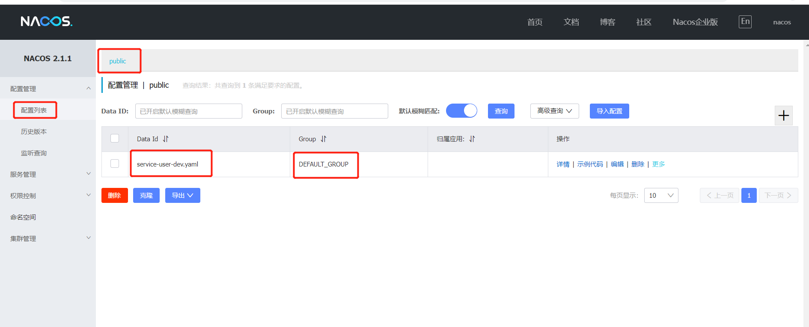
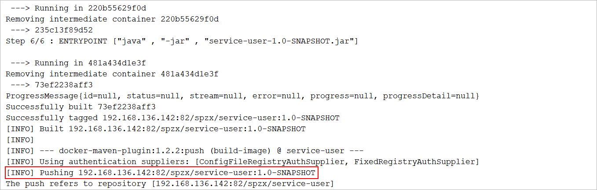
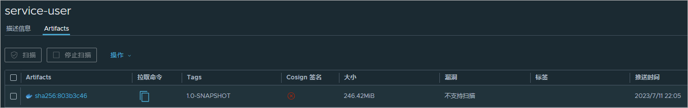

# 1 项目部署

## 1.1 安装redis mysql nacos

### 安装redis

```shell
#1 拉取镜像
docker pull redis:7.0.10

#2 在宿主机的 /var/lib/docker/volumes/redis-config/_data/目录下创建一个redis的配置文件，
vim redis.conf
# 内容如下所示
#开启持久化
appendonly yes
port 6379
# requirepass 1234
bind 0.0.0.0

#3 如果/var/lib/docker/volumes没有redis-config，创建数据卷 
docker volume create redis-config

#4 创建容器
docker run -d -p 6379:6379 --restart=always \
-v redis-config:/etc/redis/config \
-v redis-data:/data \
--name redis redis \
redis-server /etc/redis/config/redis.conf
```


### 安装mysql

```shell
# 拉取镜像
docker pull mysql:8.0.30

# 创建容器
docker run -d --name mysql -p 3306:3306 -v mysql_data:/var/lib/mysql -v mysql_conf:/etc/mysql --restart=always --privileged=true -e MYSQL_ROOT_PASSWORD=1234 mysql:8.0.30
```

* Linux下 mysql -uroot -p 登录你的 MySQL 数据库，然后 执行这条SQL：

```sql
ALTER USER 'root'@'%' IDENTIFIED WITH mysql_native_password BY '123456';
```

然后再重新配置SQLyog的连接，重新填写密码，则可连接成功了。 

* 导入建表语句  db_spzx.sql


### 安装nacos

```shell
# 拉取镜像
docker pull nacos/nacos-server:v2.2.2

# 创建容器
docker run --name nacos -e MODE=standalone -p 8848:8848 -p 9848:9848 -d nacos/nacos-server:v2.2.2

# nacos2.x的版本新增了一个客户端与服务端的gRpc的通讯端口号9848
```

打开浏览器访问nacos的所提供的后端管理界面：http://ip:8848/nacos


## 1.2 将配置文件导入nacos

以service-user为例，其他模块类似

### 1.2.1 引入依赖

spzx-service模块引入依赖

```xml
<!-- 服务配置 -->
<dependency>
    <groupId>com.alibaba.cloud</groupId>
    <artifactId>spring-cloud-starter-alibaba-nacos-config</artifactId>
</dependency>
```


### 1.2.2 添加nacos配置文件

在nacos服务器添加配置文件



将application-dev.yml文件中的内容复制到nacos的service-user-dev.yml配置中：

```yaml
server:
  port: 8512

spring:
  application:
    name: service-user
  cloud:
    nacos:
      discovery:
        server-addr: 192.168.6.131:8848
  datasource:
    type: com.zaxxer.hikari.HikariDataSource
    driver-class-name: com.mysql.cj.jdbc.Driver
    url: jdbc:mysql://192.168.6.131:3306/db_spzx?serverTimezone=UTC&characterEncoding=utf8&useUnicode=true&useSSL=true
    username: root
    password: 1234
  data:
    redis:
      host: 192.168.6.131
      port: 6379

mybatis:
  config-location: classpath:mybatis-config.xml
  mapper-locations: classpath:mapper/*/*.xml
```


### 1.2.3 修改application.yml

修改application.yml文件的内容如下所示：

```yaml
spring:
  cloud:
    nacos:
      config:
        server-addr: 192.168.6.131:8848
  config:
    import:
      - nacos:service-user-dev.yml
```


### 1.2.4 启动项目测试

正常运行，接口正常访问

**说明：**

1、service-cart、service-pay、service-product、service-order按以上步骤调整（不需再次引入依赖）

2、spzx-server-gateway服务网关也是类似，注意单独引入依赖


## 1.3 docker compose

### 1.3.1 docker compose简介

1、Docker Compose是一个工具，用于定义和运行多容器应用程序的工具；

2、Docker Compose通过yml文件定义多容器的docker应用；

3、Docker Compose通过一条命令根据yml文件的定义去创建或管理多容器；

如下图所示：

 

Docker Compose 是用来做Docker 的多容器控制，有了 Docker Compose 你可以把所有繁复的 Docker 操作全都一条命令，自动化的完成。

官网地址：https://docs.docker.com/compose/install/linux/


### 1.3.2 下载与安装

下载与安装：

* 在安装docker时候已经完成了安装，直接查看版本号，查看是否安装成功

```shell
# 安装步骤 略 ....
yum install -y docker-ce docker-ce-cli containerd.io docker-buildx-plugin docker-compose-plugin

# 查看docker compose的版本
docker compose version
```


* 或者单独安装

```shell
# 创建指定目录存储docker compose
mkdir -p /usr/local/lib/docker/cli-plugins

# 下载并移动
curl -SL https://github.com/docker/compose/releases/download/v2.14.2/docker-compose-linux-x86_64 -o /usr/local/lib/docker/cli-plugins/docker-compose

# 给docker-compose文件赋予可执行权限
sudo chmod +x /usr/local/lib/docker/cli-plugins/docker-compose

# 查看docker compose的版本
docker compose version
```


### 2.3.3 入门案例

需求：使用docker compose部署redis

* docker-compose.yml文件的内容如下所示：

```yml
services:
  redis:
    image: redis:7.0.10
    container_name: redis02
    ports:
      - "6389:6379"
    volumes:
      - redis-data:/data
volumes:
  redis-data: {}
```


* docker compose相关命令：  

```shell
# 启动容器(如果不存在容器就创建、存在则修改)
docker compose -f docker-compose.yml up -d

# 删除所有容器
docker compose -f docker-compose.yml down

# 停止所有容器
docker compose -f docker-compose.yml stop

# 启动所有容器
docker compose -f docker-compose.yml start

# 重启所有容器
docker compose -f docker-compose.yml restart
```

docker compose文件中其他的常见指令参考官方文档：https://docs.docker.com/compose/compose-file/05-services/


* 多容器配置文件示例：

```yaml
services:
  mysql:
    container_name: mysql02
    image: mysql:8.0.30
    ports:
      - "3307:3306"
    volumes:
      - mysql_data:/var/lib/mysql
      - mysql_conf:/etc/mysql
    privileged: true
    environment:
      - "MYSQL_ROOT_PASSWORD=1234"
  redis:
    image: redis:7.0.10
    container_name: redis02
    ports:
      - "6389:6379"
    volumes:
      - redis-data:/data
volumes:
  mysql_data: {}
  mysql_conf: {}
  redis-data: {}
```


## 1.4 docker镜像仓库

### 1.4.1 镜像仓库简介

镜像仓库作用：存储镜像，可以通过镜像仓库实现镜像的共享

镜像仓库的使用流程：

 

镜像仓库分类：

1、公有镜像仓库：可以理解成云仓库、公有仓库，是由某个组织、公司维护的仓库，对互联网开放，所有人共享。如官方的仓库docker hub。

2、私有镜像仓库：不对外开放。一般情况下只在公司内网中使用，用于加快镜像拉取速度、维护公司资产。

私有镜像仓库种类：

1、Registry是Docker自带的镜像仓库，部署运行非常简洁，非常适合在测试时使用。

2、Harbor

### 1.4.2 Harbor简介

Harbor是VMware公司开源的企业级DockerRegistry项目，其目标是帮助用户迅速搭建一个企业级的Dockerregistry服务。它以Docker公司开源的registry为基础，提供了管理UI，基于角色的访问控制(Role Based Access Control)，AD/LDAP集成、以及审计日志(Auditlogging) 等企业用户需求的功能，同时还原生支持中文。


### 1.4.3 下载

Harbor被部署为多个Docker容器，因此可以部署在任何支持Docker的Linux服务器上，且需要Docker和Docker Compose才能安装。

下载地址：https://github.com/goharbor/harbor/releases

 

这里我们下载在线安装包：

```
wget https://github.com/goharbor/harbor/releases/download/v2.8.0/harbor-online-installer-v2.8.0.tgz
```


### 1.4.4 安装

具体步骤如下所示：

**1、解压并修改配置文件**

```
tar -zxvf harbor-online-installer-v2.8.0.tgz     # 解压tgz包
cp harbor.yml.tmpl harbor.yml                    # 创建一个配置文件
vim harbor.yml                                   # 修改配置文件
```

配置的文件的修改如下所示：


**2、安装Harbor**

```shell
# 1、 进入到Harbor的解压目录
# 2、执行安装脚本
sh install.sh
```


注意：如果安装的时候报错了，可以给docker配置多个镜像地址：

```json
// 编辑文件
vim /etc/docker/daemon.json

// 文件内容
{
  "registry-mirrors": ["https://registry.docker-cn.com","http://hub-mirror.c.163.com","http://f1361db2.m.daocloud.io","https://mirror.ccs.tencentyun.com","https://phtv51hj.mirror.aliyuncs.com"]
}
```


**3、启动关闭命令**

```
docker compose -f docker-compose.yml up -d            启动 Harbor
docker compose -f docker-compose.yml stop             关闭 Harbor
```


**4、访问Harbor**

* 访问地址：http://192.168.6.131/


* 用户名/密码：admin/Harbor12345


**5、docker添加安全访问权限**

```shell
# 编辑/etc/docker/daemon.json文件
vim /etc/docker/daemon.json

# 添加安全访问权限
{
  "insecure-registries":["http://192.168.6.131"]
}

# 重启Docker
systemctl restart docker
```


## 1.5 docker部署

基于docker环境及Harbor部署，以service-user为例，其他模块类似

### 1.5.1 settings.xml

在maven的settings.xml文件中配置harbor服务的账号信息：

```xml
<server>
    <id>harbor</id>
    <username>admin</username>
    <password>Harbor12345</password>
    <configuration>
        <email>123456@aliyun.com</email>
    </configuration>
</server>
```


### 1.5.2 引入依赖插件

pom.xml文件添加docker插件

```xml
<properties>
    <docker.repostory>192.168.6.131</docker.repostory>
    <docker.registry.name>spzx</docker.registry.name>
</properties>

<build>
    <plugins>
        <plugin>
            <groupId>org.springframework.boot</groupId>
            <artifactId>spring-boot-maven-plugin</artifactId>
        </plugin>
        <plugin>
            <groupId>com.spotify</groupId>
            <artifactId>docker-maven-plugin</artifactId>
            <version>1.2.2</version>

            <!--将插件绑定在某个phase执行-->
            <executions>
                <execution>
                    <id>build-image</id>
                    <!--将插件绑定在package这个phase(阶段)上。也就是说，用户只需执行mvn package，就会自动执行mvn docker:build-->
                    <phase>package</phase>
                    <goals>
                        <goal>build</goal>
                        <goal>push</goal>
                    </goals>
                </execution>
            </executions>

            <configuration>

                <serverId>harbor</serverId>
                <registryUrl>http://${docker.repostory}</registryUrl>
                <dockerHost>http://192.168.6.131:2375</dockerHost>  <!-- 配置docker主机地址 -->

                <!--指定生成的镜像名-->
            <imageName>${docker.repostory}/${docker.registry.name}/${project.artifactId}:${project.version}</imageName>

                <!-- 指定 dockerfile 路径-->
                <dockerDirectory>${project.basedir}</dockerDirectory>

                <!-- 是否跳过docker构建 -->
                <skipDockerBuild>false</skipDockerBuild>

            </configuration>

        </plugin>
    </plugins>
</build>
```

**插件原理**：就是在docker主机上构建docker对应的镜像，然后将构建的镜像推送到harbor远程仓库中。


### 1.5.3 docker服务端开启远程访问

```shell
#修改该文件
vim /lib/systemd/system/docker.service

#找到ExecStart行，修改成如下内容
ExecStart=/usr/bin/dockerd -H tcp://0.0.0.0:2375 -H fd:// --containerd=/run/containerd/containerd.sock

systemctl daemon-reload				#重启守护进程
systemctl restart docker			#重启docker
```

注意：关闭防火墙[systemctl stop firewalld.service]


### 1.5.4 编写dockerfile文件

* 使用dockerfile来构建一个包含Jdk17的centos7镜像

分析：

1、基础的镜像的应该选择centos:7

2、在自己所构建的镜像中需要包含Jdk17，就需要把Jdk17添加到centos:7的基础镜像中

3、为了方便的去使用自己构建的镜像中的Jdk17，就需要去配置环境变量

4、因为Jdk17仅仅是一个开发工具，并不是一个服务进程，因此在启动容器的时候可以不指定任何的执行命令

实现步骤：

1、将Jdk17的安装包上传到linux服务器的指定目录下

2、在Jdk17所在的目录下创建一个dockerfile文件

3、使用docker build命令构建镜像

4、使用docker images查看镜像构建情况

代码实现

```shell
# 1、创建目录
mkdir –p /usr/local/dockerfilejdk17
cd /usr/local/dockerfilejdk17
  
# 2、下载jdk-17_linux-x64_bin.tar.gz并上传到服务器（虚拟机）中的/usr/local/dockerfilejdk17目录
# 3、在/usr/local/dockerfilejdk17目录下创建dockerfile文件，文件内容如下：
vim dockerfile

FROM centos:7
MAINTAINER atguigu
RUN mkdir -p /usr/local/java
ADD jdk-17_linux-x64_bin.tar.gz /usr/local/java/
ENV JAVA_HOME=/usr/local/java/jdk-17.0.7
ENV PATH=$PATH:$JAVA_HOME/bin

# 4、执行命令构建镜像；不要忘了后面的那个 .
docker build -t centos7-jdk17 .

# 5、查看镜像是否建立完成
docker images
```


* Dockerfile文件的位置必须是和pom.xml处于同一个目录

```shell
FROM centos7-jdk17
MAINTAINER atguigu
EXPOSE 8512
ADD target/service-user-1.0-SNAPSHOT.jar /service-user-1.0-SNAPSHOT.jar

WORKDIR /
ENTRYPOINT ["java" , "-jar" , "service-user-1.0-SNAPSHOT.jar"]
```


### 1.5.5 执行maven的打包命令

* 在父工程目录下面执行命令

```shell
mvn clean package -DskipTests								# 打包跳过测试
mvn clean package -DskipTests -DskipdockerBuild				# 打包跳过测试的同时提高构建
```

控制台打印如图：

 

Harbor查看镜像：

 

注意：需要先在Harbor上将spzx项目创建出来


### 1.5.6  拉取镜像部署

#### 部署

使用docker compose部署

service-user.yml文件的内容如下所示：

```yaml
services:
  service-user:
    container_name: service-user
    image: 192.168.6.131/spzx/service-user:1.0-SNAPSHOT
    ports:
      - "8512:8512" 
```

**注意：**拉取失败，请在docker中添加安全访问权限

```shell
# 编辑/etc/docker/daemon.json文件
vim /etc/docker/daemon.json

# 添加安全访问权限
{
  "insecure-registries":["http://192.168.6.131"]
}

# 重启Docker
systemctl restart docker
```

docker compose相关命令复习  

```shell
# 启动容器(如果不存在容器就创建、存在则修改)
docker compose -f docker-compose.yml up -d

# 删除所有容器
docker compose -f docker-compose.yml down

# 停止所有容器
docker compose -f docker-compose.yml stop

# 启动所有容器
docker compose -f docker-compose.yml start

# 重启所有容器
docker compose -f docker-compose.yml restart
```

#### 启动

docker compose相关命令：  

```shell
# 启动容器(如果不存在容器就创建、存在则修改)
docker compose -f service-user.yml up -d
```

